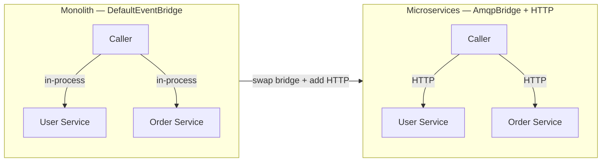

# Embedded Client

The embedded client pattern runs all services in the same process connected by a `DefaultEventBridge`. Commands are invoked as direct in-process messages — no HTTP server, no serialization overhead, no network.

## When to use

| Scenario | Client type |
|---|---|
| Same-process monolith | Embedded |
| Tests and scripts | Embedded |
| Split into microservices later | Swap `DefaultEventBridge` for `AmqpBridge`/`NatsBridge` and add HTTP exposure |

## How it works

Start all services with a shared `DefaultEventBridge`. The generated `EventBridgeClient` (or direct `context.service.*` calls inside handlers) routes command messages through the in-process bridge to the target service — no TCP connection needed.

```typescript
import { DefaultEventBridge } from '@purista/core'
import { userServiceV1Service } from './service/user/v1/index.js'
import { orderServiceV1Service } from './service/order/v1/index.js'
import { EventBridgeClient } from './generated/EventBridgeClient.js'

// 1. Start the in-process bridge
const eventBridge = new DefaultEventBridge()
await eventBridge.start()

// 2. Start services — all share the same bridge
const userService = await userServiceV1Service.getInstance(eventBridge)
await userService.start()

const orderService = await orderServiceV1Service.getInstance(eventBridge)
await orderService.start()

// 3. Use the generated typed client — calls go through the bridge, not HTTP
const client = new EventBridgeClient(eventBridge)

const user = await client.user.v1.signUp(
  { email: 'alice@example.com' },
  {},
)
```

The generated `EventBridgeClient` is created with `ClientBuilder.generateEventBridgeClient()` — see [Event Bridge Client](./create_an_eventbridge_client.md) for the generation workflow.

## Cross-service calls inside handlers

Inside any command or subscription handler you can call sibling services directly through `context.service`:

```typescript
.setCommandFunction(async function (context, payload) {
  // Calls UserService v1 command 'getUser' — in-process via the bridge
  const user = await context.service.UserService[1].getUser(
    { userId: payload.userId },
    {},
  )
  return user
})
```

## Monolith to microservice migration



The business logic in every service stays unchanged. The only changes are:

- Swap `DefaultEventBridge` for a broker-backed bridge (`AmqpBridge`, `NatsBridge`)
- Add `.exposeAsHttpEndpoint()` to commands you want to reach via HTTP
- Start a `honoV1Service` to serve HTTP requests

## Common use cases

- **GraphQL resolvers** — invoke commands without HTTP overhead; see [GraphQL](../exposing_endpoints/graphql_mutation_and_query.md)
- **Integration tests** — fast, deterministic tests with no network mocks
- **Local scripts** — one-off administrative scripts that reuse service logic
- **Initial monolith** — start simple, split later without rewriting business logic

## Next steps

- [Event Bridge Client](./create_an_eventbridge_client.md) — generate a typed client from service definitions
- [REST API Client](./create_a_rest_api_client.md) — for external consumers over HTTP
