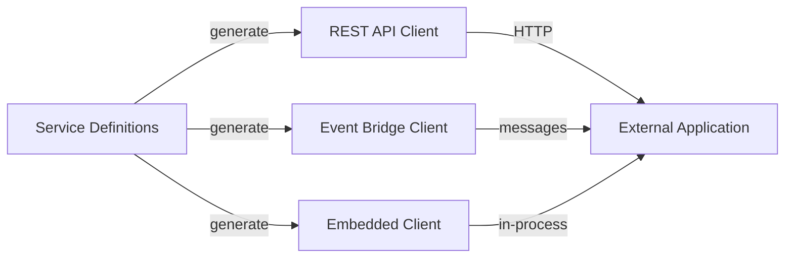
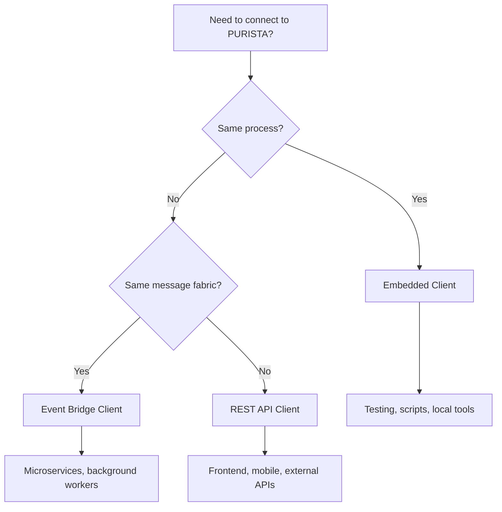

# Connect the Outside World to PURISTA

External clients — mobile apps, frontend code, third-party services — need a typed, stable interface to your PURISTA application.

## Client types

| Client | Transport | Use case |
|---|---|---|
| [REST API Client](./create_a_rest_api_client.md) | HTTP / fetch | Frontend, mobile, external services |
| [Event Bridge Client](./create_an_eventbridge_client.md) | Messages | Services in the same message fabric |
| [Embedded Client](./embedded_client.md) | In-process | Testing, scripting, local tooling |

## Generating a REST client

HTTP client generation uses `ClientBuilder` from `@purista/core/client`; `createHttpClient` is not exported. See the [REST API client guide](./create_a_rest_api_client.md) for the correct pattern.

## When to use which client

## Next steps

- [REST API Client](./create_a_rest_api_client.md) — HTTP client generation
- [Event Bridge Client](./create_an_eventbridge_client.md) — message-based client
- [Embedded Client](./embedded_client.md) — in-process client for testing
