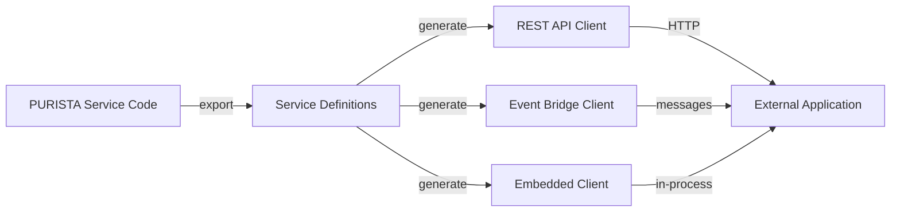
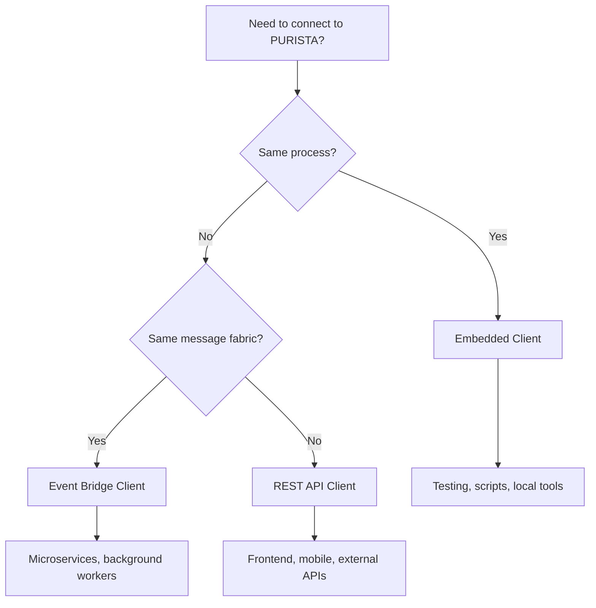

# Connect the Outside World to PURISTA

External clients — mobile apps, frontend code, third-party services — need a typed, stable interface to your PURISTA application. Because PURISTA uses builders with full type information, client generation is a two-step process:

1. **Export service definitions** from your code
2. **Generate a client** from those definitions



## Client types

| Client | Transport | Use case |
|---|---|---|
| [REST API Client](./create_a_rest_api_client.md) | HTTP / fetch | Frontend, mobile, external services |
| [Event Bridge Client](./create_an_eventbridge_client.md) | Messages | Services in the same message fabric |
| [Embedded Client](./embedded_client.md) | In-process | Testing, scripting, local tooling |

## Exporting service definitions

Use the built-in exporter to extract typed definitions:

```typescript [export.ts]
import { writeFile } from 'node:fs/promises'
import { exportServiceDefinitions } from '@purista/core'
import { userServiceV1Service } from './service/user/v1/userServiceV1Service.js'

const definitions = await exportServiceDefinitions([userServiceV1Service])
await writeFile('./definitions.json', JSON.stringify(definitions, null, 2))
```

The export includes:

- Service metadata (name, version, description)
- Command schemas (input payload, parameters, output)
- Subscription filters
- HTTP endpoint mappings
- Event names and schemas

## Generating a REST client

HTTP client generation uses the `ClientBuilder` utility — `createHttpClient` is not exported from `@purista/core`. See the [REST API client guide](./create_a_rest_api_client.md) for the correct pattern using `ClientBuilder`.

## When to use which client



## Design guidelines

- **Export definitions as part of CI** — keep client types in sync with service code
- **Version service definitions** — clients pin to specific service versions
- **Use embedded clients in tests** — fastest, no network overhead
- **Use REST clients for external consumers** — stable HTTP contract

## Next steps

- [Export Service Definitions](./export_service_definitions.md) — extract typed definitions
- [REST API Client](./create_a_rest_api_client.md) — HTTP client generation
- [Event Bridge Client](./create_an_eventbridge_client.md) — message-based client
- [Embedded Client](./embedded_client.md) — in-process client for testing
