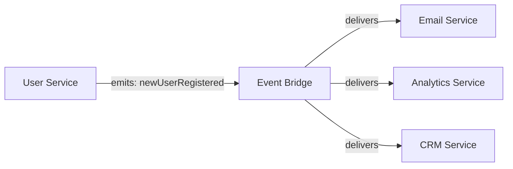

# Custom Event Messages

Custom events are the glue between PURISTA services. A command emits an event. A subscription reacts to it. Neither knows the other exists.



## Declaring events

Before emitting, declare the event on the builder with `canEmit`:

```typescript [userSignUpCommandBuilder.ts]
const userSignUpCommandBuilder = userServiceV1ServiceBuilder
  .getCommandBuilder('userSignUp', 'register a new user', 'newUserRegistered')
  .addPayloadSchema(inputPayloadSchema)
  .addOutputSchema(outputSchema)
  .canEmit('newUserRegistered', z.object({ userId: z.string().uuid() }))
  .setCommandFunction(async function (context, payload) {
    const userId = await context.resources.db.createUser(payload)

    // Emit the declared event
    await context.emit('newUserRegistered', { userId })

    return { userId }
  })
```

## Consuming events

Subscriptions listen for events by name, sender, or message type:

```typescript [sendWelcomeEmailSubscriptionBuilder.ts]
const sendWelcomeEmailSubscriptionBuilder = emailServiceV1ServiceBuilder
  .getSubscriptionBuilder('sendWelcomeEmail', 'send welcome email')
  .subscribeToEvent('newUserRegistered')
  .addPayloadSchema(z.object({ userId: z.string().uuid() }))
  .setSubscriptionFunction(async function (context, payload) {
    const user = await context.resources.db.getUser(payload.userId)
    await context.resources.mailer.send({
      to: user.email,
      subject: 'Welcome!',
    })
  })
```

## Event naming conventions

| Pattern | Example | Use case |
|---|---|---|
| Domain + past tense | `user.created`, `order.placed` | Business facts |
| Service + action | `userService.userCreated` | Explicit service origin |
| Camel case | `newUserRegistered` | PURISTA default convention |

Choose a convention and stick to it. The `purista.json` `eventConvention` setting enforces file naming consistency.

## Event design guidelines

- **Emit business facts, not instructions** — `order.placed` not `sendEmail`
- **Keep payloads minimal** — include IDs, not full objects; subscribers fetch what they need
- **Version with the service** — `userServiceV1.userCreated` vs `userServiceV2.userCreated`
- **Be idempotent** — the same event may be delivered more than once

## Emission patterns

### From commands

Commands can emit events as part of their success response:

```typescript
.setCommandFunction(async function (context, payload) {
  const result = await process(payload)
  await context.emit('myEvent', result)
  return result
})
```

### From subscriptions

Subscriptions can emit follow-up events:

```typescript
.setSubscriptionFunction(async function (context, payload) {
  await handle(payload)
  await context.emit('followUpEvent', { done: true })
})
```

### From streams and agents

The same pattern works in streams and AI agents:

```typescript
.canEmit('support.agent.completed', z.object({ sessionId: z.string() }))
.setHandler(async function (context, payload) {
  await context.emit('support.agent.completed', { sessionId: payload.sessionId })
})
```

## What happens when nobody listens

Emitted events are broadcast. If no subscription matches, the event is silently dropped. This is by design — producers should not know or care about consumers.

To ensure critical events are not lost:

- Use [result events](../6_integrations/enterprise_interoperability/result-events.md) for guaranteed delivery
- Use [event-to-queue bindings](../6_integrations/enterprise_interoperability/event-to-queue.md) for durable handoff
- Monitor event emission in your observability platform

Next: [Subscription Builder](../subscription/the-subscription-builder.md) for consuming events.
