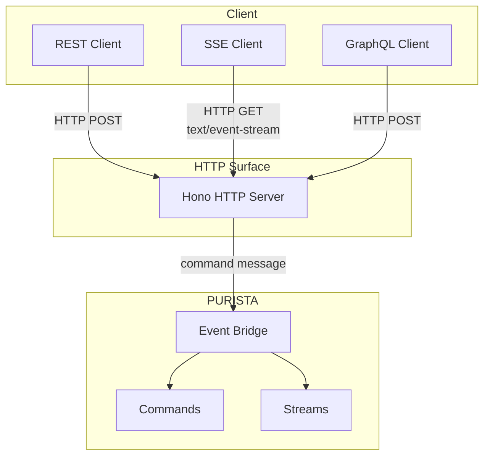

# Exposing Commands

PURISTA commands are transport-agnostic. You implement business logic once, then expose it through one or more adapters. The framework provides first-class support for REST/OpenAPI and SSE streaming.

## Architecture



## Exposing a command as REST

Add `.exposeAsHttpEndpoint()` to any command builder:

```typescript [userSignUpCommandBuilder.ts]
export const userSignUpCommandBuilder = userServiceV1ServiceBuilder
  .getCommandBuilder('userSignUp', 'register a new user')
  .addPayloadSchema(inputPayloadSchema)
  .addParameterSchema(queryParameterSchema)
  .addOutputSchema(outputSchema)
  .exposeAsHttpEndpoint('POST', 'users')
  .setCommandFunction(async function (context, payload, parameter) {
    // business logic
  })
```

The Hono HTTP server automatically:

- Validates request body against `inputPayloadSchema`
- Validates query/path params against `inputParameterSchema`
- Returns the command response as JSON
- Generates OpenAPI documentation from schemas
- Returns problem details (RFC 7807) for errors

## Streaming with SSE

For real-time updates, use a stream builder and expose it:

```typescript [userSearchStreamBuilder.ts]
export const userSearchStreamBuilder = userServiceV1ServiceBuilder
  .getStreamBuilder('userSearch', 'search users with incremental results')
  .addPayloadSchema(searchPayloadSchema)
  .setStreamFunction(async function (context, payload, streamWriter) {
    const results = await context.resources.db.search(payload.query)
    for (const user of results) {
      await streamWriter.write({ type: 'frame', data: user })
    }
    await streamWriter.write({ type: 'close' })
  })
```

The HTTP server handles SSE protocol framing automatically.

## REST vs. GraphQL

| Aspect | REST | GraphQL |
|---|---|---|
| **Endpoint style** | One URL per command | Single `/graphql` endpoint |
| **Schema** | OpenAPI from Zod schemas | GraphQL schema from service definitions |
| **Flexibility** | Fixed request/response shape | Client selects fields |
| **Tooling** | Broad HTTP client support | Apollo, Relay, codegen |
| **When to use** | Standard HTTP semantics, caching | Complex data requirements, mobile clients |

You can use both in parallel because commands stay independent from transport-specific code.

## Design guidelines

- **Keep command contracts stable** — changing a schema breaks clients
- **Version in the service name** — `UserServiceV1`, `UserServiceV2`
- **Use parameters for query filters** — `?status=active` maps to parameter schema
- **Use payload for body data** — POST body maps to payload schema
- **Protect sensitive endpoints** — set `protected: true` and add auth middleware

## Next steps

- [REST API HTTP Endpoints](./rest_api_http_endpoints.md) — full REST configuration
- [GraphQL](./graphql_mutation_and_query.md) — GraphQL adapter setup
