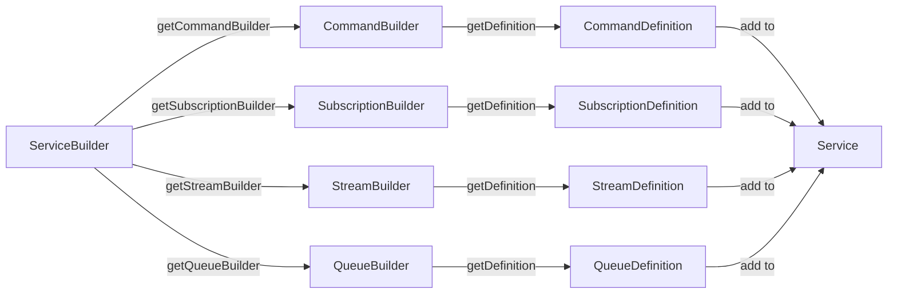
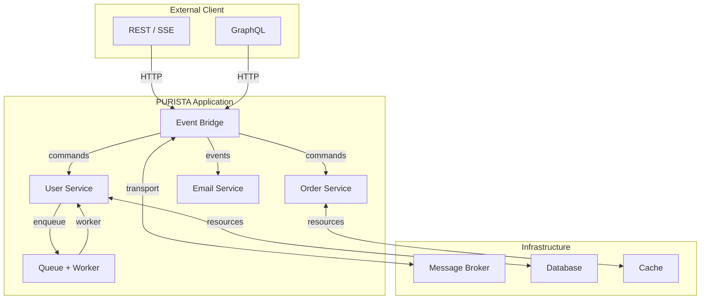

# Building Business Logic

This section covers everything you need to implement business capabilities in PURISTA: services, commands, subscriptions, streams, queues, schemas, error handling, and more.

## The builder pattern

PURISTA uses a fluent builder API for every artifact. Each builder collects metadata, schemas, and functions, then produces a typed definition.

## Core concepts

| Concept | Purpose | Pattern |
|---|---|---|
| [Service](./service/index.md) | Business boundary with metadata, config, and resources | Domain-driven grouping |
| [Command](./command/index.md) | Typed request/response operation | Active, synchronous |
| [Subscription](./subscription/index.md) | Reaction to events matching filters | Passive, asynchronous |
| [Stream](./stream/index.md) | Multi-frame response for live updates | Push, real-time |
| [Queue](./queue/index.md) | Pull-based async work with workers | Durable, background |
| [Schema](./schemas.md) | Zod-based validation and TypeScript types | Boundary enforcement |
| [Store](./stores/index.md) | Config, secret, and state persistence | Externalized state |

## Suggested reading order

Follow this path to build a complete mental model:

1. **[Builders](./builders.md)** — understand the builder pattern and shared configuration
2. **[Schemas & Validation](./schemas.md)** — define Zod schemas for inputs, outputs, and events
3. **[Service](./service/index.md)** — create a service with metadata, config, and resources
4. **[Command](./command/index.md)** — add request/response operations with guards and transforms
5. **[Stream](./stream/index.md)** — implement live, incremental responses
6. **[Subscription](./subscription/index.md)** — react to events from other services
7. **[Queue](./queue/index.md)** — handle durable background work
8. **[AI Agents](./ai/index.md)** — add LLM-powered workflows (optional)
9. **[Custom Events](./custom_events.md)** — emit and handle domain events
10. **[Error Handling](./error-handling.md)** — structured errors and recovery
11. **[Logging](./logging.md)** — structured logging with context
12. **[Stores](./stores/index.md)** — config, secret, and state management
13. **[Exposing Commands](./exposing_endpoints/index.md)** — REST, SSE, and GraphQL
14. **[HTTP Client](./fetch_based_http_client.md)** — call external APIs with typed clients
15. **[Connect to PURISTA](./connect_to_a_purista_application/index.md)** — build clients for your services
16. **[Advanced](./advanced/index.md)** — message structure, delivery semantics, protocol internals

## How the pieces fit together

## Key design guidelines

- **One service per business capability** — not per technical layer
- **Commands are named operations** — `userSignUp`, not `POST /users`
- **Subscriptions are decoupled** — the producer does not know the consumer exists
- **Schemas at every boundary** — no untyped data enters or leaves a service
- **State externalized** — use stores, not in-memory state
- **Errors are typed** — return `UnhandledError` or custom error schemas

Next: start with [Builders](./builders.md) to understand the foundation of every PURISTA artifact.
