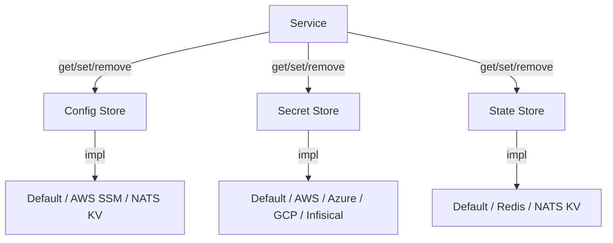

# Stores

PURISTA services are stateless. All persistent data lives in external stores. The framework provides three store types with unified interfaces — you swap the implementation without changing business logic.



## Why three separate store types?

At first glance it can feel redundant to have three distinct stores instead of one generic key-value store. The separation exists for security and operational reasons that matter significantly in production. Config values (API URLs, feature flags, timeouts) are safe to log, inspect in dashboards, or pass through environment variables — they are not sensitive. Secrets (API keys, database passwords, certificates) must never appear in logs, diagnostic traces, or version control. Mixing them into the same store removes the enforcement boundary and makes audits harder.

State is different again: it is *runtime* business data generated while the system is running, not something you deploy with the service. A checkout service might write the current cart contents to state so that a background subscription can pick up an abandoned-cart workflow ten minutes later. That data lives in the state store, not the database and not a config file, because it is ephemeral, per-entity, and needs to be shared across service instances without going through the full command/subscription message flow.

A practical rule: if you would put it in `.env` or a config file, use the config store. If it would go in a password manager or a secrets vault, use the secret store. If it is produced at runtime by your business logic and needs to outlive a single function invocation, use the state store.

## Three store types

| Type | Stores | Use case | Examples |
|---|---|---|---|
| **Config** | Non-secret configuration | Environment-specific values | API URLs, feature flags, timeouts |
| **Secret** | Sensitive data | Credentials and tokens | API keys, DB passwords, certificates |
| **State** | Business state | Domain data shared across instances | User sessions, counters, job status |

## Choosing the right implementation

For local development and unit tests, all three default in-memory implementations are sufficient. The key discipline is to never call cloud-provider SDKs directly inside your command or subscription functions — always go through the context. This is what makes the implementations swappable: your `userSignUp` command does not know whether `context.secrets.getSecret('stripeApiKey')` is reading from AWS Secrets Manager or from a local in-memory map during a test run.

In staging and production, pick implementations that match your infrastructure. If your team is already on AWS, `@purista/aws-secret-store` and `@purista/aws-config-store` (backed by SSM Parameter Store) are the natural fit. If you're running NATS as your event bridge, `@purista/nats-config-store` and `@purista/nats-state-store` keep your infrastructure footprint minimal. For state stores in production, in-memory is never acceptable — use Redis, NATS KV, Dapr, or another durable adapter so that state survives instance restarts and is shared across replicas. Choose Redis or an explicitly TTL-capable Dapr component when you need per-write expiry.

## Using stores in a service

Attach stores to the service builder:

```typescript [userServiceV1ServiceBuilder.ts]
import { ServiceBuilder } from '@purista/core'
import { RedisStateStore } from '@purista/redis-state-store'
import { AWSSecretStore } from '@purista/aws-secret-store'

export const userServiceV1ServiceBuilder = new ServiceBuilder(myServiceInfo)
  .addConfigStore(/* ... */)
  .addSecretStore(AWSSecretStore, { region: 'us-east-1' })
  .addStateStore(RedisStateStore, { url: process.env.REDIS_URL })
```

Access stores from command and subscription handlers:

```typescript [userSignUpCommandBuilder.ts]
.setCommandFunction(async function (context, payload) {
  // Config: non-sensitive values
  const apiUrl = await context.configs.getConfig('thirdPartyApiUrl')

  // Secret: credentials
  const apiKey = await context.secrets.getSecret('thirdPartyApiKey')

  // State: shared business data
  const session = await context.states.getState(`session:${payload.sessionId}`)

  // Business logic...
})
```

## Store implementations

### Config stores

| Package | Backend | Best for |
|---|---|---|
| `@purista/core` | In-memory | Development, testing |
| `@purista/aws-config-store` | AWS Systems Manager Parameter Store | AWS deployments |
| `@purista/nats-config-store` | NATS KV | NATS-first platforms |
| `@purista/redis-config-store` | Redis | Simple key-value, any Redis |

### Secret stores

| Package | Backend | Best for |
|---|---|---|
| `@purista/core` | In-memory (development only) | Local development |
| `@purista/aws-secret-store` | AWS Secrets Manager | AWS deployments |
| `@purista/azure-secret-store` | Azure Key Vault | Azure deployments |
| `@purista/gcloud-secret-store` | Google Cloud Secret Manager | GCP deployments |
| `@purista/vault-secret-store` | HashiCorp Vault | Self-hosted, multi-cloud |
| `@purista/infisical-secret-store` | Infisical | Multi-cloud, team secrets |

### State stores

| Package | Backend | Best for |
|---|---|---|
| `@purista/core` | In-memory | Development, testing |
| `@purista/redis-state-store` | Redis | Production sessions, counters, caches; atomic per-key expiry |
| `@purista/nats-state-store` | NATS KV | NATS-first platforms; fixed bucket lifetime only |
| `@purista/dapr-sdk` | Dapr state store | Polyglot/service mesh; per-write expiry only with a TTL-capable component |

## Common pitfalls

| Mistake | Why it hurts | Fix |
|---|---|---|
| Storing secrets in config store | Configs may be logged or exposed | Use secret store for credentials |
| Direct SDK imports in commands | Couples business logic to vendor | Access through `context.secrets` / `context.states` |
| In-memory state in production | Lost on restart, not shared across instances | Use Redis or NATS state store |
| No schema validation on state | Corrupted data, type mismatches | Validate critical reads/writes |

## Checklist

- [ ] Correct store type selected for each data class
- [ ] Getter/setter/remove capabilities configured intentionally
- [ ] Read/write values validated where critical
- [ ] Integration tests cover the concrete provider behavior
- [ ] Secret store used for all credentials (never in config or code)

Next: [Config Stores](./config-stores.md), [Secret Stores](./secret-stores.md), or [State Stores](./state-stores.md) for implementation details.
