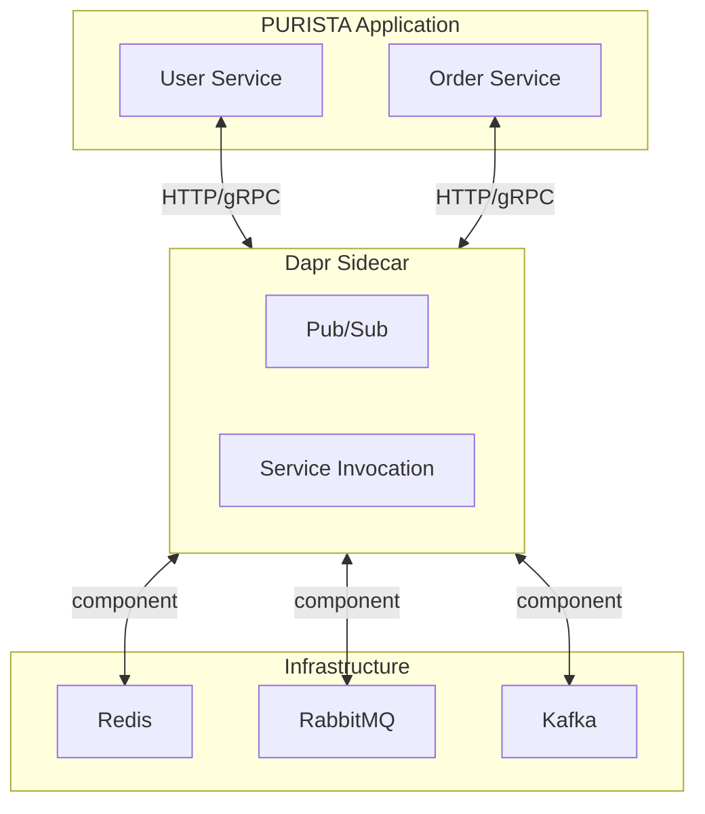

# Dapr Event Bridge

`@purista/dapr-sdk` provides a Dapr-oriented bridge and state/config/secret adapters. Use it when you operate in a polyglot environment or want Dapr's sidecar model for transport abstraction.

## Architecture



PURISTA services talk to the Dapr sidecar. The sidecar handles routing, retries, and broker connectivity.

## Setup

```typescript [eventbridge.ts]
import { DaprEventBridge } from '@purista/dapr-sdk'

const eventBridge = new DaprEventBridge({
  clientConfig: {
    daprHost: 'localhost',
    daprPort: '3500',
  },
})
```

## Delivery semantics

Semantics depend on the Dapr pub/sub component and broker backend:

| Aspect | Behavior |
|---|---|
| Delivery | Component-dependent (most setups are at-least-once) |
| Durability | Component-dependent |
| Retries / DLQ | Component and resiliency policy dependent |

Always verify your concrete component behavior in integration tests.

## Command invocation

For Dapr invoke paths, timeout behavior is owned by the Dapr sidecar/client request lifecycle. PURISTA forwards TTL from invoke calls but does not emulate broker-style command retries.

## Stream support

PURISTA stream runtime (`openStream`) is currently not implemented for the Dapr bridge.

## Startup order

Use the sequence required for Dapr endpoint discovery:

```typescript
// 1. Create bridge (do not start yet)
const eventBridge = new DaprEventBridge(config)

// 2. Create and start service
const myService = await myV1Service.getInstance(eventBridge)
await myService.start()

// 3. Start bridge (registers endpoints with Dapr)
await eventBridge.start()
```

## Dapr stores

The Dapr SDK also provides store adapters:

| Store | Class | Dapr component |
|---|---|---|
| Config | `DaprConfigStore` | Dapr configuration store |
| Secret | `DaprSecretStore` | Dapr secret store |
| State | `DaprStateStore` | Dapr state store |

```typescript [serviceBuilder.ts]
import { DaprStateStore, DaprSecretStore } from '@purista/dapr-sdk'

const builder = new ServiceBuilder(myServiceInfo)
  .addStateStore(DaprStateStore)
  .addSecretStore(DaprSecretStore)
```

## Reliability recommendations

- Document and version-control Dapr component/resiliency specs
- Validate duplicate handling in command/subscription side effects
- Test sidecar restarts and service readiness ordering
- Verify shutdown behavior with the same readiness probes used in production

## When to choose Dapr

| Use case | Recommendation |
|---|---|
| Polyglot services (Go, Python, Java + TypeScript) | ✅ Good fit |
| Existing Dapr infrastructure | ✅ Good fit |
| Service mesh requirements | ✅ Good fit |
| Pure TypeScript, no sidecar preference | Consider NATS or AMQP directly |
| Stream support needed | Not yet available |

Next: [Event Bridges overview](./index.md) to compare all bridge options.
