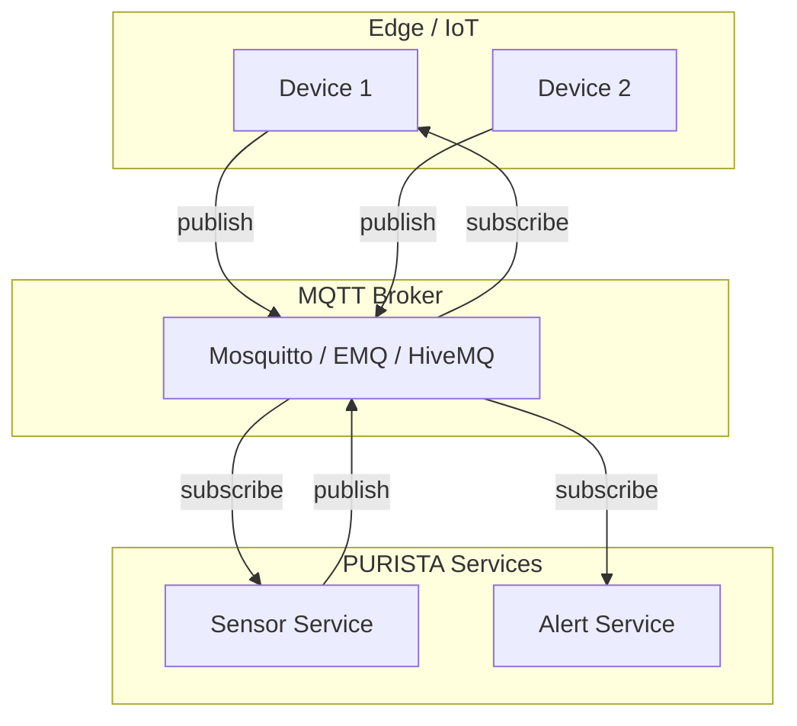

# MQTT Event Bridge

`@purista/mqttbridge` integrates MQTT v5 brokers with PURISTA routing semantics. Use it for IoT/edge scenarios or when topic-based routing is central to your architecture.

## Architecture



## Setup

```typescript [eventbridge.ts]
import { MqttBridge } from '@purista/mqttbridge'

const eventBridge = new MqttBridge({
  url: 'mqtt://localhost:1883',
  clientId: 'purista-service-1',
})
```

## Delivery semantics

MQTT delivery depends on QoS and session settings:

| QoS | Guarantee | Use case |
|---|---|---|
| 0 | At-most-once | Telemetry, metrics, non-critical events |
| 1 | At-least-once | Commands, business events |
| 2 | Exactly-once (protocol level) | Critical control messages |

Application side effects must still be idempotent — QoS 2 guarantees protocol delivery, not exactly-once processing.

## Command timeout

PURISTA applies dual timeout tracking:

- **Caller-side** — pending invocation timeout
- **Broker-side** — MQTT `messageExpiryInterval` derived from command timeout

This keeps timeout handling predictable while preferring broker-native expiry where available.

## Topic strategy

PURISTA composes MQTT topics from message metadata:

```
purista/{messageType}/{senderService}/{senderVersion}/{receiverService}/{receiverVersion}/{eventName}
```

Keep topic prefixes and QoS consistent across all service instances.

## Stream support

PURISTA stream runtime (`openStream`) is currently not implemented for the MQTT bridge.

## Reliability recommendations

- **Choose QoS per traffic class** — QoS 0 for telemetry, QoS 1 for commands
- **Align expiry and timeout values** — don't let MQTT expiry exceed PURISTA timeouts
- **Use shared subscriptions carefully** — they enable scale-out but may reorder messages
- **Test reconnect behavior** — verify retained sessions and clean start flags
- **Set `messageExpiryInterval`** — prevents stale commands from executing after outages

## When to choose MQTT

| Use case | Recommendation |
|---|---|
| IoT / edge devices | ✅ Excellent fit |
| Topic-centric routing | ✅ Good fit |
| Existing MQTT infrastructure | ✅ Good fit |
| Durable subscriptions needed | Use AMQP or NATS JetStream |
| Stream support needed | Not yet available |
| Low-latency intra-service messaging | Consider NATS |

Next: [Event Bridges overview](./index.md) to compare all bridge options.
