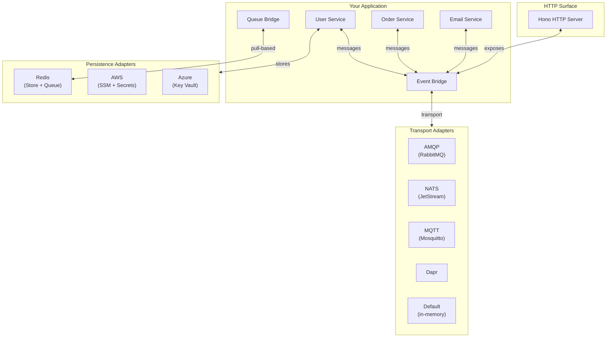
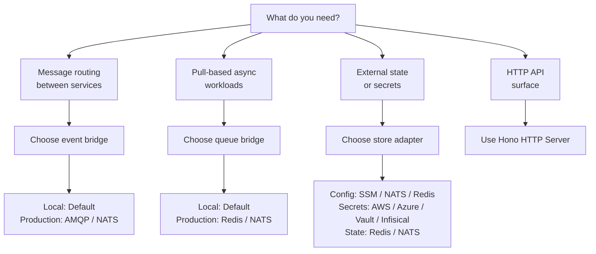

# PURISTA Ecosystem

PURISTA is modular. The core framework handles message contracts, routing, and type safety. The ecosystem provides adapters for message brokers, queue backends, state stores, and HTTP servers.

## Architecture overview

## Choosing your stack

### Event bridges (push-based messaging)

| Bridge | Scale out | Durable subscriptions | Manual ack | Stream support | Best for |
|---|---|---|---|---|---|
| [Default](./eventbridges/default_event_bridge.md) | No | No | No | Yes | Local dev, single instance |
| [AMQP](./eventbridges/amqp.md) | Yes | Yes | Yes | No | Production, operational control |
| [MQTT](./eventbridges/mqtt.md) | Yes | Broker-dependent | No | No | IoT, edge, topic-centric |
| [NATS](./eventbridges/nats.md) | Yes | JetStream only | JetStream only | No | Low-latency, simple ops |
| [Dapr](./eventbridges/dapr.md) | Yes | Component-dependent | Component-dependent | No | Polyglot, service mesh |

See the [Event Bridges](./eventbridges/index.md) page for the full capability matrix.

### Queue bridges (pull-based workloads)

| Package | Backend | Best for |
|---|---|---|
| `@purista/core` | In-memory | Local dev, tests, single instance |
| `@purista/redis-queue-bridge` | Redis | Production CQRS, delayed jobs, AI workers |
| `@purista/nats-queue-bridge` | NATS JetStream | NATS-first platforms, pull-based scaling |

### Stores

| Type | Packages | Purpose |
|---|---|---|
| Config | `@purista/core`, `@purista/aws-config-store`, `@purista/nats-config-store`, `@purista/redis-config-store` | Environment-specific values |
| Secret | `@purista/core`, `@purista/aws-secret-store`, `@purista/azure-secret-store`, `@purista/gcloud-secret-store`, `@purista/infisical-secret-store`, `@purista/vault-secret-store` | API keys, passwords, tokens |
| State | `@purista/core`, `@purista/redis-state-store`, `@purista/nats-state-store` | Business state, sessions, counters |

See [Stores](./stores.md) for the full list.

### HTTP servers

| Package | Features |
|---|---|
| `@purista/hono-http-server` | REST endpoints, SSE streaming, OpenAPI generation, problem details |

See [HTTP Server](./http_server.md) for configuration and middleware.

## Ecosystem decision tree

## Next steps

- [Event Bridges](./eventbridges/index.md) — deep dive into transport adapters
- [Queue Bridges](./queue_bridges/index.md) — pull-based workloads and worker pools
- [Stores](./stores.md) — config, secret, and state persistence
- [HTTP Server](./http_server.md) — REST, SSE, and OpenAPI
