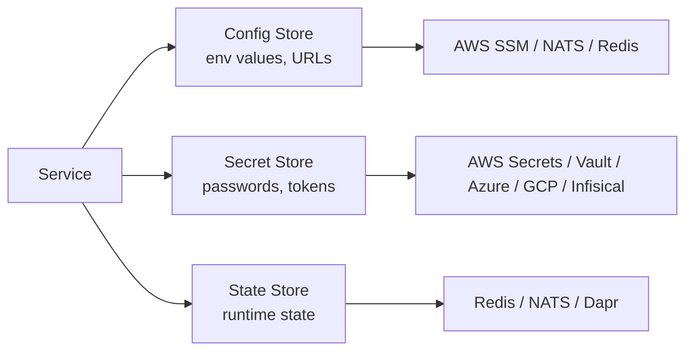
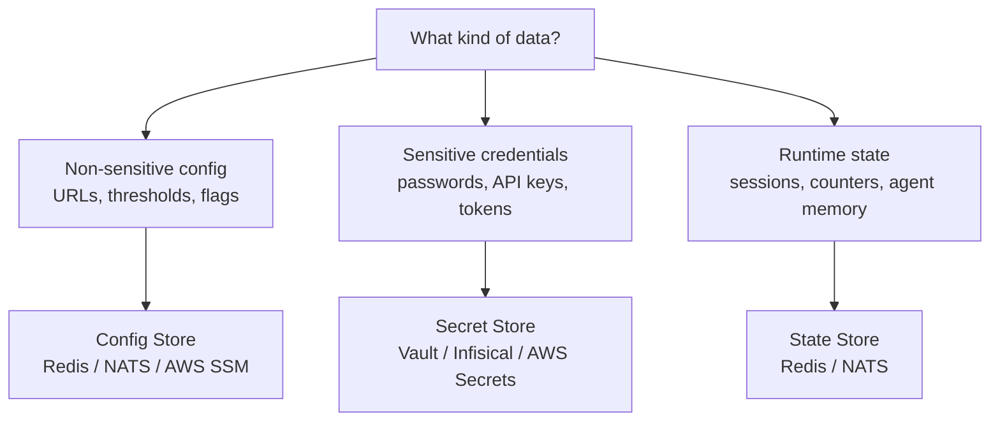

# Stores

PURISTA has three distinct store types, each with a clear, separate purpose. All share the same interface pattern — swap a provider in the `getInstance()` call without touching business logic.



## Config stores

Config stores hold non-sensitive, environment-specific values that may change without a restart — third-party URLs, feature flags, thresholds.

> **Not for secrets.** Secrets (API keys, passwords) belong in a secret store.

### Available config stores

| Vendor | Package | Notes |
|---|---|---|
| In-memory (default) | `@purista/core` `DefaultConfigStore` | Local dev and testing |
| AWS Systems Manager Parameter Store | `@purista/aws-config-store` | Native AWS; versioned, audited |
| NATS JetStream KV | `@purista/nats-config-store` | Best for NATS-first stacks |
| Redis | `@purista/redis-config-store` | Simple key-value; works with any Redis |
| Dapr | `@purista/dapr-sdk` | Delegates to the configured Dapr component |
| Azure App Configuration | planned | [Issue #105](https://github.com/puristajs/purista/issues/105) |

### @purista/redis-config-store

Redis is a natural fit for config: fast, widely deployed, and straightforward to operate. Values are stored as JSON strings.

**Install:**

```bash
npm install @purista/redis-config-store
```

**Setup:**

```typescript [main.ts]
import { RedisConfigStore } from '@purista/redis-config-store'

const configStore = new RedisConfigStore({
  config: {
    url: process.env.REDIS_URL ?? 'redis://localhost:6379',
  },
  // By default only reads (enableGet) are enabled.
  // Enable writes and deletes explicitly:
  enableSet: true,
  enableRemove: true,
})

const myService = await myV1Service.getInstance(eventBridge, {
  configStore,
})
```

**Usage inside a command or subscription:**

```typescript
.setCommandFunction(async function (context, payload) {
  // Read one or more keys — returns a keyed object
  const { apiBaseUrl, retryLimit } = await context.configs.getConfig('apiBaseUrl', 'retryLimit')

  // Write a value at runtime
  await context.configs.setConfig('featureFlags', { newCheckout: true })

  // Remove a key
  await context.configs.removeConfig('deprecatedKey')
})
```

**Feature flags:**

```typescript
enableGet: true,     // allow reading  (default: true)
enableSet: true,     // allow writing  (default: false)
enableRemove: true,  // allow deleting (default: false)
```

The Redis client connects lazily on first use. Connection errors are logged through the PURISTA logger with full span context.

---

## Secret stores

Secret stores hold sensitive credentials that should never appear in environment variables or config files — API keys, OAuth tokens, database passwords.

### Available secret stores

| Vendor | Package | Notes |
|---|---|---|
| In-memory (default) | `@purista/core` `DefaultSecretStore` | Local dev only — not for production |
| AWS Secrets Manager | `@purista/aws-secret-store` | Native AWS; automatic rotation support |
| Azure Key Vault | `@purista/azure-secret-store` | Native Azure; managed identity support |
| Google Cloud Secret Manager | `@purista/gcloud-secret-store` | Native GCP; version-aware |
| HashiCorp Vault | `@purista/vault-secret-store` | Self-hosted; multi-cloud |
| Infisical | `@purista/infisical-secret-store` | Open-source secrets platform |
| Dapr | `@purista/dapr-sdk` | Delegates to the configured Dapr component |

**Usage pattern (all providers):**

```typescript
.setCommandFunction(async function (context, payload) {
  const { emailToken } = await context.secrets.getSecret('emailToken')
  // use emailToken to authenticate with your email provider
})
```

---

## State stores

State stores hold runtime application state that must survive service restarts — session data, counters, work-in-progress records, agent memory.

### Available state stores

| Vendor | Package | Notes |
|---|---|---|
| In-memory (default) | `@purista/core` `DefaultStateStore` | Local dev only — lost on restart |
| Redis | `@purista/redis-state-store` | Production-ready; supports TTL, pub/sub |
| NATS JetStream KV | `@purista/nats-state-store` | Best for NATS-first stacks |
| Dapr | `@purista/dapr-sdk` | Delegates to the configured Dapr component |

**Usage pattern:**

```typescript
.setCommandFunction(async function (context, payload) {
  await context.states.setState('lastProcessedAt', new Date().toISOString())
  const { lastProcessedAt } = await context.states.getState('lastProcessedAt')
})
```

---

## Choosing the right store



## Next steps

- [Config store usage in commands](../2_building_business-logic/stores/config-stores.md)
- [Secret store usage in commands](../2_building_business-logic/stores/secret-stores.md)
- [State store usage in commands](../2_building_business-logic/stores/state-stores.md)
