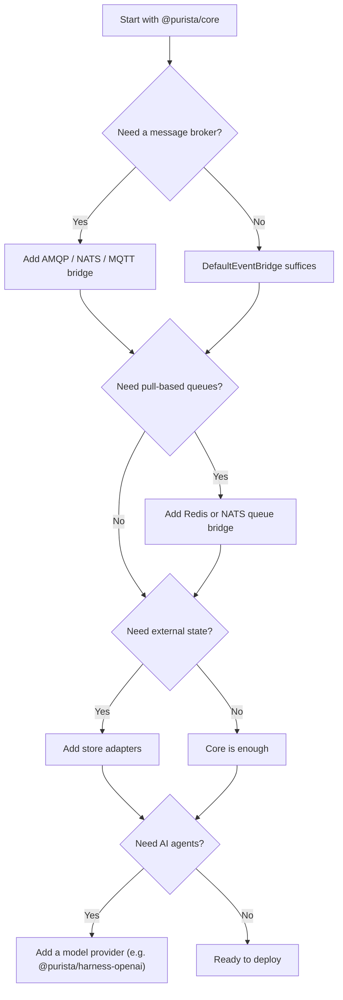

# Tools

This page lists tools that extend PURISTA for specific platforms and workflows.

## Official tools

| Tool | Package | Purpose | Docs |
|---|---|---|---|
| **CLI** | `@purista/cli` | Scaffold projects, generate services, commands, subscriptions | [CLI guide](../cli.md) |
| **Hono HTTP Server** | `@purista/hono-http-server` | REST endpoints, SSE streaming, OpenAPI generation | [HTTP Server](./http_server.md) |
| **Kubernetes SDK** | `@purista/k8s-sdk` | K8s deployment helpers, health checks, service discovery | [Kubernetes](../5_deploy_and_scale/microservice_style/kubernetes.md) |

## Ecosystem packages

| Package | Category | Use case |
|---|---|---|
| `@purista/core` | Core framework | Services, commands, subscriptions, builders, default bridges |
| `@purista/ai-harness` | AI Harness | Queue-backed AI agents, harness workflows, model provider bindings |
| `@purista/amqpbridge` | Event bridge | RabbitMQ / AMQP 0-9-1 transport |
| `@purista/natsbridge` | Event bridge | NATS / JetStream transport |
| `@purista/mqttbridge` | Event bridge | MQTT v5 transport |
| `@purista/dapr-sdk` | Event bridge + stores | Dapr pub/sub, state, config, secrets |
| `@purista/redis-queue-bridge` | Queue bridge | Redis-backed pull-based queues |
| `@purista/nats-queue-bridge` | Queue bridge | NATS JetStream-backed queues |
| `@purista/aws-config-store` | Store | AWS Systems Manager Parameter Store |
| `@purista/aws-secret-store` | Store | AWS Secrets Manager |
| `@purista/azure-secret-store` | Store | Azure Key Vault |
| `@purista/gcloud-secret-store` | Store | Google Cloud Secret Manager |
| `@purista/infisical-secret-store` | Store | Infisical secrets platform |
| `@purista/nats-config-store` | Store | NATS KV config store |
| `@purista/nats-state-store` | Store | NATS KV state store |
| `@purista/redis-state-store` | Store | Redis state store |
| `@purista/harness-openai` | AI provider | OpenAI model provider for AI agents |

## Choosing packages

Start with `@purista/core` for local development. Add transport and store packages as you move to production:

## Version compatibility

All official packages share the same major version as `@purista/core`. Keep them in sync to avoid type mismatches.
