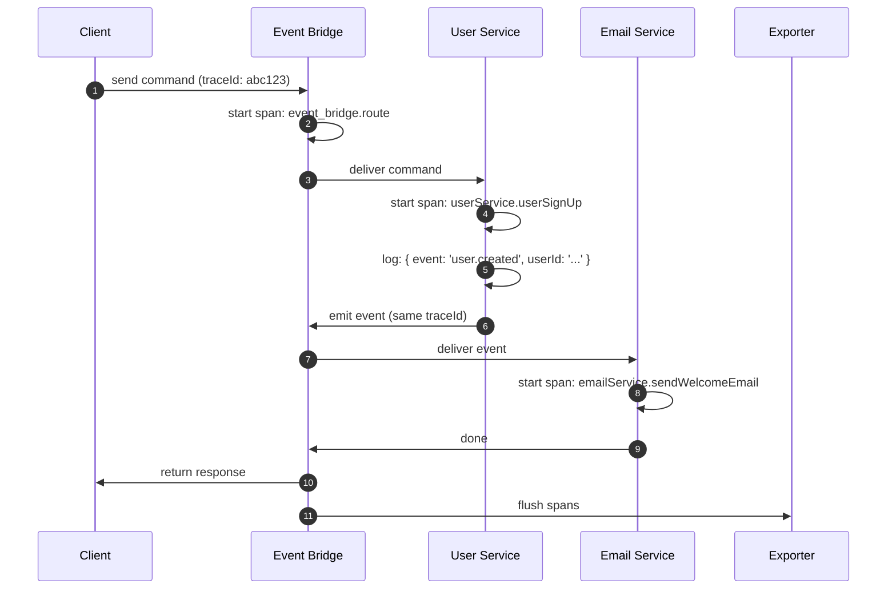

# OpenTelemetry

PURISTA has built-in OpenTelemetry support. Every message — command, subscription, stream, or queue job — automatically creates spans, carries trace context, and emits structured logs. You do not instrument your business logic.

## How tracing works in PURISTA



Each span includes:

- **Trace ID** — correlates the entire distributed flow
- **Service name and version** — know exactly which service handled the message
- **Command or subscription name** — pinpoint the operation
- **Timing** — how long each hop took
- **Logs** — structured JSON logs attached to the span

## What you get for free

| Observability signal | What PURISTA provides | What you add |
|---|---|---|
| **Traces** | Spans for every message route, command, subscription, stream, and queue job | Configure an exporter |
| **Logs** | Structured JSON logs with trace IDs, service names, and message metadata | None — use the provided logger |
| **Metrics** | Message counts, latency histograms, error rates | Configure a metrics exporter |
| **Error tracking** | Typed errors with stack traces in spans | None |

## Recommended product layer: CloudGrid

[CloudGrid](https://cloudgrid.dev/) is a PURISTA-powered observability platform for teams that want traces, logs, metrics, dashboards, alerts, and AI evaluation in one product surface. It accepts OpenTelemetry data and keeps AI Harness evaluation evidence close to the production traces that produced it.

For AI evaluation and optimization workflows, see [CloudGrid AI Evaluation](https://cloudgrid.dev/features/ai-evaluation/). Use the Harness eval helpers as the inner loop, then let CloudGrid manage datasets, runs, per-item results, comparisons, and promotion evidence.

## Supported backends

| Backend | Package | Setup complexity |
|---|---|---|
| [CloudGrid](https://cloudgrid.dev/) | OTLP HTTP / gRPC | Medium — observability plus AI evaluation |
| [Jaeger](./jaeger.md) | `@opentelemetry/exporter-trace-otlp-http` | Low — single Docker container |
| [Grafana Tempo](./grafana.md) | `@opentelemetry/exporter-trace-otlp-http` | Low — works with existing Grafana stack |
| [Zipkin](./zipkin.md) | `@opentelemetry/exporter-zipkin` | Low — single Docker container |
| [SigNoz](./signoz.md) | `@opentelemetry/exporter-trace-otlp-http` | Medium — full observability platform |
| [Uptrace](./uptrace.md) | `@opentelemetry/exporter-trace-otlp-http` | Medium — hosted or self-hosted |
| [Teletrace](./teletrace.md) | `@opentelemetry/exporter-trace-otlp-http` | Low — lightweight trace viewer |
| [AWS X-Ray](./aws.md) | `@opentelemetry/exporter-trace-otlp-http` | Medium — IAM and service setup |
| [Azure Monitor](./azure_monitor.md) | `@azure/monitor-opentelemetry-exporter` | Medium — Azure resource setup |
| [Google Cloud Trace](./google_cloud_trace.md) | `@google-cloud/opentelemetry-cloud-trace-exporter` | Medium — GCP project setup |

## How to wire OpenTelemetry in PURISTA

PURISTA does **not** use `NodeSDK` or a global tracer registration. Instead, you create a `SpanProcessor` (wrapping your exporter) and pass it directly to the event bridge and each service instance. This keeps instrumentation explicit, testable, and entirely under your control.

```typescript [main.ts]
import { OTLPTraceExporter } from '@opentelemetry/exporter-trace-otlp-http'
import { OTLPMetricExporter } from '@opentelemetry/exporter-metrics-otlp-http'
import { metrics } from '@opentelemetry/api'
import { MeterProvider, PeriodicExportingMetricReader } from '@opentelemetry/sdk-metrics'
import { SimpleSpanProcessor } from '@opentelemetry/sdk-trace-node'
import { AmqpBridge } from '@purista/amqpbridge'

// 1. Create a SpanProcessor wrapping your exporter
const spanProcessor = new SimpleSpanProcessor(
  new OTLPTraceExporter({ url: 'http://localhost:4318/v1/traces' })
)

// 2. Set up metrics (optional but recommended)
const metricReader = new PeriodicExportingMetricReader({
  exporter: new OTLPMetricExporter({ url: 'http://localhost:4318/v1/metrics' }),
  exportIntervalMillis: 5000,
})
const meterProvider = new MeterProvider({ readers: [metricReader] })
metrics.setGlobalMeterProvider(meterProvider)
const meter = meterProvider.getMeter('my-app')

// 3. Pass spanProcessor and meter to the event bridge
const eventBridge = new AmqpBridge({ spanProcessor, metrics: { meter } })
await eventBridge.start()

// 4. Pass the same spanProcessor and meter to each service
const myService = await myV1Service.getInstance(eventBridge, {
  spanProcessor,
  metrics: { meter },
})
await myService.start()
```

Every command, subscription, stream, and queue job inside `myService` automatically emits spans correlated to the same trace — no changes to your business logic required.

### Graceful shutdown

Always shut down both the span processor and meter provider before the process exits:

```typescript [shutdown.ts]
gracefulShutdown(logger, [
  eventBridge,
  myService,
  {
    name: 'OTSpanProcessor',
    destroy: () => spanProcessor.shutdown(),
  },
  {
    name: 'OTelMeterProvider',
    destroy: () => meterProvider.shutdown(),
  },
])
```

## Business vs. technical metrics

| Type | Examples | How to collect |
|---|---|---|
| **Technical** | Response time, error rate, throughput, resource usage | OpenTelemetry metrics + exporter |
| **Business** | Daily active users, order volume, conversion rate | Emit custom events from commands, aggregate in analytics |

For business metrics, emit custom events from your commands and subscribe to them with an analytics service:

```typescript
.setCommandFunction(async function (context, payload) {
  const result = await processOrder(payload)
  await context.emit('orderCompleted', { orderId: result.id, amount: result.amount })
  return result
})
```

## Next steps

- Choose your [tracing backend](./jaeger.md) and configure the exporter
- Read about [delivery semantics and reliability](../2_building_business-logic/advanced/delivery-semantics-and-reliability.md)
- Set up [health checks and monitoring](../5_deploy_and_scale/index.md)
