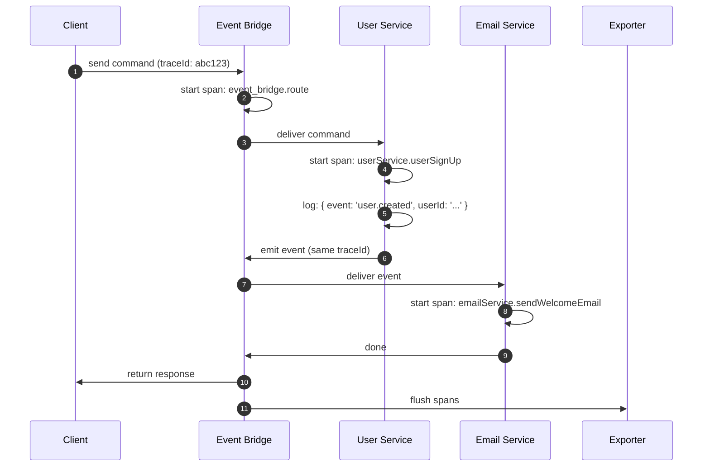

# OpenTelemetry

PURISTA has built-in OpenTelemetry support. Every message — command, subscription, stream, or queue job — automatically creates spans, carries trace context, and emits structured logs. You do not manually instrument framework tracing. Declare business measurements explicitly, with typed custom metrics, when they express a product outcome.

## How tracing works in PURISTA



Each span includes:

- **Trace ID** — correlates the entire distributed flow
- **Service name and version** — know exactly which service handled the message
- **Command or subscription name** — pinpoint the operation
- **Timing** — how long each hop took
- **Logs** — structured JSON logs attached to the span

## What you get for free

| Observability signal | What PURISTA provides | What you add |
|---|---|---|
| **Traces** | Spans for every message route, command, subscription, stream, and queue job | Configure an exporter |
| **Logs** | Structured JSON logs with trace IDs, service names, and message metadata | None — use the provided logger |
| **Metrics** | Message counts, latency histograms, error rates | Configure a metrics exporter |
| **Error tracking** | Typed errors with stack traces in spans | None |

## Recommended product layer: CloudGrid

[CloudGrid](https://cloudgrid.dev/) is a PURISTA-powered observability platform for teams that want traces, logs, metrics, dashboards, alerts, and AI evaluation in one product surface. It accepts OpenTelemetry data and keeps AI Harness evaluation evidence close to the production traces that produced it.

For AI evaluation and optimization workflows, see [CloudGrid AI Evaluation](https://cloudgrid.dev/features/ai-evaluation/). Use the Harness eval helpers as the inner loop, then let CloudGrid manage datasets, runs, per-item results, comparisons, and promotion evidence.

## Supported backends

| Backend | Package | Setup complexity |
|---|---|---|
| [CloudGrid](https://cloudgrid.dev/) | OTLP HTTP / gRPC | Medium — observability plus AI evaluation |
| [Jaeger](./jaeger.md) | `@opentelemetry/exporter-trace-otlp-http` | Low — single Docker container |
| [Grafana Tempo](./grafana.md) | `@opentelemetry/exporter-trace-otlp-http` | Low — works with existing Grafana stack |
| [Zipkin](./zipkin.md) | `@opentelemetry/exporter-zipkin` | Low — single Docker container |
| [SigNoz](./signoz.md) | `@opentelemetry/exporter-trace-otlp-http` | Medium — full observability platform |
| [Uptrace](./uptrace.md) | `@opentelemetry/exporter-trace-otlp-http` | Medium — hosted or self-hosted |
| [Teletrace](./teletrace.md) | `@opentelemetry/exporter-trace-otlp-http` | Low — lightweight trace viewer |
| [AWS X-Ray](./aws.md) | `@opentelemetry/exporter-trace-otlp-http` | Medium — IAM and service setup |
| [Azure Monitor](./azure_monitor.md) | `@azure/monitor-opentelemetry-exporter` | Medium — Azure resource setup |
| [Google Cloud Trace](./google_cloud_trace.md) | `@google-cloud/opentelemetry-cloud-trace-exporter` | Medium — GCP project setup |

## How to wire OpenTelemetry in PURISTA

PURISTA does **not** require your application to use `NodeSDK`. Create a
`SpanProcessor` (wrapping your exporter), then pass flat service runtime
options before the bridge starts. Core defaults and built-in event bridges
receive missing logger, metrics, and tracing values; an explicit component
setting always wins.

```typescript [main.ts]
import { OTLPTraceExporter } from '@opentelemetry/exporter-trace-otlp-http'
import { OTLPMetricExporter } from '@opentelemetry/exporter-metrics-otlp-http'
import { metrics } from '@opentelemetry/api'
import { MeterProvider, PeriodicExportingMetricReader } from '@opentelemetry/sdk-metrics'
import { SimpleSpanProcessor } from '@opentelemetry/sdk-trace-node'
import { AmqpBridge } from '@purista/amqpbridge'

// 1. Create a SpanProcessor wrapping your exporter
const spanProcessor = new SimpleSpanProcessor(
  new OTLPTraceExporter({ url: 'http://localhost:4318/v1/traces' })
)

// 2. Set up metrics (optional but recommended)
const metricReader = new PeriodicExportingMetricReader({
  exporter: new OTLPMetricExporter({ url: 'http://localhost:4318/v1/metrics' }),
  exportIntervalMillis: 5000,
})
const meterProvider = new MeterProvider({ readers: [metricReader] })
metrics.setGlobalMeterProvider(meterProvider)
const meter = meterProvider.getMeter('my-app')

// 3. Construct the bridge. Do not repeat telemetry settings here.
const eventBridge = new AmqpBridge()

// 4. Pass service-owned telemetry once before the bridge starts. Default
// Core stores inherit a missing logger; Core EventBridgeBaseClass adapters
// inherit missing logger, span processor, and metrics/metricsRecorder values.
// DefaultQueueBridge also inherits an explicitly supplied metricsRecorder.
const myService = await myV1Service.getInstance(eventBridge, {
  spanProcessor,
  metrics: { meter },
})
await eventBridge.start()
await myService.start()
```

Every command, subscription, stream, and queue job inside `myService` automatically emits spans correlated to the same trace — no changes to your business logic required.

An adapter constructed outside the service can only inherit through its
documented `inheritServiceObservability(...)` hook and only before it starts
or creates a tracer. Late changes are ignored; PURISTA never rewires a live
provider pipeline, and static `purista inspect`/`doctor` does not claim live
provider health.

A shared event bridge has one telemetry pipeline. If services sharing that
bridge need different telemetry configuration, configure the bridge explicitly
instead of relying on service inheritance.

### Graceful shutdown

Always shut down both the span processor and meter provider before the process exits:

```typescript [shutdown.ts]
gracefulShutdown(logger, [
  eventBridge,
  myService,
  {
    name: 'OTSpanProcessor',
    destroy: () => spanProcessor.shutdown(),
  },
  {
    name: 'OTelMeterProvider',
    destroy: () => meterProvider.shutdown(),
  },
])
```

## Business vs. technical metrics

| Type | Examples | How to collect |
|---|---|---|
| **Technical** | Response time, error rate, throughput, resource usage | OpenTelemetry metrics + exporter |
| **Business operational** | Orders created, payment latency, cache hits | Declare a typed `app.*` custom metric on the builder |
| **Business audit/analytics** | Order lifecycle, conversion funnel, detailed user activity | Emit a domain event and aggregate it in an analytics service |

### Typed custom metrics

Use a custom metric when a low-cardinality counter, up/down counter, or histogram is the operational answer. Declare it on the builder before handler code records it. The declaration gives agents and TypeScript the metric name, allowed operation, unit, and attributes; handlers never receive a raw arbitrary-name recorder.

```typescript [serviceBuilder.ts]
import { ServiceBuilder } from '@purista/core'
import { z } from 'zod'

const metricAttributes = z.object({
  source: z.enum(['web', 'api']),
})

export const ordersService = new ServiceBuilder(serviceInfo)
  .defineMetric('app.orders.created', {
    kind: 'counter',
    unit: '{order}',
    description: 'Orders accepted by the service',
    attributes: metricAttributes,
  })
  .defineMetric('app.orders.processing.duration', {
    kind: 'histogram',
    unit: 'ms',
    description: 'Order processing duration',
    attributes: metricAttributes,
  })
```

```typescript [createOrderCommandBuilder.ts]
.setCommandFunction(async (context, payload) => {
  const startedAt = Date.now()

  try {
    const order = await createOrder(payload)
    context.metrics['app.orders.created'].add(1, { source: 'api' })
    return order
  } finally {
    context.metrics['app.orders.processing.duration'].record(Date.now() - startedAt, { source: 'api' })
  }
})
```

Service metrics cascade to commands, subscriptions, streams, queue workers, and attached agent handlers. An agent can additionally declare a metric on `AgentQueueBuilder`; that agent-local metric is available only in that agent handler.

```typescript
serviceBuilder
  .getAgentQueueBuilder('triageTicket', 'Triages a support ticket')
  .defineMetric('app.agent.escalations', {
    kind: 'counter',
    unit: '{escalation}',
    description: 'Escalated support tickets',
  })
```

Metric attributes must be stable, low-cardinality, and non-sensitive. Never use order IDs, user IDs, tenant IDs, correlation IDs, request URLs, headers, payload values, prompts, completions, tokens, or stack traces as attributes. Put detailed records in authorized state, audit, or analytics systems instead.

PURISTA uses the OpenTelemetry **Metrics API** only. Core does not create an exporter, collector, or Prometheus endpoint; your application owns the MeterProvider, reader, exporter, and any Prometheus or OTLP setup. PURISTA records service and agent wrapper metrics; `@purista/harness` owns GenAI/model/token/tool telemetry and must not be duplicated in handlers.

### When an event is the right business signal

Emit a domain event when downstream services need the fact itself, its durable business context, or a complete audit/analytics record. Events and metrics often complement each other:

```typescript
.setCommandFunction(async function (context, payload) {
  const result = await processOrder(payload)
  context.metrics['app.orders.created'].add(1, { source: 'api' })
  await context.emit('orderCompleted', { orderId: result.id, amount: result.amount })
  return result
})
```

## Next steps

- Choose your [tracing backend](./jaeger.md) and configure the exporter
- Read about [delivery semantics and reliability](../2_building_business-logic/advanced/delivery-semantics-and-reliability.md)
- Set up [health checks and monitoring](../5_deploy_and_scale/index.md)
