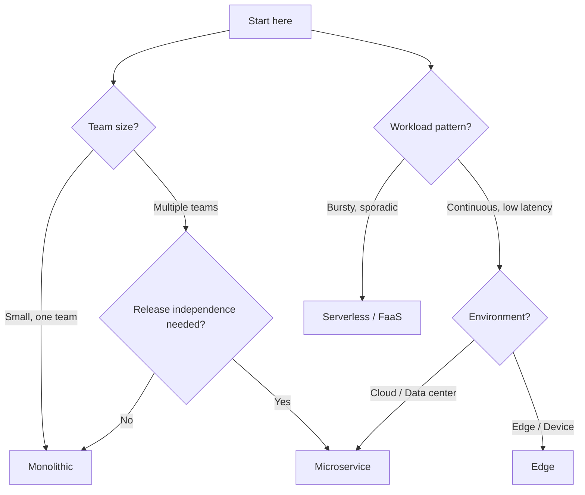
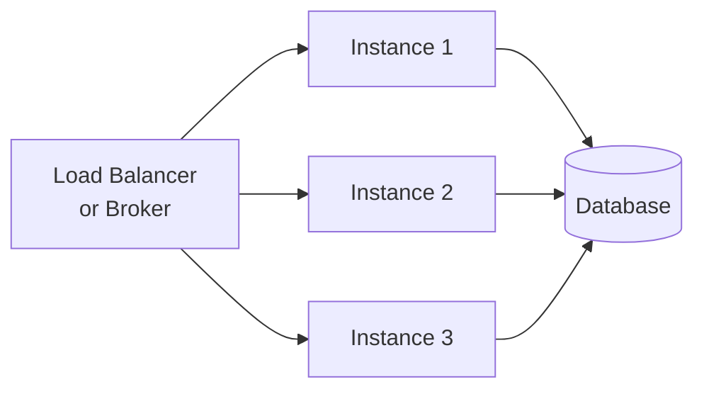

# Deploy & Scale

PURISTA services are infrastructure-agnostic. The same business logic runs on a laptop, in a Docker container, on Kubernetes, or as a serverless function. The only thing that changes is the event bridge adapter and bootstrap configuration.

## Choosing a deployment pattern

The most common mistake when adopting a service-oriented framework is jumping straight to a microservice deployment because it feels like the "right" architecture. The cost of that choice is paid immediately in infrastructure complexity, operational overhead, and inter-service networking problems — before a single real user has seen the product. PURISTA is designed so you do not have to make that call up front.

Start with the monolithic pattern: all services running in one process, one event bridge, one deployment artifact. You get all the domain separation benefits (bounded contexts, clean command/subscription boundaries) with zero distributed-systems overhead. When a team or scaling requirement genuinely demands it, you split a service out by pointing it at the same external event bridge and running it as a separate process. No business logic changes. No interface changes.

The serverless and edge patterns are for workloads with fundamentally different runtime characteristics. Serverless fits bursty, sporadic invocations where you do not want to pay for idle capacity — a webhook processor or a nightly batch trigger are good candidates, not an always-on order pipeline. The edge pattern targets constrained environments (IoT devices, on-premises edge nodes) where the process footprint must be minimal and connectivity may be intermittent.

## Deployment patterns

| Pattern | Architecture | Best for | Complexity |
|---|---|---|---|
| [Monolithic](./monolithic.md) | All services in one process | Fastest delivery, smallest ops overhead | Low |
| [Microservice](./microservice_style/index.md) | One service per process/container | Independent release cycles, team autonomy | Medium |
| [Edge](./edge.md) | Lightweight single-process | IoT, on-device, constrained environments | Low |
| [Serverless / FaaS](./serverless_function_fass.md) | Function-per-trigger | Bursty workloads, platform-managed scaling | Medium |

## Deployment decision tree

The decision tree prioritises two independent signals: team structure and workload shape. They are independent because a large team can still benefit from a monolith during early development, and a single developer can have workloads that are genuinely bursty and better served by serverless. Evaluate both branches and let the more constraining factor win.

## Scaling model

Because PURISTA services are stateless, scaling is horizontal:

- **The broker distributes messages** across service instances
- **No session affinity** required
- **Instances are interchangeable** — start more, stop some, no data loss
- **Scale per service** — User Service needs 3 instances, Email Service needs 1

## Runtime configuration

The same service code, different bootstrap:

| Environment | Event Bridge | Queue Bridge | Store |
|---|---|---|---|
| Local dev | `DefaultEventBridge` | `DefaultQueueBridge` | `DefaultStateStore` |
| CI / testing | `DefaultEventBridge` | `DefaultQueueBridge` | `DefaultStateStore` |
| Staging | `AmqpBridge` or `NatsBridge` | `RedisQueueBridge` | `RedisStateStore` |
| Production | `AmqpBridge` or `NatsBridge` | `RedisQueueBridge` or `NatsQueueBridge` | `RedisStateStore` or cloud-native |
| Serverless | `DefaultEventBridge` | `RedisQueueBridge` | `DefaultConfigStore` or `@purista/aws-config-store` |
| Edge | `MqttBridge` | `DefaultQueueBridge` | `DefaultStateStore` or Dapr state store |

## Production checklist

- [ ] Event bridge chosen and configured for durability requirements
- [ ] Queue bridge configured for pull-based workloads
- [ ] Graceful shutdown implemented (`gracefulShutdown(logger, [eventBridge, ...services])`)
- [ ] Health checks exposed
- [ ] OpenTelemetry exporter configured
- [ ] Secrets in secret stores, not environment variables or code
- [ ] Integration tests pass against real broker/store setup
- [ ] Retry policies defined and documented
- [ ] Idempotency implemented for command side effects

## Related

- [Event Bridges](../3_eco_system/eventbridges/index.md) — choose your transport
- [Stores](../2_building_business-logic/stores/index.md) — externalize state
- [OpenTelemetry](../4_open_telemetry/index.md) — observability in production
