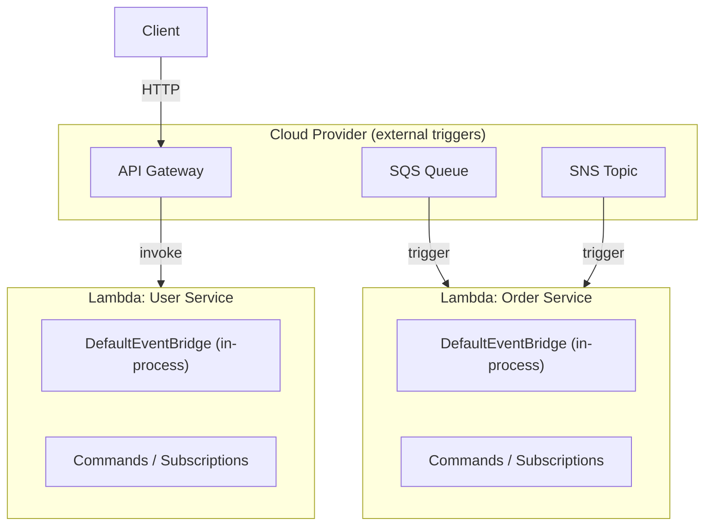

# Serverless Functions (FaaS)

## When to choose serverless

Serverless is the right model when your workload is **bursty and event-driven** and you want to pay only for actual execution time. Classic cases: HTTP APIs with unpredictable traffic, event processors triggered by queues or object storage, and scheduled background jobs that run infrequently.

Serverless works less well for long-running processes (Lambda has a 15-minute maximum), low-latency real-time workloads (cold starts add jitter), or complex multi-step workflows (use [Temporal](../6_integrations/temporal_and_purista/index.md) or containers for those).

If you need always-on services with fine-grained scaling per service, see [Microservice style](./microservice_style/index.md).

---

Serverless functions run code in response to events without managing servers. PURISTA's stateless, message-driven design maps naturally to function-as-a-service platforms.

## Architecture

Inside each function invocation, PURISTA uses the `DefaultEventBridge` — the in-memory event bridge from `@purista/core` — for routing between commands and subscriptions within that process. There is no external broker running inside the function.

External AWS services (API Gateway, SQS, SNS) act as **triggers** that invoke function instances from outside. They are not PURISTA event bridge adapters — they are the cloud glue that determines when a function starts.



In this model:

- Each PURISTA service runs as a separate function invocation
- The `DefaultEventBridge` handles in-process routing within a single function
- External events (SQS, SNS, API Gateway) are cloud-level triggers that start function invocations — they are not PURISTA event bridge adapters
- Functions are stateless and short-lived; use `aws-secret-store` and `aws-config-store` for runtime configuration

## PURISTA adapter pattern

PURISTA does not vendor-lock you to a single FaaS provider. The same service code runs on AWS, Azure, or GCP by changing the bootstrap adapter.

Each Lambda invocation creates its own `DefaultEventBridge`, starts the service, processes the event, and then destroys the bridge before returning. There is no external broker — `DefaultEventBridge` routes commands and subscriptions entirely in-process.

```typescript [lambda-handler.ts]
import { DefaultEventBridge } from '@purista/core'
import { userServiceV1Service } from './service/user/v1/userServiceV1Service.js'

export const handler = async (event: APIGatewayEvent) => {
  const eventBridge = new DefaultEventBridge()
  await eventBridge.start()

  const userService = await userServiceV1Service.getInstance(eventBridge)
  await userService.start()

  // Map Lambda event to PURISTA command message
  const result = await eventBridge.invoke({
    sender: { serviceName: 'ApiGateway', serviceVersion: '1', serviceTarget: 'handler' },
    receiver: { serviceName: 'UserService', serviceVersion: '1', serviceTarget: 'userSignUp' },
    payload: JSON.parse(event.body || '{}'),
  })

  await eventBridge.destroy()

  return {
    statusCode: 200,
    body: JSON.stringify(result),
  }
}
```

> **Note on SQS / SNS / API Gateway**: these are AWS-level triggers that determine *when* your Lambda function is invoked. They are not PURISTA event bridge adapters. Inside the function, the event bridge is always `DefaultEventBridge` — in-process, no broker required.

## Pros and cons

| Pros | Cons |
|---|---|
| Granular scaling — each function scales independently | Cold start latency for infrequently invoked functions |
| Pay-per-invocation — no idle capacity costs | Provider-specific configuration and IAM complexity |
| Fine-grained access control per function | Harder to test locally when functions invoke each other |
| Built-in scheduled triggers | Logging and tracing depend on cloud provider tools |
| Integrates with cloud-native orchestration (Step Functions, Temporal) | Vendor lock-in for orchestration and monitoring |

## When to use serverless

| Use case | Recommendation |
|---|---|
| Bursty HTTP APIs | ✅ Good fit |
| Event-driven processing | ✅ Good fit |
| Scheduled background jobs | ✅ Good fit |
| Long-running processes (>15 min) | ❌ Use queues or containers |
| Low-latency real-time | ❌ Consider containers or edge |
| Complex multi-step workflows | ❌ Consider Temporal + containers |

## Configuration tips

- **Keep functions warm** — use provisioned concurrency for critical paths
- **Minimize cold starts** — bundle dependencies, use lazy initialization
- **Set appropriate timeouts** — match PURISTA command timeouts to function timeouts
- **Use SQS for async work** — SQS is an AWS-level trigger that invokes Lambda; use PURISTA queue workers for the actual processing inside the function
- **Externalize state** — use `@purista/aws-config-store`, `@purista/aws-secret-store`, Redis (`@purista/redis-state-store`), or Dapr (`@purista/dapr-sdk`) for configuration, secrets, and state

## Related

- [Monolithic deployment](./monolithic.md) — simpler operational model
- [Microservice style](./microservice_style/index.md) — containers with independent scaling
- [Edge deployment](./edge.md) — lightweight for constrained environments
