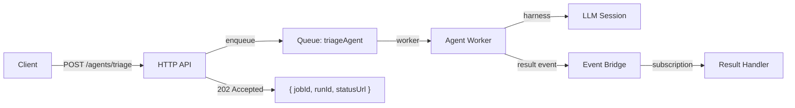

# Async Agent Queues

AI agents can take minutes or longer to complete. Running them synchronously blocks HTTP handlers and risks timeouts. Async agent queues run agents on the same durable queue infrastructure as other background work.

## Architecture



## Identifier model

Async agents use multiple identifiers for different concerns:

| Identifier | Purpose | Example |
|---|---|---|
| `jobId` | Queue ownership, retry, lease, DLQ | `job_abc123` |
| `runId` | Agent execution instance | `run_def456` |
| `conversationId` | Logical AI conversation | `conv_ghi789` |
| `correlationId` | Transport correlation | `corr_jkl012` |

Keep these separate. A single queue job may spawn multiple agent runs, and a single conversation may span multiple queue jobs.

## HTTP response pattern

Async agent endpoints return an accepted handle immediately:

```json
{
  "jobId": "job_abc123",
  "runId": "run_def456",
  "status": "queued",
  "statusUrl": "/jobs/job_abc123",
  "streamUrl": "/jobs/job_abc123/events"
}
```

The client polls `statusUrl` or connects to `streamUrl` for SSE updates.

## Delivery options

Final agent output can be delivered through:

| Mechanism | When to use |
|---|---|
| **Result event** | Downstream services need to react |
| **Status storage** | Client polls for completion |
| **SSE stream** | Real-time progress updates |
| **Callback webhook** | External system needs notification |

## Key constraint

Agents run on **normal PURISTA queues**. They inherit the same lease, heartbeat, retry, and result-event semantics as any other queue worker. Do not create a separate agent queue transport.

```typescript [triageAgentQueue.ts]
const triageAgentQueue = supportServiceV1ServiceBuilder
  .getQueueBuilder('triageAgent', 'AI triage for support tickets')
  .addPayloadSchema(triagePayloadSchema)
  .setExecutionProfile('longRunning', {
    maxRuntimeMs: 10 * 60 * 1000, // 10 minutes
  })
  .emitResultAsEvent('support.triage.completed', {
    failureEventName: 'support.triage.failed',
    delivery: 'best-effort',
  })
```

## Worker implementation

```typescript [triageAgentWorker.ts]
.setHandler(async function (context, job) {
  const payload = job.payload

  const session = await context.resources.harness.createSession({
    runId: job.id,
  })

  const result = await session.agents.triage.prompt({
    ticketId: payload.ticketId,
    content: payload.content,
  })

  await context.job.complete({
    classification: result.classification,
    priority: result.priority,
    suggestedTeam: result.suggestedTeam,
  })
})
```

## Design guidelines

- **Always return 202 Accepted** — never block HTTP handlers on agent execution
- **Set appropriate timeouts** — LLM calls can be slow; use long-running profiles
- **Emit results as events** — decouple agent execution from result consumption
- **Handle failures explicitly** — failed agent runs should be inspectable and retryable

Next: [Exports](./exports.md) for generating service contracts.
