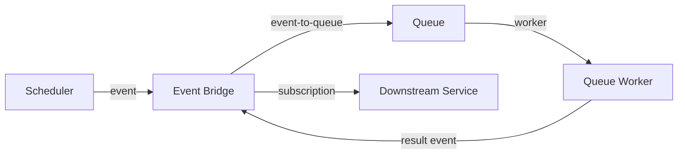
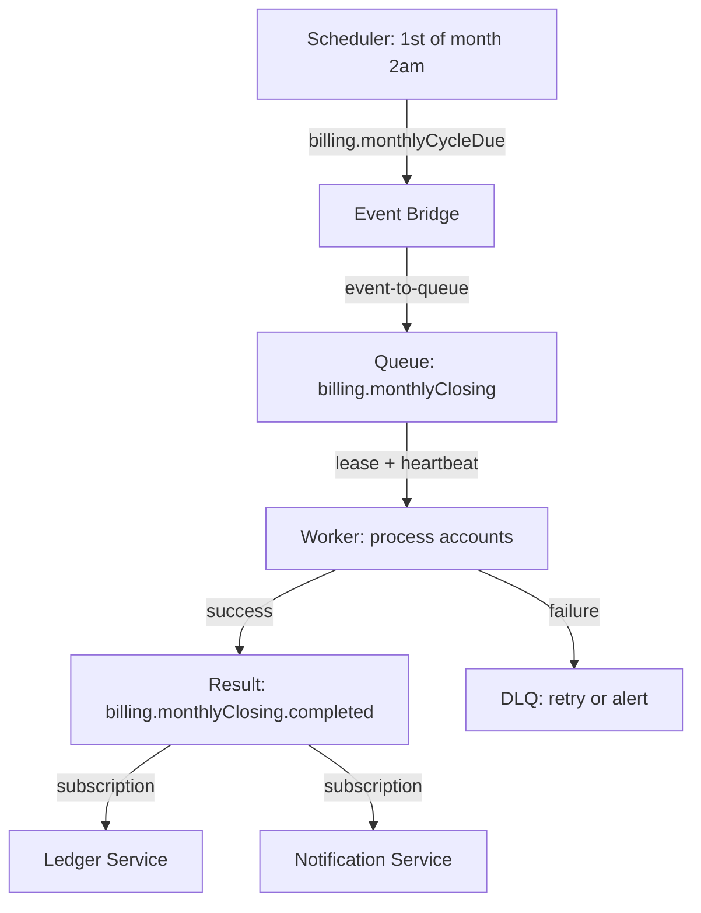

# Enterprise Interoperability

Enterprise systems have existing infrastructure: schedulers, message brokers, governance tools, and compliance requirements. PURISTA's interoperability layer makes your service contracts legible to these systems without moving business logic out of PURISTA.

## The enterprise flow

This pattern keeps each responsibility small and replaceable:

| Component | Responsibility | Replaced by |
|---|---|---|
| **Scheduler Runtime** | Evaluates time and publishes one trigger event | Core runtime with a selected scheduler provider |
| **Event** | Broadcasts a business fact | NATS (`@purista/natsbridge`), AMQP (`@purista/amqpbridge`), MQTT (`@purista/mqttbridge`), or via Dapr pubsub components |
| **Event-to-queue binding** | Hands off from push to pull semantics | PURISTA bridge adapter |
| **Queue** | Owns lease, retry, heartbeat, DLQ | Redis (`@purista/redis-queue-bridge`), NATS JetStream (`@purista/nats-queue-bridge`) |
| **Worker** | Executes business logic | PURISTA queue worker |
| **Result event** | Publishes completion to subscribers | Same event bridge |

## Interoperability topics

| Topic | Purpose |
|---|---|
| [Scheduling](./scheduling.md) | Declare schedules and run a separate trigger-only scheduler host |
| [Event-to-queue](./event-to-queue.md) | Durable handoff from events to pull-based work |
| [Long-running queues](./long-running-queues.md) | Lease, heartbeat, and retry for background jobs |
| [Result events](./result-events.md) | Publish queue completion as typed events |
| [Async agent queues](./async-agent-queues.md) | Queue lifecycle for AI agent execution |
| [Exports](./exports.md) | Generate AsyncAPI, OpenAPI, and runtime capability reports |

## Design principles

1. **Business logic stays in PURISTA** — commands, subscriptions, and queue workers own the domain logic
2. **Schedules are trigger-only** — the Core Scheduler Runtime publishes events; downstream consumers own business work
3. **Adapters bind at runtime** — the same service runs with different schedulers, brokers, and queue backends
4. **Exports are generated, not hand-written** — AsyncAPI and OpenAPI schemas derive from builder declarations

## Example: billing cycle

A complete enterprise flow for monthly billing:

See the local runnable example in `examples/enterprise-billing-cycle`.

## Governance and compliance

Use `purista export` to generate deterministic, provider-neutral documentation from exported service definitions. The CLI never starts services or contacts infrastructure. Build pipelines can also call the equivalent Core helpers directly when they need custom composition.

These documents show:

- Service ownership and version
- Message schemas and validation rules
- Delivery semantics and limitations
- Retry policies and dead-letter behavior

Review these before binding to specific infrastructure.

Next: [Scheduling](./scheduling.md) to declare time-based triggers.
