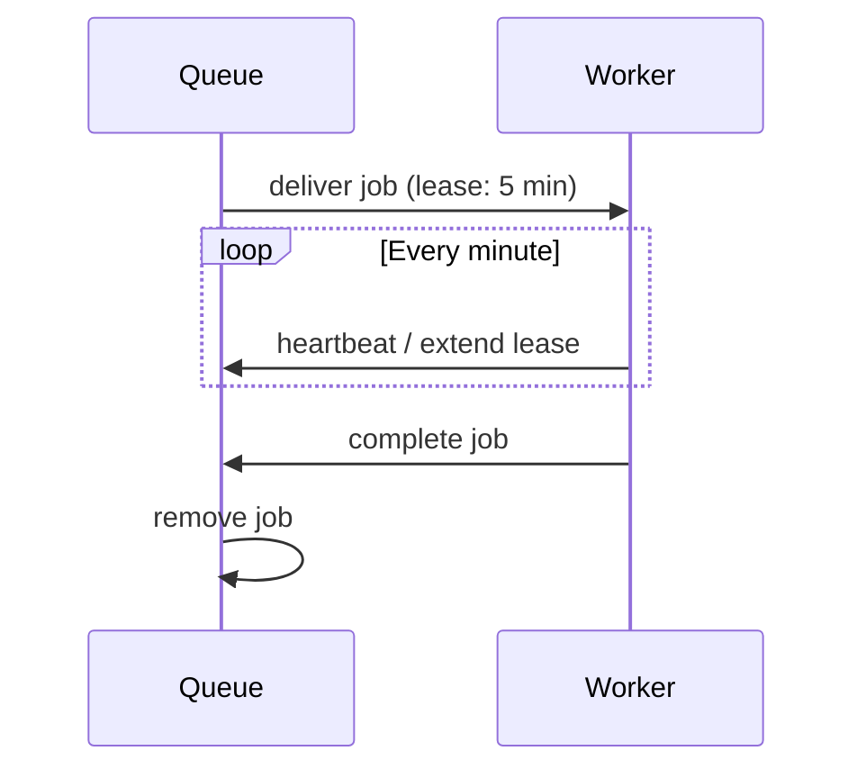

# Long-running Queues

Background jobs that take minutes or hours need special handling: leases that don't expire mid-work, heartbeats that prove liveness, and bounded retries that don't run forever.

## The long-running profile

PURISTA provides a `longRunning` execution profile with safe defaults:

```typescript [monthlyClosingQueue.ts]
const monthlyClosingQueue = billingServiceV1ServiceBuilder
  .getQueueBuilder('billing.monthlyClosing', 'Close a monthly billing cycle')
  .addPayloadSchema(billingClosingPayloadSchema)
  .setExecutionProfile('longRunning', {
    maxRuntimeMs: 6 * 60 * 60 * 1000, // 6 hours
  })
```

This profile configures:

| Setting | Value | Purpose |
|---|---|---|
| Visibility timeout | 5 minutes | Initial lease duration |
| Heartbeat interval | 1 minute | Prove worker is still alive |
| Lease extension | Automatic | Extend lease while heartbeating |
| Max extensions | Derived from `maxRuntimeMs` | Prevent infinite leases |
| Retry attempts | Bounded | Don't retry forever |
| Graceful shutdown | Wait for leases to expire | Don't kill active workers |

## Lease lifecycle



If the worker crashes or stops heartbeating, the lease expires and the job becomes available for another worker.

## Worker implementation

Call `context.job.extendLease(durationMs)` for fine-grained control:

```typescript
.setHandler(async function (context, job) {
  const payload = job.payload

  for (const account of payload.accounts) {
    await processAccount(account)

    // Extend lease by 5 minutes before processing next account
    await context.job.extendLease(5 * 60 * 1000)
  }

  await context.job.complete({ processed: payload.accounts.length })
})
```

## Bridge capabilities

| Bridge | Package | Lease | Persist | Recovery | Production ready |
|---|---|---|---|---|---|
| `DefaultQueueBridge` | `@purista/core` | In-memory | ❌ Lost on restart | ❌ | Local dev only |
| `RedisQueueBridge` | `@purista/redis-queue-bridge` | Redis | ✅ | ✅ | ✅ Yes |
| `NatsQueueBridge` | `@purista/nats-queue-bridge` | JetStream | ✅ | ✅ | ✅ Yes |

## Strict mode

Enable strict startup validation to fail fast if the bridge cannot honor long-running requirements:

```typescript
.setExecutionProfile('longRunning', {
  maxRuntimeMs: 6 * 60 * 60 * 1000,
  strict: true,
})
```

With `strict: true`, startup fails if:

- The queue bridge does not support lease extension
- The queue bridge does not support heartbeat
- The requested runtime exceeds bridge limits

## Idempotency

Long-running workers must be idempotent. PURISTA provides at-least-once execution, not exactly-once. A worker may:

1. Process part of a job
2. Crash before completion
3. Retry and re-process from the beginning

Design handlers to tolerate duplicate processing:

```typescript
.setHandler(async function (context, job) {
  const payload = job.payload

  // Check if already processed
  const existing = await context.states.getState(`job:${job.id}`)
  if (existing?.status === 'completed') {
    return context.job.complete(existing.result)
  }

  // Process...
  const result = await process(payload)

  // Mark complete
  await context.states.setState(`job:${job.id}`, { status: 'completed', result })

  await context.job.complete(result)
})
```

## Design guidelines

- **Use `longRunning` profile** — don't manually tune lease/heartbeat settings
- **Heartbeat regularly** — every minute or before slow operations
- **Handle lease expiry gracefully** — save progress when possible
- **Test crash recovery** — kill workers mid-job and verify retry behavior

Next: [Queue internals](../../2_building_business-logic/advanced/queues.md) for low-level tuning.
