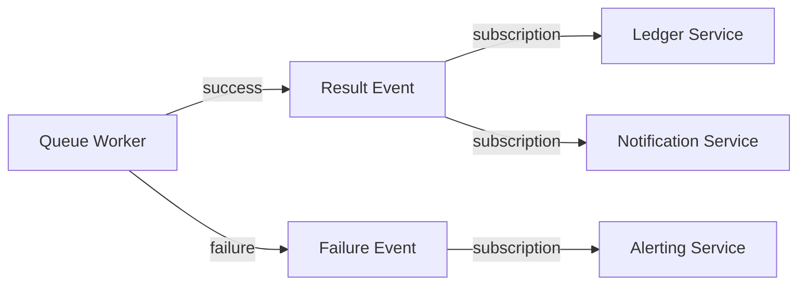

# Result Events

Queue workers process jobs asynchronously. When they finish, downstream services often need to know. Result events bridge this gap — they are normal PURISTA custom events emitted when a queue job completes or fails.

## Declaring result events

Add `emitResultAsEvent` to a queue builder:

```typescript [monthlyClosingQueue.ts]
const monthlyClosingQueue = billingServiceV1ServiceBuilder
  .getQueueBuilder('billing.monthlyClosing', 'Close a monthly billing cycle')
  .addPayloadSchema(billingClosingPayloadSchema)
  .emitResultAsEvent('billing.monthlyClosing.completed', {
    failureEventName: 'billing.monthlyClosing.failed',
    delivery: 'required',
  })
```

## Result event payload

Result payloads include queue identity, status, and worker output:

```typescript
const billingClosingCompletedPayloadSchema = z.object({
  jobId: z.string(),
  queueName: z.string(),
  status: z.enum(['completed', 'failed']),
  attempts: z.number(),
  traceId: z.string(),
  correlationId: z.string(),
  tenantId: z.string().optional(),
  principalId: z.string().optional(),
  output: z.object({
    processedAccounts: z.number(),
    totalAmount: z.number(),
  }),
})
```

## Consuming result events

Downstream services subscribe like any other event:

```typescript [recordBillingResultSubscription.ts]
const recordBillingResult = ledgerServiceV1ServiceBuilder
  .getSubscriptionBuilder('recordBillingResult', 'Record completed billing cycles')
  .subscribeToEvent('billing.monthlyClosing.completed')
  .addPayloadSchema(billingClosingCompletedPayloadSchema)
  .setSubscriptionFunction(async function (context, payload) {
    await context.resources.ledger.record({
      cycleId: payload.jobId,
      amount: payload.output.totalAmount,
      accounts: payload.output.processedAccounts,
    })
    context.logger.info({ jobId: payload.jobId }, 'billing cycle recorded')
  })
```

## Delivery modes

| Mode | Behavior | When to use |
|---|---|---|
| `required` | Job is not acknowledged until result event is delivered | Critical downstream reactions |
| `best-effort` | Job acknowledges even if result delivery fails | Metrics, logging, non-critical notifications |

## Architecture



## Idempotency note

Result subscribers should be idempotent. A worker may emit the result event and then fail before the queue acknowledges the job. In this case, the job retries and the result event may be emitted again.

## Design guidelines

- **Include job identity** — `jobId`, `queueName`, `traceId` for correlation
- **Include business output** — what subscribers need to act on
- **Emit failures separately** — `failureEventName` for alerting and dead-letter inspection
- **Keep subscribers independent** — each reacts to the result without knowing other subscribers exist

Next: [Async agent queues](./async-agent-queues.md) for queue lifecycle with AI agents.
