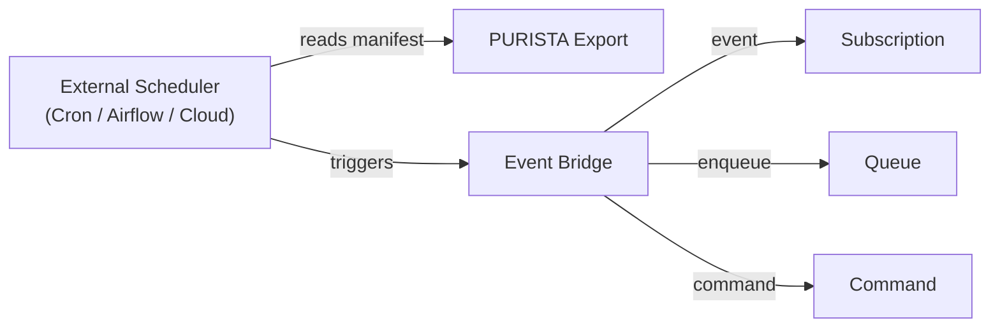

# Scheduling

Schedules in PURISTA are **trigger contracts**, not a runtime scheduler. You declare when something should happen. Production scheduling, state management, and missed-run recovery stay with external schedulers (Cron, Airflow, cloud schedulers, or Temporal).

## Declaring a schedule

Use the schedule builder to define when and what to trigger:

```typescript [billingSchedule.ts]
const monthlyBillingSchedule = userServiceV1ServiceBuilder
  .getScheduleBuilder('monthlyBillingCycle', 'Trigger monthly billing on the 1st')
  .emitEvent('billing.monthlyCycleDue', {
    expression: { kind: 'cron', value: '0 2 1 * *' },
    timezone: 'Europe/Berlin',
    concurrencyPolicy: 'forbid',
    missedRunPolicy: 'runOnce',
    idempotencyKey: 'payload.cycleId',
    payloadSchema: z.object({ cycleId: z.string() }),
  })

userServiceV1ServiceBuilder.addScheduleDefinition(monthlyBillingSchedule)
```

## Schedule targets

| Target | Use when | Example |
|---|---|---|
| **Event** | Multiple consumers may react | `billing.monthlyCycleDue` |
| **Queue** | Exactly one durable background task | Monthly report generation |
| **Command** | Short, idempotent logic | Cleanup routine |

Prefer events for business facts — they allow multiple subscribers without coupling.

## Schedule options

| Option | Description | Example |
|---|---|---|
| `expression` | When to trigger (cron or interval) | `{ kind: 'cron', value: '0 2 1 * *' }` |
| `timezone` | Timezone for cron evaluation | `Europe/Berlin` |
| `concurrencyPolicy` | What to do if previous run hasn't finished | `forbid`, `allow`, `replace` |
| `missedRunPolicy` | How to handle missed triggers | `runOnce`, `skip`, `catchUp` |
| `idempotencyKey` | Field used for deduplication | `payload.cycleId` |

## Architecture



The scheduler reads the PURISTA schedule manifest (generated programmatically — see Production scheduling below) and configures itself. At trigger time, it sends the appropriate message to the event bridge.

## Local development

For local testing, use the `DefaultEventBridge` with a local runner:

```typescript [local-schedule.ts]
import { DefaultEventBridge } from '@purista/core'

const eventBridge = new DefaultEventBridge()
await eventBridge.start()

// The schedule declaration is registered with the service
const userService = await userServiceV1Service.getInstance(eventBridge)
await userService.start()

// In production, an external scheduler replaces the local runner
```

## Production scheduling

Schedules are registered automatically when your service starts — there is no `purista export` CLI command. To feed your schedule definitions into an external scheduler (AWS EventBridge, GCP Scheduler, Temporal, Airflow), export them programmatically by iterating your service builder's schedule definitions in a standalone script and writing the output to JSON.

The target integrations are:

- **AWS EventBridge** — scheduled rules with Lambda targets
- **Google Cloud Scheduler** — cron jobs with Pub/Sub targets
- **Temporal** — scheduled workflows
- **Airflow** — DAGs with HTTP or message triggers

## Design guidelines

- **Keep schedules declarative** — they describe intent, not implementation
- **Use events for business facts** — `billing.cycleDue` not `runBillingJob`
- **Make payloads idempotent** — the same trigger may fire more than once
- **Handle missed runs explicitly** — choose `runOnce` or `catchUp` based on business rules

Next: [Event-to-queue bindings](./event-to-queue.md) for durable handoff from events to queues.
