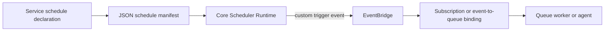

# Scheduling

PURISTA schedules are declarations owned by a service, but they run in a
separate **Scheduler Runtime** deployment. The runtime has one job: when time
matches a declaration, publish a normal PURISTA custom event. It does not load
business services, invoke handlers, enqueue domain jobs, or run agents.



This keeps the clock, business behavior, and durable work as independent
deployment concerns.

## Declare a trigger event

Use `getScheduleBuilder(...)` in the service that owns the capability. The
Core runtime currently accepts event targets with the default `allow`
publication policy.

The CLI creates this declaration, its test, the service composition entry, and
the target event in one operation:

```bash
npm run add:schedule -- monthly-billing-cycle \
  --description "Request the monthly billing cycle" \
  --service billing --service-version 1 \
  --event billing.monthly_cycle_due \
  --cron "0 2 1 * *" \
  --timezone Europe/Berlin \
  --scheduler-group billing
```

It writes `src/service/billing/v1/schedule/monthlyBillingCycle/` and adds the
resulting `monthlyBillingCycleScheduleDefinition` to `scheduleDefinitions`.
The generated test verifies the declaration. It deliberately creates no
handler: time publication is not business work.

```ts [billingSchedule.ts]
const monthlyBillingSchedule = billingServiceBuilder
  .getScheduleBuilder('monthlyBillingCycle', 'Request the monthly billing cycle')
  .emitEvent('billing.monthlyCycleDue', {
    expression: { kind: 'cron', value: '0 2 1 * *', timezone: 'Europe/Berlin' },
    schedulerGroup: 'billing',
    missedRunPolicy: 'runOnce',
  })

billingServiceBuilder.addScheduleDefinition(monthlyBillingSchedule)
```

Cron expressions use the normal five-field cron form. A schedule is a pure
trigger in the first runtime: it emits no business payload. The receiving
subscription can fetch current state or enqueue a typed job.

## Start a separate scheduler host

Export the service definitions and manifest during build or deployment, then
start a small process that reads that JSON and imports only scheduler
infrastructure. It must not instantiate your business `ServiceBuilder`
instances.

New starter and CLI-generated applications provide this local/test flow:

```bash
npm run export:schedules
npm run start:scheduler
```

`export:schedules` updates `purista.definitions.json` from the explicit
`src/definitions.ts` inventory and writes `purista.schedules.json`. The
generated `src/scheduler.ts` imports that JSON manifest only. Its local
provider is deliberately not a production configuration: a separate process
using `DefaultEventBridge` cannot deliver events to the application process.

```ts [scheduler.ts]
import { readFile } from 'node:fs/promises'
import { SchedulerBuilder, type ScheduleManifest } from '@purista/core'
import { RedisSchedulerProvider } from '@purista/redis-scheduler-provider'

const manifest = JSON.parse(
  await readFile(process.env.PURISTA_SCHEDULE_MANIFEST ?? 'purista.schedules.json', 'utf8'),
) as ScheduleManifest

const scheduler = new SchedulerBuilder('billing')
  .loadManifest(manifest)
  .useEventBridge(eventBridge) // a production EventBridge for the shared transport
  .useProvider(
    new RedisSchedulerProvider({
      config: { url: process.env.REDIS_URL },
      keyPrefix: 'billing:production:scheduler:',
    }),
  )
  .setStrict()
  .setRequireDistributedClaims()
  .getInstance()

await scheduler.start()
```

`DefaultSchedulerProvider` is intentionally process-local. Use it for tests
and local development only. For replicated production hosts,
`@purista/redis-scheduler-provider` provides Redis-backed durable completion
state and distributed occurrence leases; `setRequireDistributedClaims()` makes
an accidental local provider a startup error. Use a unique `keyPrefix` per
application/environment. The Redis provider stores the latest completed UTC
instant per schedule, so its completion state stays bounded by the number of
schedules rather than growing once per trigger. It protects scheduling only:
the EventBridge must still be a real shared production transport.

Provider authors must run `assertSchedulerProviderContract(...)` from
`@purista/core` in their package test suite. A provider advertising durable
completion or distributed claims must construct an independent replica against
the same test backend; otherwise the contract fails before release.

## Downstream work owns business behavior

The common durable path is:

```text
schedule -> billing.monthlyCycleDue event -> event-to-queue binding -> queue worker
```

The event carries `message.schedule` metadata:

| Field | Purpose |
|---|---|
| `scheduleKey` | Stable service/version/schedule identity |
| `occurrenceId` | Deterministic id for downstream deduplication |
| `scheduledAt` | Intended trigger time |
| `firedAt` | Scheduler publication attempt time |
| `attempt` | Publication attempt number |

Delivery is at-least-once. A scheduler can fail after publishing but before it
records completion, so consumers must make business effects idempotent with
`occurrenceId` when duplicates matter. Configure worker concurrency and
cancellation downstream; an event publisher cannot control work that happens
after it has emitted an event.

For a queue whose payload does not need scheduler metadata, a binding can use
the occurrence ID as its enqueue idempotency key:

```ts
billingServiceBuilder.bindEventToQueue(ServiceEvent.BillingMonthlyCycleDue, 'billing.monthlyClosing', {
  idempotencyMode: 'strict',
  idempotencyKey: message => message.schedule?.occurrenceId,
})
```

The original event is available in a subscription context. Use a bounded
subscription when the queue payload itself needs scheduler metadata:

```ts [monthlyBillingSubscription.ts]
const monthlyBillingSubscription = billingServiceBuilder
  .getSubscriptionBuilder('startMonthlyBilling', 'Start one monthly billing cycle')
  .subscribeToEvent(ServiceEvent.BillingMonthlyCycleDue)
  .setSubscriptionFunction(async function (context) {
    const occurrence = context.message.schedule
    if (!occurrence) return

    // Declare the queue invoke on this builder, then enqueue typed work with
    // occurrence.occurrenceId as the idempotency key in your worker/store.
    await this.startBillingCycleOnce(occurrence.occurrenceId)
  })
```

`bindEventToQueue(...)` maps the event payload, not scheduler envelope
metadata. Use a bounded subscription when the queue payload must contain
`occurrenceId`, `scheduledAt`, or another `message.schedule` field. That
prevents an implicit or invented payload contract.

## Scheduler groups and operations

Set `schedulerGroup` when you need separate deployments for different purposes,
such as `billing`, `maintenance`, or `notifications`. A host only loads its own
group. Multiple replicas in one group require a provider with distributed
occurrence claims; do not run multiple `DefaultSchedulerProvider` instances
and expect duplicate protection.

The runtime exposes `listStatus()`, `getRuntimeStatus()`, `pause()`, `resume()`,
`triggerNow()`, and `tick()` for an operator host or deterministic tests.
`getRuntimeStatus()` is JSON-safe and includes the selected provider's declared
capabilities plus each registration's next occurrence, last attempted/published
occurrence, observed publication lag, pause state, and last Core diagnostic:

```ts
const status = scheduler.getRuntimeStatus()

console.log(status.provider.name)
console.log(status.provider.capabilities.distributedOccurrenceClaims)
console.log(status.schedules[0]?.lastPublicationLagMs)
```

These are Core runtime facts and provider declarations, not a live health check
of Redis or the EventBridge, nor proof of a current distributed owner or
exactly-once business effects. Authorization for a production control API and
provider-specific health checks belong to the host application.

## Existing exports and migration

Existing event, queue, and command schedule declarations still export through
the provider-neutral manifest and Kubernetes CronJob exporter. The Core runtime
rejects queue/command targets, payload-bearing schedules, and `forbid` or
`replace` concurrency policies with stable diagnostics. Migrate runtime use to
an event trigger and a downstream event-to-queue binding.

Generate an external manifest with the project CLI:

```bash
npm run export:schedules
# equivalent lower-level commands:
purista export schedule-manifest --definitions purista.definitions.json --out schedules.json
```

Use [Event-to-queue bindings](./event-to-queue.md) for durable work, or keep
using a [Kubernetes CronJob export](./exports.md) when Kubernetes owns the
clock.
