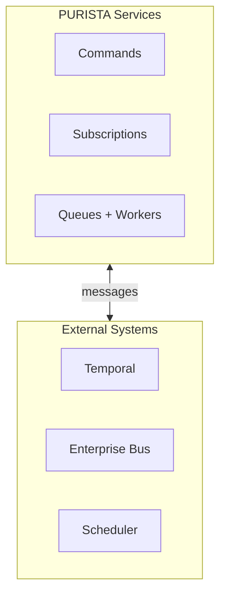
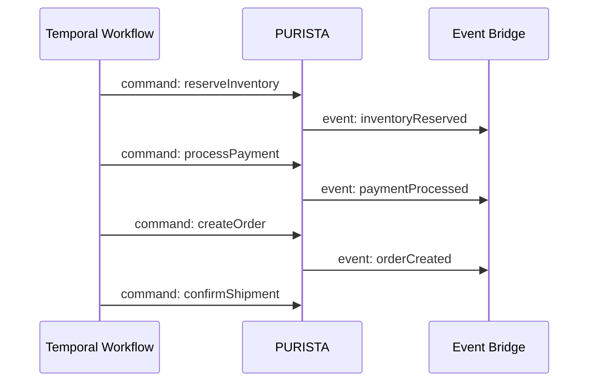

# Integrations

PURISTA focuses on business logic and message-driven architecture. It provides a minimal Core Scheduler Runtime for trigger events; durable workflows and provider-specific orchestration remain explicit integrations.

## Integration philosophy

The integration pattern is always the same:

1. **Keep business logic in PURISTA** — commands, subscriptions, and queues
2. **Use explicit runtime boundaries** — Core scheduler trigger hosts, Temporal workflows, enterprise gateways, and provider adapters
3. **Pass only typed data** — schemas define what crosses the boundary

## Available integrations

| Integration | Purpose | Pattern |
|---|---|---|
| [Temporal](./temporal_and_purista/index.md) | Durable workflows, saga orchestration, long-running processes | Temporal calls PURISTA commands; PURISTA emits events Temporal subscribes to |
| [Enterprise Interoperability](./enterprise_interoperability/index.md) | Async agent queues, scheduling, result events, exports | Bridge between PURISTA and enterprise messaging systems |

## Temporal + PURISTA

Temporal handles complex orchestration — retries, timeouts, compensations, and human-in-the-loop steps. PURISTA handles the business operations.

If `processPayment` fails, Temporal's saga pattern triggers compensations — like releasing the reserved inventory — without any retry logic in your business code.

See [Temporal and PURISTA](./temporal_and_purista/index.md) for setup and examples.

## Enterprise interoperability

For organizations with existing messaging infrastructure:

| Pattern | Use case |
|---|---|
| [Async agent queues](./enterprise_interoperability/async-agent-queues.md) | Bridge PURISTA queues to enterprise MQ systems |
| [Scheduling](./enterprise_interoperability/scheduling.md) | Time-based trigger events from a separate Core scheduler host with a selected provider |
| [Result events](./enterprise_interoperability/result-events.md) | Publish PURISTA command results to enterprise topics |
| [Exports](./enterprise_interoperability/exports.md) | Export service definitions and schemas for enterprise governance |
| [Long-running queues](./enterprise_interoperability/long-running-queues.md) | Durable queue workers that survive restarts and retries |

## Next steps

- [Temporal and PURISTA](./temporal_and_purista/index.md) — durable workflow orchestration
- [Enterprise Interoperability](./enterprise_interoperability/index.md) — integrate with existing infrastructure
