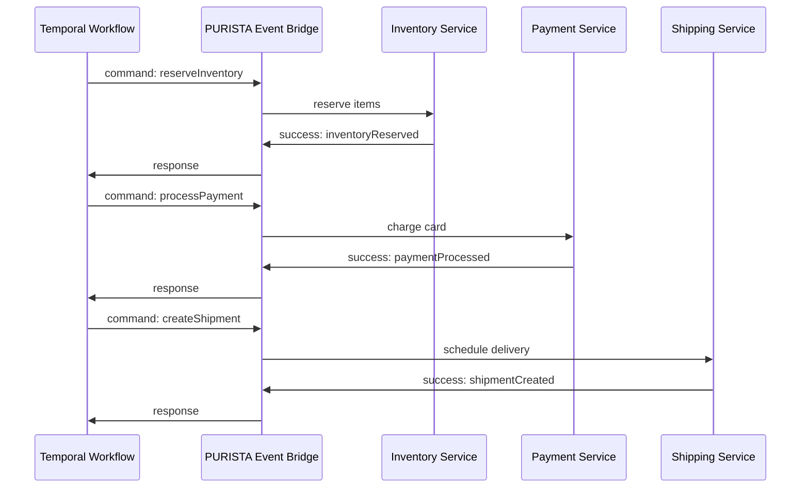
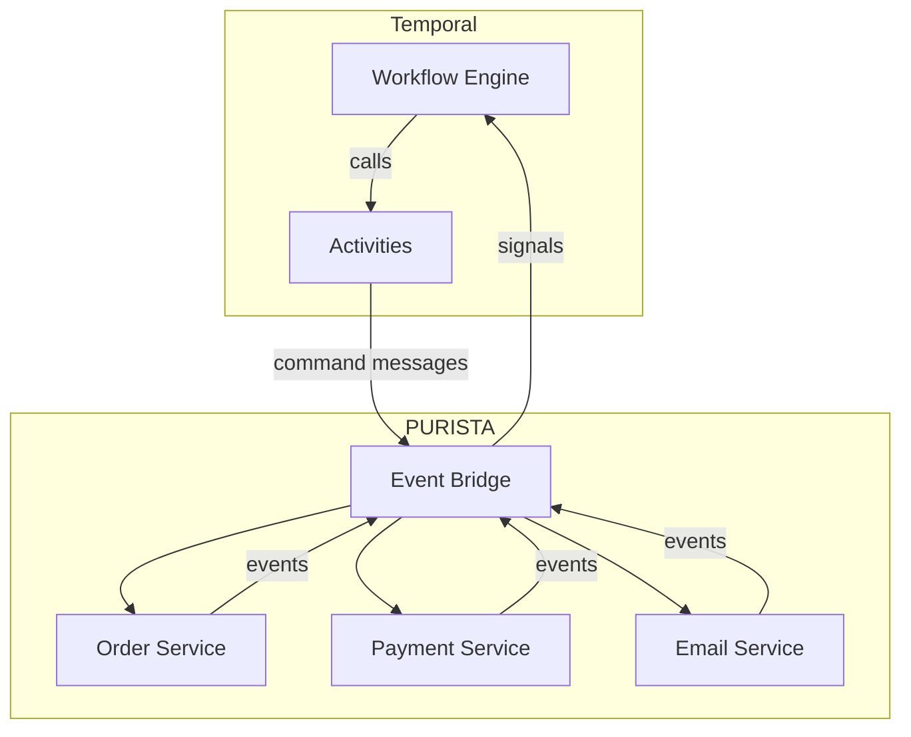

# Temporal and PURISTA

PURISTA excels at building isolated, message-driven business capabilities. Temporal excels at orchestrating long-running, failure-prone processes across those capabilities. Together, they handle the full spectrum from simple commands to complex sagas.

## What each layer does

| Layer | Responsibility | Example |
|---|---|---|
| **PURISTA** | Business logic, type safety, message routing | `createOrder`, `processPayment`, `reserveInventory` |
| **Temporal** | Workflow orchestration, retries, timeouts, compensation | "Reserve inventory, then charge payment, then ship — and undo if anything fails" |

## Why combine them

PURISTA handles immediate request/response and event-driven reactions well. But some business processes span minutes, hours, or days:

- **Order fulfillment** — reserve stock, charge payment, ship, confirm delivery
- **User onboarding** — send email, wait for verification, provision account, send welcome
- **Billing cycles** — generate invoices, retry failed charges, escalate after N attempts
- **Approval workflows** — submit request, wait for human approval, execute or reject

Temporal manages the orchestration layer:

- **Retries with backoff** — retry failed activities automatically
- **Timeouts** — fail or compensate when steps take too long
- **Sagas** — undo completed steps when later steps fail
- **Human-in-the-loop** — pause workflows until external signals arrive
- **Observability** — see the full workflow state, history, and pending actions

## Architecture

Temporal activities send PURISTA command messages. PURISTA subscriptions can signal Temporal workflows when events occur.

## When to use Temporal

| Use case | PURISTA alone | PURISTA + Temporal |
|---|---|---|
| Simple CRUD | ✅ | Overkill |
| Event-driven reactions | ✅ | Overkill |
| Multi-step process with retries | ⚠️ | ✅ |
| Human approval required | ❌ | ✅ |
| Saga/compensation pattern | ❌ | ✅ |
| Long-running (hours/days) | ❌ | ✅ |

## Next steps

- [Why use Temporal](./why_to_use_temporal_and_purista.md) — deeper motivation and trade-offs
- [Setup Temporal](./setup_temporal.md) — install and configure the Temporal server
- [Connect Temporal with PURISTA](./connect_temporal_with_purista.md) — wire activities to PURISTA commands
