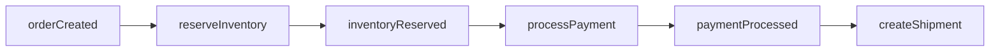
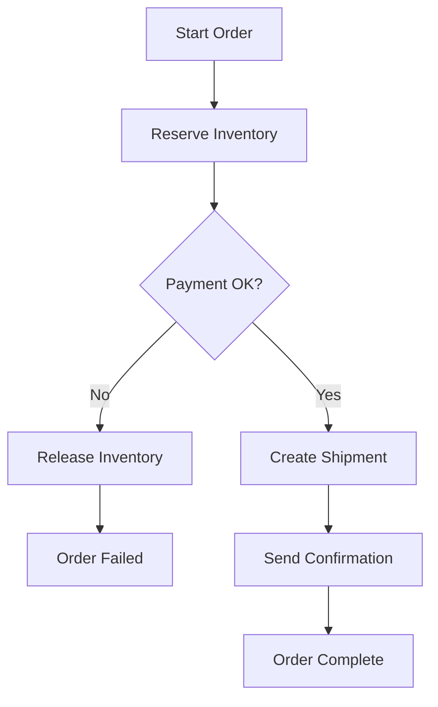
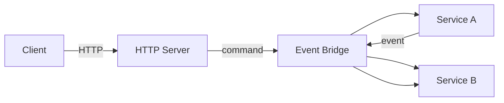
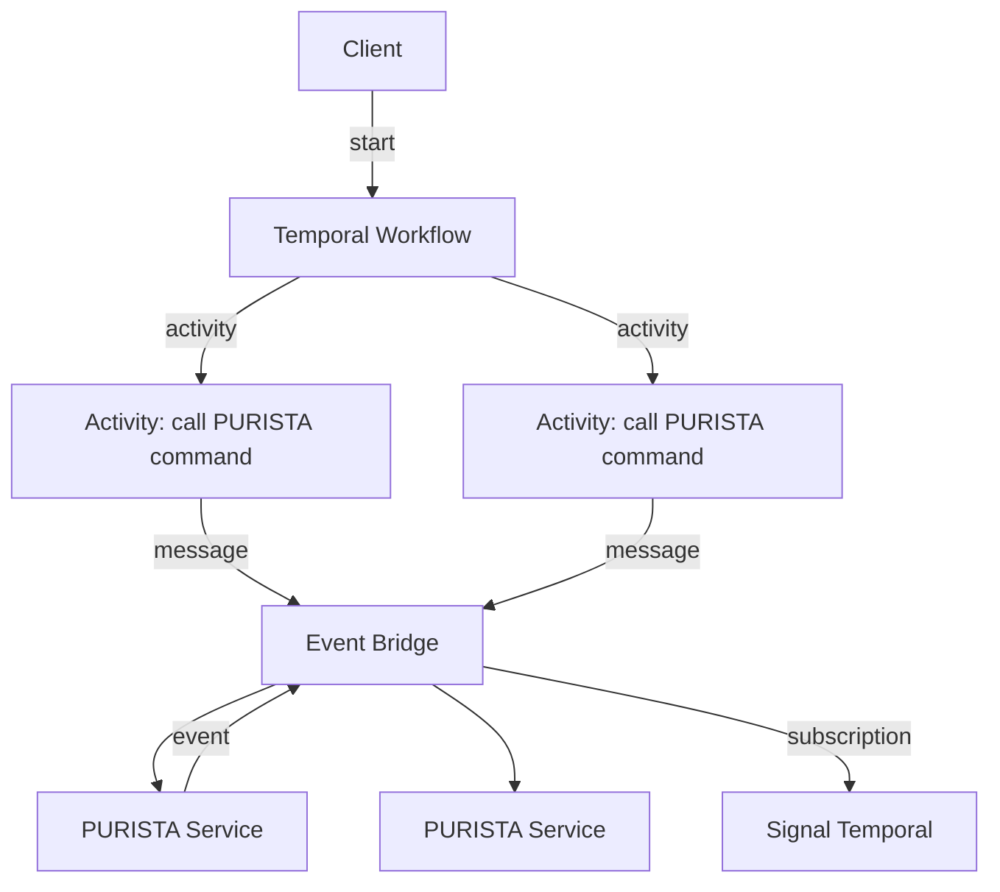

# Why Use Temporal with PURISTA

PURISTA builds reactive, message-driven systems. Commands execute. Subscriptions react. Events flow. This works beautifully for immediate actions and simple causal chains.

But not all business processes fit the immediate-reaction model. Some need to wait. Some need to retry with carefully tuned backoff. Some need human approval. Some need to undo prior steps when later steps fail.

## The gap

Consider an order fulfillment process:

1. Reserve inventory
2. Charge payment
3. Create shipment
4. Send confirmation email

In PURISTA alone, you could chain these with subscriptions:

This works until something fails. What if payment fails after inventory is reserved? You need to release the reservation. What if the user cancels mid-process? You need to stop and compensate. What if step 3 needs a human to review unusual orders?

PURISTA handles the individual steps. Temporal handles the orchestration.

## What Temporal adds

| Feature | What it means |
|---|---|
| **Durable workflows** | Process state survives server restarts, crashes, and deployments |
| **Retries with backoff** | Failed activities retry automatically with configurable policy |
| **Timeouts** | Steps have deadlines; missed deadlines trigger compensation or alerts |
| **Sagas** | When step N fails, undo steps 1 through N-1 in reverse order |
| **Signals** | External systems (humans, webhooks, subscriptions) can pause or resume workflows |
| **Queries** | Inspect running workflow state without mutating it |
| **Observability** | See the full history, pending actions, and failure reasons |

## The saga pattern

A saga executes a sequence of steps, each with a compensating action:

If payment fails, Temporal automatically invokes the compensation (release inventory) without any compensation logic in your PURISTA services.

## Architecture comparison

### Without Temporal

Best for: simple request/response, event-driven reactions, independent capabilities.

### With Temporal

Best for: multi-step processes, retries, human approval, sagas, long-running work.

## When to introduce Temporal

| Indicator | Action |
|---|---|
| Process has 3+ sequential steps | Consider Temporal |
| Steps can fail and need retry | Use Temporal |
| Failure requires undoing prior steps | Use Temporal sagas |
| Human approval is required | Use Temporal signals |
| Process spans minutes, hours, or days | Use Temporal |
| Process needs audit history | Use Temporal |

## When to stay with PURISTA alone

| Indicator | Action |
|---|---|
| Simple CRUD operations | PURISTA commands + REST |
| Independent event reactions | PURISTA subscriptions |
| Real-time streaming | PURISTA streams |
| Background jobs with simple retry | PURISTA queues + workers |

## Summary

- **PURISTA** = business capabilities, type safety, message-driven architecture
- **Temporal** = orchestration, durability, retries, sagas, human workflows
- **Together** = the full spectrum from simple commands to complex long-running processes

Next: [set up Temporal](./setup_temporal.md) and [connect it to PURISTA](./connect_temporal_with_purista.md).
