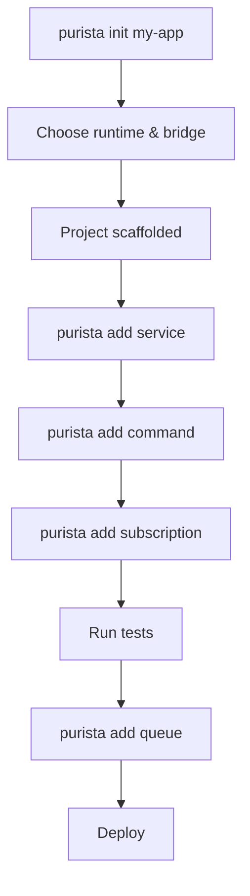

# Installation & CLI

PURISTA provides a blueprint-driven CLI that scaffolds projects and generates services, commands, subscriptions, streams, queues, and AI agents. It supports interactive, non-interactive, and programmatic usage.

## Quick start

Create a new project in one command:

::: code-group

```bash [npm]
npm create purista@latest
```

```bash [bun]
bun create purista@latest
```

```bash [yarn]
yarn create purista@latest
```

```bash [pnpm]
pnpm create purista@latest
```

:::

This runs the same engine as `purista init my-app`. Both generate an identical project shape.

## AI-assisted setup

If you use Codex, Claude, Cursor, or another AI coding assistant, install the PURISTA skill before asking it to design services or modify generated files:

```bash
npx skills add puristajs/purista --skill purista
```

The skill teaches the assistant the PURISTA mental model: services as business capability boundaries, builder definitions, command contracts, runtime adapters, event bridges, queues, and scaffold conventions. See [Install the PURISTA AI Skill](./install-ai-skill.md) for package-runner and agent-specific variants.

## CLI installation

Install globally or use `npx`:

::: code-group

```bash [npm]
npm install -g @purista/cli
```

```bash [bun]
bun add --global @purista/cli
```

```bash [yarn]
yarn global add @purista/cli
```

```bash [pnpm]
pnpm add -g @purista/cli
```

:::

## Project scaffolding

The CLI guides you through runtime, event bridge, HTTP server, linter, and module-format choices. The result is a coherent project skeleton ready for development.

```bash
purista init my-app
```

### Non-interactive mode

For CI, scripts, or agentic tooling:

```bash
purista init my-app \
  --runtime node \
  --event-bridge default \
  --webserver \
  --linter biome \
  --formatter biome \
  --type module \
  --package-manager npm \
  --non-interactive \
  --defaults \
  --no-install
```

Non-interactive mode never prompts. It applies only declared defaults and fails fast when required values are missing.

### Scaffold options

| Option | Values | Default | Description |
|---|---|---|---|
| `runtime` | `node`, `bun` | `node` | JavaScript runtime |
| `event-bridge` | `default`, `amqp`, `mqtt`, `nats`, `dapr` | `default` | Message transport |
| `webserver` | flag | off | Include Hono-based HTTP server |
| `linter` | `biome`, `eslint`, `none` | `none` | Code linter |
| `formatter` | `biome`, `prettier`, `none` | `none` | Code formatter |
| `type` | `module`, `commonjs` | `module` | Module system |

## Generating business artifacts

After scaffolding, use `purista add` to generate services and their artifacts:

```bash
purista add service      # interactive service creation
purista add command      # add command to existing service
purista add subscription # add subscription to existing service
purista add stream       # add stream for live updates
purista add queue        # add queue for async workloads
purista add queue-worker # add worker for existing queue
purista add agent        # add AI agent
```

### Common examples

```bash
# Create a service
purista add service user --description "User management"

# Add a command to the service
purista add command sign-up \
  --service user \
  --service-version 1 \
  --description "Register a new user"

# Add a subscription that reacts to events
purista add subscription welcome-email \
  --service email \
  --service-version 1 \
  --description "Send welcome email"

# Add a queue for background processing
purista add queue process-jobs \
  --service user \
  --service-version 1 \
  --description "Background job processor"

# Add a queue worker
purista add queue-worker process-jobs \
  --service user \
  --service-version 1 \
  --queue processJobs

# Add an AI agent
purista add agent triage \
  --service support \
  --service-version 1 \
  --description "Ticket triage agent"
```

## CLI workflow



## Generated file structure

The CLI creates a consistent, predictable structure:

```text
src/
├── service/
│   ├── serviceEvent.enum.ts
│   └── user/
│       ├── generalUserServiceInfo.ts
│       └── v1/
│           ├── userServiceConfig.ts
│           ├── userV1ServiceBuilder.ts
│           ├── userV1Service.ts
│           ├── userV1Service.test.ts
│           ├── command/
│           │   └── signUp/
│           │       ├── schema.ts
│           │       ├── types.ts
│           │       ├── signUpCommandBuilder.ts
│           │       └── signUpCommandBuilder.test.ts
│           └── subscription/
│               └── welcomeEmail/
│                   ├── schema.ts
│                   ├── welcomeEmailSubscriptionBuilder.ts
│                   └── welcomeEmailSubscriptionBuilder.test.ts
├── eventbridge.ts
├── http.ts
└── index.ts
```

Key files:

| File | Purpose |
|---|---|
| `*ServiceBuilder.ts` | Service metadata, config, resources |
| `*Service.ts` | Wires commands, subscriptions, streams into the service |
| `schema.ts` | Zod schemas for input, output, and parameters |
| `types.ts` | Derived TypeScript types from schemas |
| `*CommandBuilder.ts` | Command definition with business logic |
| `*SubscriptionBuilder.ts` | Subscription definition with event filter |
| `eventbridge.ts` | Bootstrap file for the event bridge instance |

::: warning Keep CLI-managed definition lists
When the CLI generates or updates service files, keep `commandDefinitions` and `subscriptionDefinitions` as typed constants:

```typescript
const commandDefinitions: Parameters<typeof builder['addCommandDefinition']>[0][] = [
  myCommandBuilder.getDefinition(),
]
```

Renaming or untyping these lists can break follow-up CLI updates and weaken inferred types.
:::

## Programmatic usage

Tools and agents can invoke the CLI engine directly:

```typescript
import { createPuristaCliEngine, resolvePuristaCommand, runPuristaCommand } from '@purista/cli'

const engine = createPuristaCliEngine({ /* options */ })
const command = resolvePuristaCommand(engine, 'add', 'command')
const result = await runPuristaCommand(command, { service: 'user', serviceVersion: 1 })
```

## Project configuration

Since version 1.12.0, PURISTA expects a `purista.json` file in the project root. It controls file naming conventions, event naming, and project structure.

```json [purista.json]
{
  "$schema": "https://purista.dev/schemas/1.12.0/schema.json",
  "runtime": "node",
  "eventBridge": "nats",
  "fileConvention": "kebab",
  "eventConvention": "camel",
  "linter": "biome",
  "formatter": "biome",
  "servicePath": "src/services",
  "agentPath": "src/agents"
}
```

### Configuration options

| Option | Type | Default | Allowed values |
|---|---|---|---|
| `$schema` | `string` | `https://purista.dev/schemas/1.12.0/schema.json` | Any valid JSON schema URI |
| `runtime` | `string` | `node` | `node`, `bun` |
| `eventBridge` | `string` | `default` | `default`, `amqp`, `mqtt`, `nats`, `dapr` |
| `fileConvention` | `string` | `camel` | `camel`, `snake`, `kebab`, `pascal`, `pascalSnake` |
| `eventConvention` | `string` | `camel` | `camel`, `snake`, `kebab`, `pascal`, `pascalSnake`, `constantCase`, `dotCase`, `pathCase`, `trainCase` |
| `linter` | `string` | `none` | `biome`, `eslint`, `none` |
| `formatter` | `string` | `none` | `biome`, `prettier`, `none` |
| `servicePath` | `string` | `src/service` | Any valid relative path |
| `agentPath` | `string` | `src/agents` | Any valid relative path |

## Next steps

- [Quickstart](./1_quickstart/index.md) — build your first service step by step
- [Service Builder](./2_building_business-logic/service/the-service-builder.md) — understand the generated service structure
- [Command Builder](./2_building_business-logic/command/the-command-builder.md) — add business logic to your service
