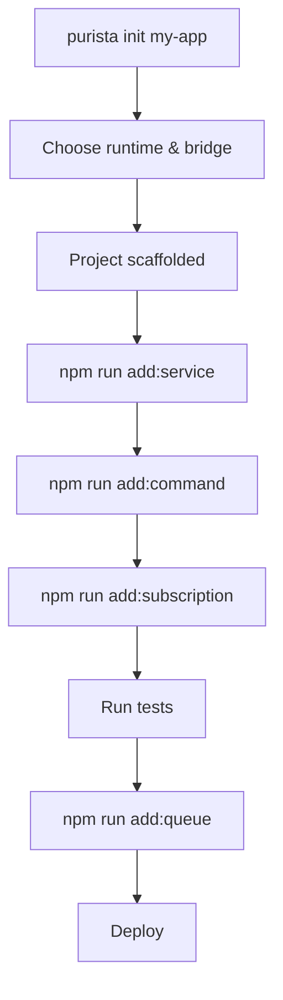

# Installation & CLI

PURISTA provides a blueprint-driven CLI that scaffolds projects and generates services, commands, subscriptions, streams, queues, event-only schedules, and AI agents. It supports interactive, non-interactive, and programmatic usage.

## Inspect architecture before changing it

The CLI can derive a JSON-safe, static architecture view from exported service
definitions. This is the recommended first step for an AI agent or reviewer: it
shows declarations without importing handlers or contacting infrastructure.

```bash
purista inspect --definitions purista.definitions.json --format json
purista inspect --definitions purista.definitions.json --out purista.architecture.json --format json
purista validate --definitions purista.definitions.json --strict --format json
purista doctor --definitions purista.definitions.json --format json
```

`inspect` returns services, commands, subscriptions, streams, queues, workers,
schedules, event-to-queue bindings, and declared agents. `validate` applies
static cross-reference rules and exits non-zero when errors exist. `doctor`
adds project-configuration checks, but is explicitly **static**: it does not
claim to test a live bridge, store, scheduler provider, or model provider.

All three flows print stable JSON for automation. They never serialize handler
functions, provider instances, credentials, prompts, transcripts, or schedule
provider hints. Use `inspect --schemas` only when an agent needs normalized JSON
Schema alongside the default schema fingerprints. `inspect` and `validate` need
only the definitions file; `doctor` additionally reports whether `purista.json`
and the generated definitions file are present. `inspect --out` is the sole
explicit write: it persists the same static manifest it prints.

## Quick start

Create a new project in one command:

::: code-group

```bash [npm]
npm create purista@latest
```

```bash [bun]
bun create purista@latest
```

```bash [yarn]
yarn create purista@latest
```

```bash [pnpm]
pnpm create purista@latest
```

:::

This runs the same engine as `purista init my-app`. Both generate an identical project shape.

## AI-assisted setup

If you use Codex, Claude, Cursor, or another AI coding assistant, new PURISTA projects are ready by default. The initializer writes `AGENTS.md`, `CLAUDE.md`, `.agents/IMPLEMENTATION.md`, and local skill links for `.agents/skills/purista` and `.claude/skills/purista`.

The skill links target `node_modules/@purista/core/skills/purista`, so normal dependency updates keep project-local skill guidance aligned with the framework. See [Install the PURISTA AI Skill](./install-ai-skill.md) for existing projects and assistant-specific mirrors.

## CLI installation

Generated projects install `@purista/cli` as a dev dependency and expose local scripts such as `add:service`, `add:command`, `add:schedule`, and `add:agent`. Prefer those scripts inside projects so the CLI version matches the project.

Install globally only when you need an outside-project maintenance command:

::: code-group

```bash [npm]
npm install -g @purista/cli
```

```bash [bun]
bun add --global @purista/cli
```

```bash [yarn]
yarn global add @purista/cli
```

```bash [pnpm]
pnpm add -g @purista/cli
```

:::

## Project scaffolding

The CLI guides you through runtime, event bridge, HTTP server, telemetry, and linter choices. The result is an ESM project skeleton ready for development.

```bash
purista init my-app
```

### Non-interactive mode

For CI, scripts, or agentic tooling:

```bash
	purista init my-app \
	  --runtime node \
	  --event-bridge default \
	  --telemetry otel \
	  --webserver \
  --linter biome \
  --formatter biome \
  --package-manager npm \
  --non-interactive \
  --defaults \
  --no-install
```

Non-interactive mode never prompts. It applies only declared defaults and fails fast when required values are missing.

### Scaffold options

| Option | Values | Default | Description |
|---|---|---|---|
| `runtime` | `node`, `bun` | `node` | JavaScript runtime |
| `event-bridge` | `default`, `amqp`, `mqtt`, `nats`, `dapr` | `default` | Message transport |
| `telemetry` | `none`, `otel` | `none` | Add a minimal OpenTelemetry metric-provider bootstrap |
| `webserver` | flag | off | Include Hono-based HTTP server |
| `linter` | `biome`, `eslint`, `none` | `none` | Code linter |
| `formatter` | `biome`, `prettier`, `none` | `none` | Code formatter |

`--telemetry otel` adds the OpenTelemetry metric packages plus `src/telemetry.ts`, and starts that provider at the application's composition root. It is opt-in: PURISTA's metrics work with its provider-neutral recorder either way, while the generated OpenTelemetry bootstrap uses a console exporter until the application deliberately replaces it with a production exporter.

## Generating business artifacts

After scaffolding, use the local package scripts to generate services and their artifacts:

```bash
npm run add:service      # interactive service creation
npm run add:command      # add command to existing service
npm run add:subscription # add subscription to existing service
npm run add:stream       # add stream for live updates
npm run add:queue        # add queue for async workloads
npm run add:queue-worker # add worker for existing queue
npm run add:schedule     # add an event-only scheduler declaration
npm run add:agent        # add AI agent
```

Use the matching package manager and runtime for your project: `npm run ...`, `pnpm run ...`, `yarn ...`, or `bun run ...`.

### Common examples

```bash
# Create a service
npm run add:service -- user --description "User management"

# Add a command to the service
npm run add:command -- sign-up \
  --service user \
  --service-version 1 \
  --description "Register a new user"

# Add a subscription that reacts to events
npm run add:subscription -- welcome-email \
  --service email \
  --service-version 1 \
  --description "Send welcome email"

# Add a queue for background processing
npm run add:queue -- process-jobs \
  --service user \
  --service-version 1 \
  --description "Background job processor"

# Add a queue worker
npm run add:queue-worker -- process-jobs \
  --service user \
  --service-version 1 \
  --queue processJobs

# Add a scheduler declaration; it emits a normal event, not business work
npm run add:schedule -- daily-close \
  --service billing \
  --service-version 1 \
  --description "Emit the daily closing trigger" \
  --event billing.daily_close_due \
  --cron "0 2 * * *" \
  --scheduler-group billing

# Add an AI agent
npm run add:agent -- triage \
  --service support \
  --service-version 1 \
  --description "Ticket triage agent"

# Opt in to a workflow-backed agent that can use durable workspace replay
npm run add:agent -- incident-review \
  --service support \
  --service-version 1 \
  --description "Resumable incident review" \
  --durable-workspace
```

### Durable agent template

`add:agent` creates an ephemeral `setHarnessAgent(...)` by default. Pass
`--durable-workspace` only for a multi-step agent that must resume its private
workspace after retry or restart. The CLI then generates a small
`setHarnessWorkflow(...)`, its explicit delegation allowlist, and
`.setWorkspacePolicy({ mode: 'durable', required: true, cleanup: 'on_terminal' })`.

The generated test uses `createAgentDurableWorkspaceTestRuntime()` from
`@purista/core/testing`; it is hermetic and is not a production adapter. At the
application composition root, supply provider-backed `ai.runtime` and
`ai.workspaceStore` bindings. Do not select this option for a simple one-step
agent, and do not apply durable workspace policy to `setHarnessAgent(...)` or
`setRunFunction(...)`—Core rejects those shapes.

## CLI workflow



## Generated file structure

The CLI creates a consistent, predictable structure:

```text
AGENTS.md
CLAUDE.md
.agents/
├── IMPLEMENTATION.md
└── skills/
    └── purista -> node_modules/@purista/core/skills/purista
.claude/
└── skills/
    └── purista -> node_modules/@purista/core/skills/purista
src/
├── service/
│   ├── serviceEvent.enum.ts
│   └── user/
│       ├── generalUserServiceInfo.ts
│       └── v1/
│           ├── userServiceConfig.ts
│           ├── userV1ServiceBuilder.ts
│           ├── userV1Service.ts
│           ├── userV1Service.test.ts
│           ├── command/
│           │   └── signUp/
│           │       ├── schema.ts
│           │       ├── types.ts
│           │       ├── signUpCommandBuilder.ts
│           │       └── signUpCommandBuilder.test.ts
│           └── subscription/
│               └── welcomeEmail/
│                   ├── schema.ts
│                   ├── welcomeEmailSubscriptionBuilder.ts
│                   └── welcomeEmailSubscriptionBuilder.test.ts
├── eventbridge.ts
├── http.ts
└── index.ts
```

Key files:

| File | Purpose |
|---|---|
| `*ServiceBuilder.ts` | Service metadata, config, resources |
| `*Service.ts` | Wires commands, subscriptions, streams into the service |
| `schema.ts` | Zod schemas for input, output, and parameters |
| `types.ts` | Derived TypeScript types from schemas |
| `*CommandBuilder.ts` | Command definition with business logic |
| `*SubscriptionBuilder.ts` | Subscription definition with event filter |
| `eventbridge.ts` | Bootstrap file for the event bridge instance |

::: warning Keep CLI-managed definition lists
When the CLI generates or updates service files, keep `commandDefinitions` and `subscriptionDefinitions` as typed constants:

```typescript
const commandDefinitions: Parameters<typeof builder['addCommandDefinition']>[0][] = [
  myCommandBuilder.getDefinition(),
]
```

Renaming or untyping these lists can break follow-up CLI updates and weaken inferred types.
:::

## Programmatic usage

Tools and agents can invoke the CLI engine directly:

```typescript
import { createPuristaCliEngine, resolvePuristaCommand, runPuristaCommand } from '@purista/cli'

const engine = createPuristaCliEngine({ /* options */ })
const command = resolvePuristaCommand(engine, 'add', 'command')
const result = await runPuristaCommand(command, { service: 'user', serviceVersion: 1 })
```

## Project configuration

Since version 1.12.0, PURISTA expects a `purista.json` file in the project root. It controls file naming conventions, event naming, and project structure.

```json [purista.json]
{
  "$schema": "https://purista.dev/schemas/1.12.0/schema.json",
  "runtime": "node",
  "eventBridge": "nats",
  "fileConvention": "kebab",
  "eventConvention": "camel",
  "linter": "biome",
  "formatter": "biome",
  "servicePath": "src/services",
  "agentPath": "src/agents"
}
```

### Configuration options

| Option | Type | Default | Allowed values |
|---|---|---|---|
| `$schema` | `string` | `https://purista.dev/schemas/1.12.0/schema.json` | Any valid JSON schema URI |
| `runtime` | `string` | `node` | `node`, `bun` |
| `eventBridge` | `string` | `default` | `default`, `amqp`, `mqtt`, `nats`, `dapr` |
| `fileConvention` | `string` | `camel` | `camel`, `snake`, `kebab`, `pascal`, `pascalSnake` |
| `eventConvention` | `string` | `camel` | `camel`, `snake`, `kebab`, `pascal`, `pascalSnake`, `constantCase`, `dotCase`, `pathCase`, `trainCase` |
| `linter` | `string` | `none` | `biome`, `eslint`, `none` |
| `formatter` | `string` | `none` | `biome`, `prettier`, `none` |
| `servicePath` | `string` | `src/service` | Any valid relative path |
| `agentPath` | `string` | `src/agents` | Any valid relative path |

## Next steps

- [Quickstart](./1_quickstart/index.md) — build your first service step by step
- [Service Builder](./2_building_business-logic/service/the-service-builder.md) — understand the generated service structure
- [Command Builder](./2_building_business-logic/command/the-command-builder.md) — add business logic to your service
