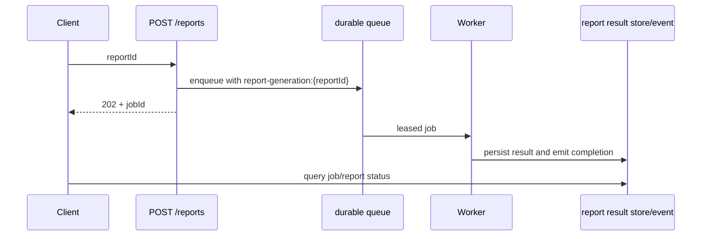

Use this pattern for report generation, document conversion, or a model-assisted
task that can outlive an HTTP request. The request command validates and
accepts one business operation; a durable worker performs it; a separate result
contract lets the caller observe completion. Never return “complete” merely
because a job was accepted.



## 1. Accept one idempotent request

This command returns a job reference only after the queue accepts the work.
The full queue definition, schemas, and worker setup belong in
[Queues and workers](/handbook/framework/build-services/queues-and-workers/);
the key must be stable when the client repeats the same report request.

```ts title="src/service/report/v1/command/requestReport/requestReportCommandBuilder.ts"
import { z } from 'zod'

const reportRequestSchema = z.object({ reportId: z.string().min(1) })
const acceptedJobSchema = z.object({
  jobId: z.string(),
  queueName: z.string(),
  scheduledAt: z.number().optional(),
})

export const requestReportCommandBuilder = reportV1ServiceBuilder
  .getCommandBuilder('requestReport', 'Accept report generation')
  .addPayloadSchema(reportRequestSchema)
  .addOutputSchema(acceptedJobSchema)
  .canEnqueue('generateReport', reportRequestSchema)
  .exposeAsHttpEndpoint(
    'POST',
    'reports',
    'application/json',
    'utf-8',
    'application/json',
    'utf-8',
    { mode: 'async' },
  )
  .setCommandFunction(async function (context, payload) {
    const job = await context.queue.enqueue.generateReport(
      { reportId: payload.reportId },
      undefined,
      { idempotencyKey: `report-generation:${payload.reportId}` },
    )
    return job
  })
```

| Call | Parameters/options | Effect and reason |
| --- | --- | --- |
| [`getCommandBuilder(name, description, successEventName?)`](/handbook/api/classes/_purista_core.ServiceBuilder/#getcommandbuilder) | `name` is a non-empty command target; `description` documents that target. The optional third argument adds a command success event, which is separate from a worker result event. | Creates the request-acceptance boundary and retains service resource types for the handler. Register its finished definition with [`addCommandDefinition(...)`](/handbook/api/classes/_purista_core.ServiceBuilder/#addcommanddefinition) before the service resolves definitions. Omit `successEventName` unless accepting the request is a business fact other services should consume. |
| [`addPayloadSchema(schema)`](/handbook/api/classes/_purista_core.CommandDefinitionBuilder/#addpayloadschema) | A Standard Schema used for the HTTP request and command payload. | Rejects an invalid `reportId` before the handler queues work. |
| [`addOutputSchema(schema)`](/handbook/api/classes/_purista_core.CommandDefinitionBuilder/#addoutputschema) | The command’s accepted-job result shape. | Keeps the handler result aligned with the Hono async contract: `jobId`, `queueName`, and optional `scheduledAt`. |
| [`canEnqueue(queueName, payloadSchema?, parameterSchema?)`](/handbook/api/classes/_purista_core.CommandDefinitionBuilder/#canenqueue) | Non-empty queue name; optional schemas define the typed `context.queue.enqueue.<queueName>` payload and parameter. | Declares the service capability and prevents an undeclared queue call. The queue must still be registered and available at runtime. |
| [`exposeAsHttpEndpoint(method, path, requestType?, requestEncoding?, responseType?, responseEncoding?, { mode })`](/handbook/api/classes/_purista_core.CommandDefinitionBuilder/#exposeashttpendpoint) | The example explicitly declares JSON/UTF-8 on both sides. `mode` is `sync` by default; `async` is the required choice here. | `sync` waits for the command result. `async` makes Hono return `202 Accepted`, but only when the command returns a queue enqueue result with `jobId` and `queueName`. |
| [`setCommandFunction(handler)`](/handbook/api/classes/_purista_core.CommandDefinitionBuilder/#setcommandfunction) | A non-arrow `function` receives typed context, payload, and parameter. | Enqueues one job and returns its receipt; it does not wait for report generation. |

The Hono adapter maps asynchronous command exposure to `202 Accepted`. If the
handler returns anything other than the queue receipt, the HTTP projection
returns an internal error rather than an invented acceptance response. Use a
durable Redis or NATS QueueBridge before claiming restart recovery; the default
bridge is only for local behavior and deterministic tests. For queue lifecycle
and retry options, continue with [create a queue and worker](/handbook/framework/build-services/queues-and-workers/create-a-queue-and-worker/) and [expose queued work](/handbook/framework/build-services/queues-and-workers/expose-queued-work/).

## 2. Make completion a separate contract

The worker writes a report result to a durable application store and/or emits a
versioned `report.completed` event after its side effect commits. The result API
returns a state such as `accepted`, `running`, `complete`, or `failed`; it does
not infer success from queue age or an HTTP timeout.

| Caller need | Result surface | Why |
| --- | --- | --- |
| Browser or partner polls | Explicit `getReportStatus` command/HTTP endpoint | Simple, cacheable, authenticated lookup |
| Another service reacts | Versioned `report.completed` / `report.failed` event | Decoupled processing and audit trail |
| Human downloads a large output | Durable record plus an authorized download capability | Keeps files and authorization outside queue payloads |

## 3. Design failure before scaling it

- The worker must use the same business key to reconcile a side effect after a
  lease expires or the process crashes before acknowledgement.
- Retry transient provider failures with a bounded policy; send malformed,
  unauthorized, or permanently invalid work to the defined repair/DLQ path.
- Do not put report input documents, credentials, or unredacted customer data
  in HTTP acceptance responses, queue headers, or default telemetry.
- Test acceptance duplication, worker crash/recovery, terminal failure, result
  authorization, and the client-visible timeout independently.

Next: configure [queue delivery](/handbook/framework/connect-distributed-infrastructure/queue-delivery/)
and [retries, timeouts, and idempotency](/handbook/framework/secure-and-operate/reliability/retries-timeouts-and-idempotency/).
