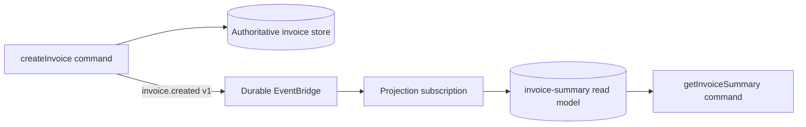

CQRS is useful when the command-side transaction and a query-side view need
different shapes or can evolve independently. A billing command writes the
authoritative invoice record; an event-driven subscription maintains the small
`invoice-summary` view a dashboard needs. It is not a reason to split a simple
CRUD service into two databases.

## Start with one explicit event contract

The write command validates and persists the authoritative record, then emits a
small business fact. The projection subscribes to that versioned event and
updates only its own read-model resource. A query command reads that resource;
it does not reach back through a chain of synchronous services to reconstruct
the dashboard response.

| Part | Owns | Must not assume |
| --- | --- | --- |
| Write command | Invariants, authoritative write, emitted fact | That every projection is already updated |
| Projection subscription | Read-model schema, replay/idempotency, update | That delivery happens exactly once or in order |
| Query command | Authorized, bounded read response | That the read model is the source of truth |

Declare the successful business fact with `setSuccessEventName(...)` or a
schema-validated custom event. Use a durable EventBridge for a production
projection, and give the projection a stable business key such as
`tenantId + invoiceId`. A duplicate message must converge on the same view;
out-of-order messages need an explicit version, timestamp, or reconciliation
decision.

## Make eventual consistency visible

The command can return the new invoice ID immediately. The dashboard might
briefly show the old projection. Represent that deliberately: return an
`accepted` or `updatedAt` value, show a refresh state, or offer a direct
authorized query of the authoritative record when the caller truly needs
read-after-write consistency.

Do not call the projection synchronously from the command merely to hide that
lag. That turns an independently recoverable event flow back into a coupled
transaction without making it atomic.

## Test the two promises separately

1. Test the command with a fake authoritative repository and assert the
   versioned event contract.
2. Test the subscription with `createSubscriptionContextMock(...)`; assert a
   duplicate input produces the same read-model value.
3. Run an adapter integration test for broker restart, retained delivery, and
   projection recovery/replay.

For the primitive guides, start with [commands](/handbook/framework/build-services/commands/),
[subscriptions](/handbook/framework/build-services/subscriptions/), and
[recovery and replay](/handbook/framework/secure-and-operate/reliability/recovery-and-replay/).
