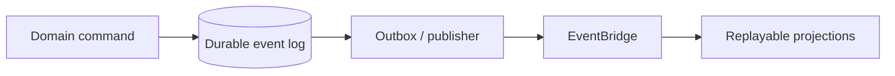

Event sourcing means the durable business-event log—not a mutable row—is the
authoritative record. Current state is rebuilt from that log, and projections
serve queries. PURISTA can publish typed events and run typed subscriptions,
but it does not turn a normal success event into an event-sourcing system or
operate your event log, snapshots, schema evolution, and replay governance.

## Choose it for a concrete reason

Use it for a ledger, regulated audit trail, or a domain where reconstructing a
decision is a primary product requirement. Prefer a conventional repository
plus events for ordinary state changes, simple CRUD, or a team without a clear
event-retention and replay owner.

| Requirement | Event sourcing helps when | It does not solve |
| --- | --- | --- |
| Audit/history | Every domain decision must be reconstructable from facts | A vague or incomplete event contract |
| Projection rebuild | New read models must be recreated from retained history | A broker's short-lived delivery retention |
| Temporal investigation | The ordering and causality of facts matter to the business | Cross-service distributed transactions |
| Operational recovery | A governed replay process is funded and owned | Automatic exactly-once external effects |

## Keep the durable log outside the delivery adapter

A broker message may be retried, expired, or dead-lettered according to its
adapter policy. That makes it a delivery mechanism, not automatically the
business source of truth. Append a validated, versioned event to the
application-owned durable log as part of the write-side boundary; then publish
the delivery event. If those two steps cannot be atomic, use an explicit
outbox/reconciliation design and document the recovery behavior.

Never replay a historical event stream into an external side-effecting
subscription by default. Give projection consumers a separate replay mode,
idempotency key, and isolated read-model target. Require an explicit human or
operational approval before a replay can reach payment, email, inventory, or
any other external effect.

## Version, snapshot, and verify deliberately

- Give each event an immutable meaning and a compatible schema evolution rule.
  Correct an old fact with a new compensating fact; do not mutate history.
- Add snapshots only after measuring rebuild cost. A snapshot is a cache of the
  log, so it needs versioning and a rebuild path.
- Test aggregate reconstruction and projection idempotency without a broker,
  then test log retention, access controls, restore, and replay in the actual
  storage environment.

Use [enterprise interoperability](/handbook/framework/apply-patterns-and-recipes/enterprise-interoperability/)
for partner contracts and [delivery semantics](/handbook/framework/secure-and-operate/reliability/delivery-semantics/)
for adapter-specific guarantees.
