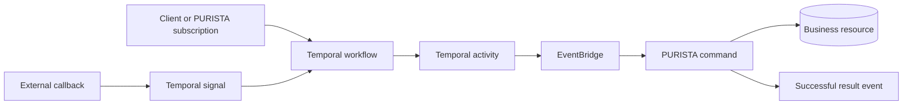

Use Temporal when a process must survive restarts, wait for hours or days, react
to external signals, or apply workflow-level retries across several business
capabilities. Temporal owns workflow history, durable timers, signals, and
activity retries. PURISTA services continue to own business validation,
authorization, data access, and domain results.

This is an application integration. PURISTA does not provide a Temporal adapter
package or hide the Temporal client and worker APIs.

## Keep the ownership boundary clear



- A Temporal workflow coordinates steps and waits. Keep it deterministic and
  do not open database or network connections from workflow code.
- A Temporal activity performs an external action. An activity that needs a
  PURISTA capability invokes the command by address through EventBridge.
- A PURISTA command remains the business boundary. It validates input, applies
  guards, uses service resources, and returns a typed result.
- A subscription may start or signal a workflow when a completed framework
  fact should advance the durable process.

## Install and run the integration

Install the Temporal packages beside the released PURISTA packages used by the
application:

```bash title="Install PURISTA and Temporal packages"
npm install @purista/core @purista/natsbridge \
  @temporalio/client @temporalio/worker @temporalio/workflow @temporalio/activity
```

The [Temporal example](https://github.com/puristajs/purista/tree/master/examples/temporal)
contains Docker Compose services for Temporal, PostgreSQL, NATS, the Temporal
UI, and Jaeger. It runs the Temporal worker and the PURISTA application as
separate processes, both connected to the same NATS EventBridge.

## Invoke commands from activities by address

Create the EventBridge in the Temporal worker process and start it before the
worker accepts activities. Build a small typed activity adapter around
`eventBridge.invoke`; the receiver address is the stable integration contract.

```ts title="src/temporal/createPuristaActivities.ts"
import type { EventBridge } from '@purista/core'
import { Context } from '@temporalio/activity'

export const createPuristaActivities = (eventBridge: EventBridge) => ({
  createAccount: async (payload: { userId: string }) => {
    const activity = Context.current().info

    return eventBridge.invoke<{ accountId: string }>({
      sender: {
        serviceName: activity.workflowType,
        serviceVersion: '1',
        serviceTarget: activity.activityType,
        instanceId: eventBridge.instanceId,
      },
      receiver: {
        serviceName: 'Account',
        serviceVersion: '1',
        serviceTarget: 'createAccount',
      },
      payload: {
        payload,
        parameter: undefined,
      },
      contentType: 'application/json',
      contentEncoding: 'utf-8',
    })
  },
})
```

Register the returned functions as Temporal activities. This keeps the worker
independent of a concrete PURISTA service instance and preserves distributed
routing through the selected EventBridge adapter.

If tenant or principal identity is part of the workflow input, validate it at
the ingress boundary and propagate the trusted values explicitly in the invoke
message. Never accept identity claims from an untrusted activity payload and
treat them as authenticated context.

## Start and signal workflows from PURISTA

Provide the Temporal client as an application resource to the service that owns
the process entry point. A command can start a workflow for a synchronous
request. A subscription can start or signal a workflow after another command
has completed successfully. Keep workflow IDs derived from a stable business
identifier so retries do not create duplicate processes.

Choose one owner for each retry boundary. Temporal activity retries may cause
the same command to be invoked more than once, and EventBridge delivery can
also repeat. Commands that create external effects therefore need an
idempotency key and an application-owned deduplication record.

## Trace and test both sides

Configure OpenTelemetry in the PURISTA process and Temporal interceptors in the
worker. Use W3C trace context propagation so a trace can cross workflow,
activity, EventBridge, and command boundaries.

Test the integration in layers:

1. Unit-test command behavior with PURISTA's command test setup and mocked
   resources.
2. Unit-test deterministic workflow branches with Temporal's workflow testing
   environment and mocked activities.
3. Run an integration test with the real EventBridge adapter and Temporal test
   server to verify addresses, retries, signals, identity propagation, and
   idempotency.

Use [delivery semantics](/handbook/framework/secure-and-operate/reliability/delivery-semantics/)
to define duplicate handling and [trace commands, events, streams, and jobs](/handbook/framework/secure-and-operate/observability/trace-commands-events-streams-and-jobs/)
for the PURISTA span vocabulary.
