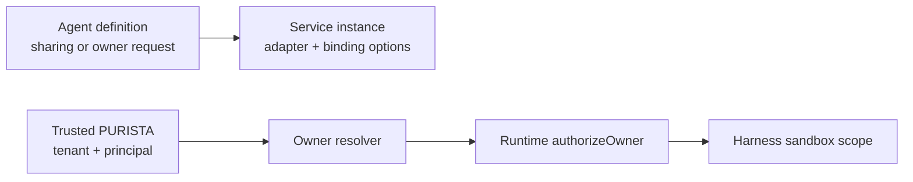

The service composition root selects and owns the sandbox adapter. An attached
agent may request a sharing policy or resolve a pre-registered external owner;
it cannot select a container provider, host path, credential, or egress policy.
This keeps deployment authority out of serializable agent definitions.



## 1. Request the smallest sharing policy

Omit `setSandboxPolicy(...)` to use the service runtime's default. Use
`private` when this definition must not share files with sibling definitions.
Use a named group only when the composition root explicitly registers it.

```ts title="src/service/support/v1/agent/draftReply/draftReplyAgentBuilder.ts"
export const draftReplyAgentBuilder = supportV1ServiceBuilder
	.getAgentQueueBuilder('draftReply', 'Drafts one support reply')
	.addPayloadSchema(draftReplyInput)
	.addOutputSchema(draftReplyOutput)
	.addModel('primary', { capabilities: ['object', 'tool_use'] })
	.setSandboxPolicy({ sharing: 'private' })
	.setHarnessAgent({
		model: 'primary',
		input: draftReplyInput,
		output: draftReplyOutput,
		builtinTools: ['read', 'write'],
		permissions: {
			write: { mode: 'allow', allow: ['/workspace/drafts/**'] },
		},
		instructions: 'Read the supplied case files and write one reply draft.',
	})
```

[`getAgentQueueBuilder(name, description)`](/handbook/api/classes/_purista_core.ServiceBuilder/#getagentqueuebuilder)
creates the service-owned agent projections.
[`addPayloadSchema(schema)`](/handbook/api/classes/_purista_core.AgentQueueBuilder/#addpayloadschema)
and [`addOutputSchema(schema)`](/handbook/api/classes/_purista_core.AgentQueueBuilder/#addoutputschema)
define the public input/final result.
[`addModel(alias, requirement)`](/handbook/api/classes/_purista_core.AgentQueueBuilder/#addmodel)
declares the provider-neutral capabilities, and
[`setHarnessAgent(definition)`](/handbook/api/classes/_purista_core.AgentQueueBuilder/#setharnessagent)
attaches the inline definition after the alias exists.

| `sharing` | Result |
| --- | --- |
| omitted | Use the runtime `defaultPolicy`, or the Harness shared default |
| `inherit` | Reuse the parent workflow/task partition when one exists |
| `private` | Use a definition-private partition |
| `{ group: 'case-team' }` | Use a named group registered in `sandboxOptions.groups` |

[`setSandboxPolicy(policy)`](/handbook/api/classes/_purista_core.AgentQueueBuilder/#setsandboxpolicy)
accepts only `sharing` and `owner`. Adapter selection and an `enabled` switch
are deliberately not agent-level fields.

## 2. Bind the adapter when the service is instantiated

```ts title="src/bootstrap.ts"
const supportService = await supportV1Service.getInstance(eventBridge, {
	ai: {
		models: {
			primary: {
				provider: openaiProvider,
				model: process.env.SUPPORT_MODEL!,
			},
		},
		sandbox: dockerSandbox,
		sandboxOptions: {
			groups: ['case-team'],
			defaultPolicy: 'private',
			authorizeOwner: async ({ owner, identity }) => owner.identity?.tenantId === identity?.tenantId,
		},
	},
})
```

| Runtime field | Owner and effect |
| --- | --- |
| `sandbox` | Application-selected Harness adapter. Its capabilities and operational guarantees must cover the built-in tools and production isolation requirement. |
| `groups` | Closed list of names an agent policy may select. Duplicate or invalid groups fail startup. |
| `defaultPolicy` | `inherit`, `private`, or one configured group. A nonconfigured group fails validation. |
| `authorizeOwner` | Required authorization callback before attaching an externally resolved owner. It receives trusted runtime identity and the exact owner record. |

Installing a sandbox package is not enough. Provision its image/runtime,
configure network and mount policy, pass the adapter here, start the service,
and run negative isolation tests. The in-memory sandbox is useful for local
files and deterministic tests; it is not container or tenant isolation.

## 3. Resolve an explicit owner only for a real sharing requirement

The agent-level `owner` callback receives schema-validated input and trusted
PURISTA identity. It returns an existing, immutable `SandboxOwner`. The
runtime-level `authorizeOwner` callback must still approve the attachment.
Do not derive an owner from unvalidated prompt text or model output.

Release of an attached session detaches live sandbox resources; destructive
session close removes Harness-owned session state. Durable file recovery also
requires a compatible `DurableWorkspace`; a sandbox alone does not provide
checkpoint recovery.

Test policy selection with `createAgentTestHarness(..., { sandbox,
sandboxOptions })`, then run the selected adapter's isolation, cleanup,
recovery, and multi-instance tests. See [choose a Harness sandbox](/handbook/harness/secure-and-govern/sandbox-and-mcp/)
for adapter capabilities and production boundaries.
