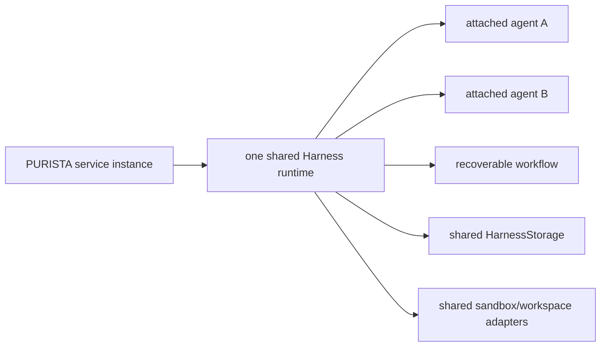

Construct one shared Harness runtime per PURISTA service instance. Every
attached Harness agent, attached workflow, and workflow-local agent registered
on that service uses it. Do not create a Harness for each queue delivery,
command, stream, agent, or workflow.

PURISTA constructs the Harness internally from the adapters supplied once to
`service.getInstance(..., { ai })`. Model aliases remain local to each attached
definition even when multiple definitions use the public alias `primary`.



## Keep definitions topology-neutral

The service definition declares model, durability, workspace, and sandbox
requirements. The application composition selects local or production
adapters.

```ts title="src/runtime/createAiRuntime.ts"
import { localDurableExecution } from '@purista/harness'
import { kubernetesSandboxRuntime } from '@purista/harness-sandbox-kubernetes'
import { postgresHarnessStorage } from '@purista/harness-storage-postgres'

export function createAiRuntime() {
	if (process.env.PURISTA_RUNTIME_MODE !== 'kubernetes') {
		const local = localDurableExecution({
			root: process.env.PURISTA_LOCAL_RUNTIME_ROOT ?? '.local/harness',
			exec: false,
		})
		return {
			ai: { storage: local.storage, sandbox: local.sandbox, workspace: local.workspace },
			close: () => local.close(),
		}
	}

	const storage = postgresHarnessStorage({ connectionString: required('DATABASE_URL') })
	const execution = kubernetesSandboxRuntime({
		namespace: required('PURISTA_SANDBOX_NAMESPACE'),
		image: required('PURISTA_SANDBOX_IMAGE'),
		runtimeId: 'support-v1',
		workspace: { snapshotClassName: process.env.PURISTA_VOLUME_SNAPSHOT_CLASS },
	})

	return {
		ai: {
			storage,
			sandbox: execution.sandbox,
			workspace: execution.workspace,
		},
		close: async () => {
			await storage.close()
			await execution.close()
		},
	}
}
```

Bind the model registry and adapters once:

```ts title="src/index.ts"
const runtime = createAiRuntime()

const supportService = await supportV1Service.getInstance(eventBridge, {
	resources,
	ai: {
		...runtime.ai,
		models: {
			primary: { provider, model: process.env.OPENAI_MODEL ?? 'gpt-4.1-mini' },
		},
		telemetry: { contentCaptureMode: 'NO_CONTENT' },
		onSuspended: reviewQueue.persist,
	},
})
```

Service construction validates every attached definition before accepting
work. A durable workflow fails startup when persistent Harness storage or its
required workspace capabilities are missing. If service construction fails
after runtime creation, PURISTA shuts the shared Harness down. Calling
`service.destroy()` later shuts it down exactly once; close any separately
owned infrastructure client after the service.

## Preserve application ownership of review

Harness persists a content-free external wait and suspends the durable run.
The PURISTA application owns the review record, reviewer authentication and
authorization, action digest, decision audit, outbox delivery, execution
claim, side-effect receipt, and resume command.

Use `ai.onSuspended` to atomically persist or publish the review task through
the application outbox and return a schema-valid `waiting` result. A decision
command records the authorized decision first, signals the exact Harness wait
with an idempotent event ID, and schedules the same durable run. The resumed
workflow rechecks trusted state immediately before an idempotent side effect.

Do not put reviewer CRUD, identity, or a hosted queue UI in Harness core. Do not
acknowledge a suspension as ordinary success unless the output contract
explicitly represents `waiting`.

## Deploy replicated instances

For a production Kubernetes deployment:

1. give every service replica the same Harness `runtimeId` and PostgreSQL
   database, but construct adapter instances inside each service process;
2. keep sandbox Pods and PVCs in a dedicated namespace with namespaced RBAC,
   quota, limits, Pod Security, and default-deny network policy;
3. enable `VolumeSnapshot` only when workflows declare durable workspace
   recovery; no S3-compatible object store is required;
4. set termination grace above the service/Harness shutdown budget and stop
   accepting HTTP or queue work before destroying the service;
5. use startup/readiness probes that include application composition readiness,
   not a live model request;
6. keep provider and database secrets in the selected PURISTA secret store or
   platform secret injection, never in definitions or manifests.

Follow [PostgreSQL Harness storage](/handbook/harness/manage-context-and-state/postgresql-harness-storage/)
and [Kubernetes sandbox execution](/handbook/harness/secure-and-govern/kubernetes-sandbox/)
for adapter-specific controls.

## Observe without retaining protected content

PURISTA owns service, command, queue, and delivery telemetry. Harness owns
model, token, tool, workflow, storage, sandbox, and durable-run telemetry.
Propagate the existing trace context; do not duplicate model or token metrics
in service handlers.

Keep `contentCaptureMode: 'NO_CONTENT'` until retention, redaction, consent,
and access controls are approved. Alert on storage migration or connection
failure, lease takeover rate, repeated suspension/resume failure, sandbox pod
loss, snapshot latency/failure, cleanup backlog, queue age, and graceful
shutdown timeout. Correlate with hashed run/session identifiers rather than
prompts, tool arguments, paths, commands, or review payloads.
