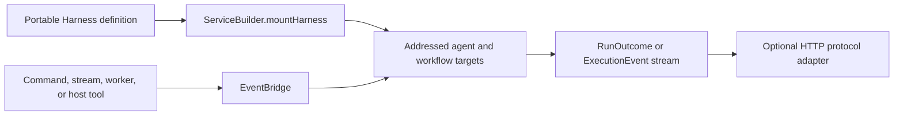

PURISTA uses `@purista/harness` as the AI definition language. Define agents,
workflows, tools, skills, guardrails, models, and schemas as direct definitions.
A service-owned Harness graph adds the agents and workflows that belong to its
business boundary. Mounting gives every added root a PURISTA address.

| Layer | Owns |
| --- | --- |
| Harness definition | Models, schemas, agents, workflows, native tools, skills, guardrails, and portable execution |
| PURISTA service | Target addresses, business guards, resources, identity propagation, events, queues, and lifecycle |
| Composition root | Concrete model, storage, sandbox, workspace, admission, and telemetry adapters |
| Consumer | Whether it needs one outcome with `.run(...)` or progressive events with `.stream(...)` |
| HTTP adapter | Authentication, endpoint exposure, and conversion to a documented client protocol |

Mounting does not generate commands, streams, queues, workers, or routes. Add
one of those Framework primitives only when the application needs that
contract. This keeps the Harness usable on its own and keeps PURISTA topology
explicit.

## Understand the parts

| Part | Job in a PURISTA application |
| --- | --- |
| Agent | Runs a bounded model loop. Its instructions and allowed tools, skills, guardrails, and child agents define what the model may do. |
| Workflow | Runs typed orchestration code when the application must control order, branching, retries, parallel work, or approval points. It may call agents and workflows. |
| Harness definition | Collects the portable AI graph owned by one service version. It has no provider credentials or live adapters. |
| Mounted root | Gives an added agent or workflow a PURISTA service address. Calls use EventBridge and preserve tenant, principal, trace, and scaling boundaries. |
| Service runtime binding | Supplies concrete models and optional storage, sandbox, queue, telemetry, and other adapters through `getInstance(..., { ai })`. |

## Start small, then add one capability at a time

1. Use the CLI to create one agent beside the service that owns it.
2. Define the smallest string-in, string-out agent and add it to a Harness.
3. Mount the Harness on the service and bind the agent's explicit model alias at startup.
4. Add a command for an aggregate result or a stream for progressive UI events.
5. Add input and output schemas when the business contract needs structure.
6. Add tools, skills, guardrails, child agents, or workflows only when their
   boundary is required.

The next page implements steps 1 through 3. Later pages build on that working
base without changing its ownership model.

Work through this chapter in order. Use the
[AI Harness handbook](/handbook/harness/start/) for standalone Harness concepts
and provider-specific setup.
