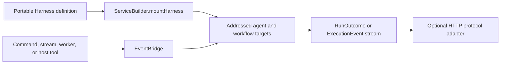

PURISTA uses `@purista/harness` as the AI definition language. Define agents,
workflows, tools, skills, guardrails, models, and schemas as direct definitions.
A service-owned Harness graph adds the agents and workflows that belong to its
business boundary. Mounting gives every added root a PURISTA address.

| Layer | Owns |
| --- | --- |
| Harness definition | Models, schemas, agents, workflows, native tools, skills, guardrails, and portable execution |
| PURISTA service | Target addresses, business guards, resources, identity propagation, events, queues, and lifecycle |
| Composition root | Concrete model, storage, sandbox, workspace, admission, and telemetry adapters |
| Consumer | Whether it needs one outcome with `.run(...)` or progressive events with `.stream(...)` |
| HTTP adapter | Authentication, endpoint exposure, and conversion to a documented client protocol |

Mounting does not generate commands, streams, queues, workers, or routes. Add
one of those Framework primitives only when the application needs that
contract. This keeps the Harness usable on its own and keeps PURISTA topology
explicit.

Work through this chapter in order. Use the
[AI Harness handbook](/handbook/harness/start/) for standalone Harness concepts
and provider-specific setup.
