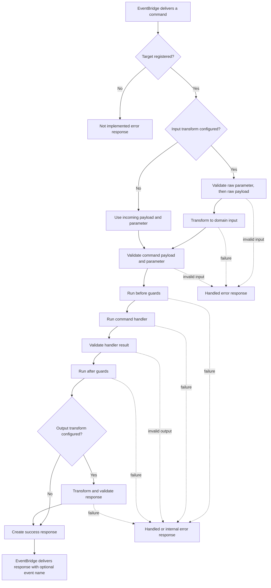

Use a command when a caller needs one bounded business result before it can continue: `createInvoice`, `approveClaim`, or `reserveInventory`. Use a queue when the caller only needs work accepted, a subscription when it reacts to an event, and a stream when it needs progressive output.

Commands belong to a versioned service. Their definition is transport-neutral: an EventBridge caller, another service, or an HTTP projection uses the same input, output, error, and success-event contract.

## See the command lifecycle

The command runtime validates and runs the definition in this order. The error path begins at the first failing stage; later stages do not run.



Payload and parameter validation run together after any input transform. Named before guards and named after guards also run in parallel, so they must not depend on each other’s mutations. An output schema is validated before after guards; an output transform runs only after those guards succeed.

`setSuccessEventName(...)` does not call `context.emit(...)`. It places an event name on the successful command response. The EventBridge delivers that response to matching subscriptions; delivery is not a database-and-broker transaction and completion is not awaited by the command.

## Start with one verified result

Define the input, parameters, output, and handler before adding more behavior. This smallest command creates a single validated result.

```ts title="src/service/invoice/v1/command/createInvoice/createInvoiceCommandBuilder.ts"
import { z } from 'zod'

export const createInvoiceCommandBuilder = invoiceV1ServiceBuilder
  .getCommandBuilder('createInvoice', 'Create an invoice')
  .addPayloadSchema(z.object({ customerId: z.string().min(1), amountCents: z.number().int().positive() }))
  .addParameterSchema(z.object({}))
  .addOutputSchema(z.object({ invoiceId: z.string() }))
  .setCommandFunction(async function (context, payload) {
    const invoice = await context.resources.invoices.create(payload)
    return { invoiceId: invoice.id }
  })
```

The handler runs only when the input matches the schemas, and its returned value must match the output schema. Continue with [Create and validate a command](/handbook/framework/build-services/commands/create-and-validate/) to see each part and its options.

The chain starts with [`getCommandBuilder(name, description, eventName?)`](/handbook/api/classes/_purista_core.ServiceBuilder/#getcommandbuilder), which names the service contract without registering it. [`addPayloadSchema(...)`](/handbook/api/classes/_purista_core.CommandDefinitionBuilder/#addpayloadschema) and [`addParameterSchema(...)`](/handbook/api/classes/_purista_core.CommandDefinitionBuilder/#addparameterschema) validate caller-controlled input; [`addOutputSchema(...)`](/handbook/api/classes/_purista_core.CommandDefinitionBuilder/#addoutputschema) validates the successful result; and [`setCommandFunction(...)`](/handbook/api/classes/_purista_core.CommandDefinitionBuilder/#setcommandfunction) installs the required, service-bound implementation. The [definition guide](/handbook/framework/build-services/commands/create-and-validate/#know-what-each-definition-method-does) covers their media defaults, failure boundaries, and registration step.

## Choose the next task

| You need to | Read |
| --- | --- |
| Define schemas, media metadata, and a service-bound handler | [Create and validate a command](/handbook/framework/build-services/commands/create-and-validate/) |
| Accept another input format or add fast policy/invariant checks | [Transform and guard command execution](/handbook/framework/build-services/commands/transform-and-guard/) |
| Return a safe business rejection or diagnose an unexpected failure | [Handle command errors](/handbook/framework/build-services/commands/handle-errors/) |
| Let subscriptions react to the canonical successful result | [Publish the success event](/handbook/framework/build-services/commands/publish-success-event/) |
| Invoke, enqueue, emit, or consume another capability | [Call other capabilities](/handbook/framework/build-services/commands/call-other-capabilities/) |
| Use a declared resource, store, identity, logger, metric, or trace helper | [Use command resources, stores, and context](/handbook/framework/build-services/commands/resources-stores-and-context/) |
| Add HTTP projection metadata to the command | [Expose a command](/handbook/framework/build-services/commands/expose-a-command/) |
| Test handler logic or the deterministic runtime flow | [Test a command](/handbook/framework/build-services/commands/test-a-command/) |

## Keep the result boundary clear

| The caller needs | Choose | Why |
| --- | --- | --- |
| The value produced now | Command output | The result is validated and returned in the command response. |
| A later, independent reaction to success | Named success event and a subscription | The command does not wait for the subscriber. |
| Durable work that may outlast the request | A queue | Acceptance and eventual completion are separate outcomes. |

Do not make a command a long-running orchestration or a chain of remote calls that behaves like a distributed transaction. Keep its output small, make side effects idempotent where callers may retry, and move durable work to a queue.

For the complete API, see [CommandDefinitionBuilder](/handbook/api/classes/_purista_core.CommandDefinitionBuilder/).
