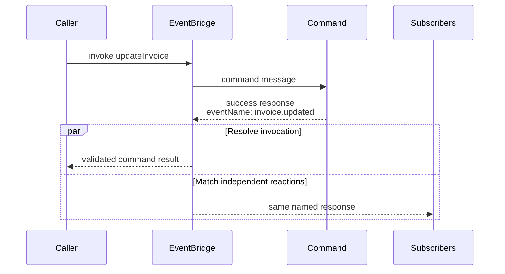
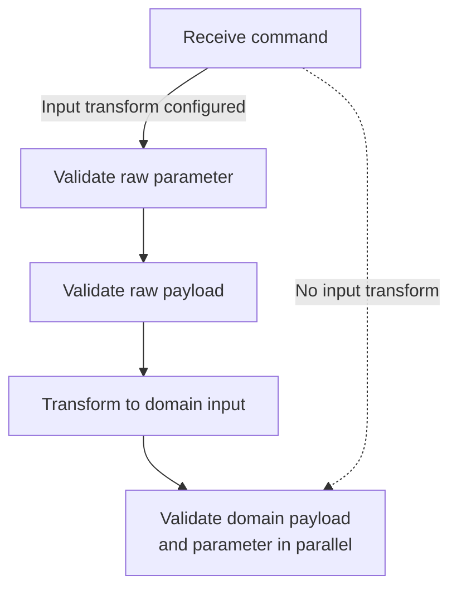
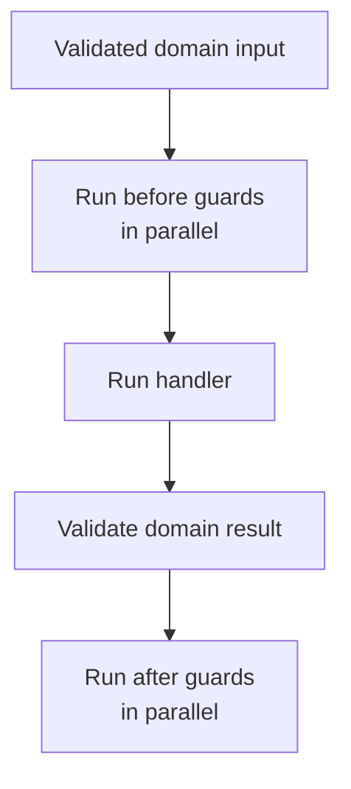
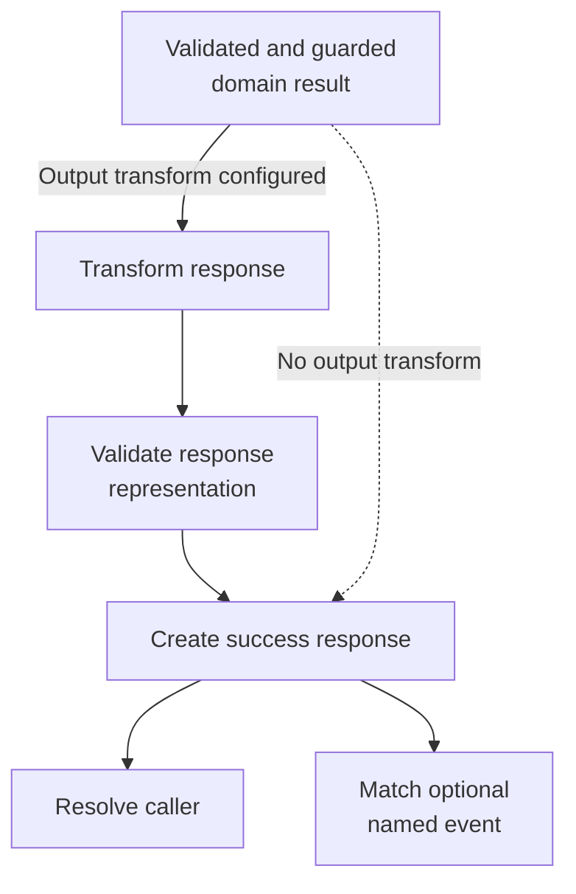

A command is an **explicit request** to a known service operation. The caller
selects the command, supplies its payload and parameter contract, and waits for
one response. The command definition does not name its callers and remains
independent of where they run.

This is the request-response choice in PURISTA. Use a subscription when code
reacts to a fact without returning a value to its producer, a queue when the
caller needs acceptance rather than completion, and a stream when the caller
needs progressive output.

The handler can inspect trusted runtime metadata such as the principal, tenant,
sender, trace, and correlation IDs. That supports authorization and auditing;
it does not couple the command contract to a specific caller.

## Separate the response from reactions to it

Every successful command produces a response for its caller. The response can
also carry an optional event name, such as `invoice.updated`.



The caller still receives the command result. Matching subscriptions may also
consume the named response, but the command neither declares those subscribers
nor waits for them. Their timing, delivery guarantees, and recovery depend on
the EventBridge and subscription configuration. A named response is not a
database-and-broker transaction.

## Follow the complete command lifecycle

The order of fluent builder calls does not decide runtime order. The builder
collects schemas and hooks; `Service.executeCommand(...)` runs them in one
fixed pipeline. A configured transform adds a second schema boundary: one for
the received representation and one for the handler's domain value.

The first boundary turns an untrusted received representation into verified
domain input. The raw branch exists only when an input transform is configured.



The middle boundary runs policy checks and business logic, then verifies the
domain result before any response representation is created.



The response boundary starts with the validated, guarded domain result. An
optional transform creates another representation and another schema boundary.



The exact runtime order is:

| Order | Stage | Configured with | Value after the stage |
| --- | --- | --- | --- |
| 0 | Resolve the registered command | Service registration | Unknown targets return `501 Not Implemented`; no command hook runs. |
| 1 | Validate the raw parameter | The second argument, `transformParameterSchema`, passed to [`setTransformInput(...)`](/handbook/api/classes/_purista_core.CommandDefinitionBuilder/#settransforminput) | Parsed received parameter. This stage exists only with an input transform. |
| 2 | Validate the raw payload | The first argument, `transformInputSchema`, passed to `setTransformInput(...)` | Parsed received payload. This stage exists only with an input transform. |
| 3 | Transform input | The transform callback passed to `setTransformInput(...)` | A `{ payload, parameter }` pair for the domain schemas. |
| 4 | Validate domain payload and parameter | [`addPayloadSchema(...)`](/handbook/api/classes/_purista_core.CommandDefinitionBuilder/#addpayloadschema) and [`addParameterSchema(...)`](/handbook/api/classes/_purista_core.CommandDefinitionBuilder/#addparameterschema) | Parsed values the guards and handler can trust. Both validations start in parallel. |
| 5 | Run before guards | [`setBeforeGuardHooks(...)`](/handbook/api/classes/_purista_core.CommandDefinitionBuilder/#setbeforeguardhooks) | No new value; every guard must complete. Named guards run in parallel. |
| 6 | Run the handler | [`setCommandFunction(...)`](/handbook/api/classes/_purista_core.CommandDefinitionBuilder/#setcommandfunction) | The command's domain result. This is the normal business side-effect boundary. |
| 7 | Validate the domain result | [`addOutputSchema(...)`](/handbook/api/classes/_purista_core.CommandDefinitionBuilder/#addoutputschema) | Parsed domain result for after guards and an optional output transform. |
| 8 | Run after guards | [`setAfterGuardHooks(...)`](/handbook/api/classes/_purista_core.CommandDefinitionBuilder/#setafterguardhooks) | No new value; every guard must complete. Named guards run in parallel. |
| 9 | Transform output | The transform callback passed to [`setTransformOutput(...)`](/handbook/api/classes/_purista_core.CommandDefinitionBuilder/#settransformoutput) | The response representation, such as encrypted data or XML/CSV. |
| 10 | Validate the response representation | The schema passed to `setTransformOutput(...)` | Parsed value used as the success-response payload. |
| 11 | Create the success response | Optional success-event name plus the final value | The EventBridge resolves the caller. When the response has an event name, it also enters independent subscription matching. |

Steps 1–3 are skipped when no input transform is configured. In that case the
received payload and parameter go directly to the domain schemas in step 4.
Steps 9–10 are skipped when no output transform is configured, so the validated
domain result becomes the response payload.

The transform schemas describe the external representation and replace the
domain schemas in generated exposure metadata. The domain schemas still run
inside the service. This keeps XML, encrypted, or legacy wire contracts
separate from the typed values used by guards and business logic.

Do not depend on ordering within a parallel group. If both domain inputs are
invalid, either validation may reject first. Each before-guard group and each
after-guard group is also concurrent, so one guard must not depend on another
guard's mutation or side effect.

An after guard and an output transform run **after** the handler. Their failure
prevents a success response but cannot undo a database write, custom event, or
other handler side effect. Put rules that must prevent the business action in
a before guard or in the handler transaction. Use after guards for independent
assertions over the already validated result, and keep transforms focused on
representation conversion.

A before guard does not protect the input transform—it runs afterward. Treat
the raw value as untrusted even after structural raw-schema validation. If a
signature or certificate must be verified before parsing or decryption, enforce
that at the transport boundary or inside the input-transform boundary before
opening the payload. Likewise, after guards inspect the validated domain result,
not the later serialized/encrypted representation; the transformed-output
schema is the final response-shape check.

## Understand the failure boundary

PURISTA treats caller-controlled input differently from application-controlled
output:

| Failure | Caller-visible result | Why |
| --- | --- | --- |
| No registered command matches the target | `501 Not Implemented` with a trace ID. | No transform, validation, guard, or handler can run. |
| Raw or domain payload/parameter validation fails | Handled `400 Bad Request` with validation issues. | The caller already owns the submitted values and needs actionable contract feedback. |
| Input transform, guard, or handler throws `HandledError` | The chosen status, safe message, and optional safe data. | The application intentionally exposes this outcome. Only put caller-safe information in it. |
| Handler, guard, transform, resource, or dependency throws another error | `500 Internal Server Error` with a trace ID; implementation details stay internal. | Provider, database, stack, and sensitive details must not cross the boundary. |
| Domain result or transformed response fails its schema | `500 Internal Server Error`; schema issues remain internal. | Invalid application output is a defect and may contain data an attacker must not receive. |
| After guard or output transform fails after handler success | The handled or internal response described above, but no success response. | The handler's side effects may already exist; PURISTA does not roll them back. |

The service logs and traces the internal failure. Do not catch an unexpected
database/provider error only to turn it into caller-visible `HandledError`
data.

## Build the smallest useful command

The first task creates an `updateInvoice` command with a repository resource,
validated payload/parameters, a caller-safe not-found result, and a
deterministic invocation.

```ts title="src/service/invoice/v1/command/updateInvoice/updateInvoiceCommandBuilder.ts"
export const updateInvoiceCommandBuilder = invoiceV1ServiceBuilder
  .getCommandBuilder('updateInvoice', 'Update an invoice')
  .addPayloadSchema(updateInvoicePayloadSchema)
  .addParameterSchema(updateInvoiceParameterSchema)
  .addOutputSchema(updateInvoiceOutputSchema)
  .setCommandFunction(async function (context, payload, parameter) {
    const invoice = await context.resources.invoices.update(parameter.invoiceId, payload)
    if (!invoice) throw new HandledError(StatusCode.NotFound, 'Invoice does not exist')
    return invoice
  })
```

The chain uses
[`getCommandBuilder(name, description, eventName?)`](/handbook/api/classes/_purista_core.ServiceBuilder/#getcommandbuilder),
[`addPayloadSchema(...)`](/handbook/api/classes/_purista_core.CommandDefinitionBuilder/#addpayloadschema),
[`addParameterSchema(...)`](/handbook/api/classes/_purista_core.CommandDefinitionBuilder/#addparameterschema),
[`addOutputSchema(...)`](/handbook/api/classes/_purista_core.CommandDefinitionBuilder/#addoutputschema),
and
[`setCommandFunction(handler)`](/handbook/api/classes/_purista_core.CommandDefinitionBuilder/#setcommandfunction).
The first task explains their parameters and runtime behavior together.

## Know which EventBridge changes command delivery

Command definitions remain transport-independent, but delivery requirements are
validated against
[`EventBridgeCapabilities`](/handbook/api/types/_purista_core.EventBridgeCapabilities/).
`DefaultEventBridge` is process-local, reports `durableCommands: false` and
`manualAckSupported: false`, and is appropriate for local execution and tests.
AMQP provides durable commands and manual acknowledgement. NATS enables those
capabilities only when JetStream starts successfully. MQTT and Dapr do not
provide durable commands or manual acknowledgement through PURISTA.

In strict command mode, a definition requesting manual acknowledgement cannot
start on a bridge that does not advertise it. Choose the adapter from the
required delivery/recovery contract and verify it in the real topology; changing
the adapter does not make the handler's external side effects exactly once.

Continue with [Create and validate a command](/handbook/framework/build-services/commands/create-and-validate/) for the complete resource, schema, registration, invocation, and expected result.

## Continue in implementation order

| You need to | Read |
| --- | --- |
| Define the contract, handler, default errors, and first deterministic result | [Create and validate a command](/handbook/framework/build-services/commands/create-and-validate/) |
| Await a value from another service | [Invoke another command](/handbook/framework/build-services/commands/call-other-capabilities/invoke-command/) |
| Let subscriptions react to successful completion | [Publish the success event](/handbook/framework/build-services/commands/publish-success-event/) |
| Publish another independently meaningful fact from the handler | [Emit custom events](/handbook/framework/build-services/commands/call-other-capabilities/emit-custom-events/) |
| Accept durable work instead of waiting for completion | [Enqueue background work](/handbook/framework/build-services/commands/call-other-capabilities/enqueue-work/) |
| Read progressive output from another service | [Consume a stream](/handbook/framework/build-services/commands/call-other-capabilities/consume-a-stream/) |
| Support another representation or add boundary checks | [Transform and guard command execution](/handbook/framework/build-services/commands/transform-and-guard/) |
| Use resources, stores, identity, logging, metrics, and tracing | [Use command resources, stores, and context](/handbook/framework/build-services/commands/resources-stores-and-context/) |
| Project the command through Hono | [Expose a command](/handbook/framework/build-services/commands/expose-a-command/) |
| Design error responses, delivery advice, and recovery | [Handle command errors](/handbook/framework/build-services/commands/handle-errors/) |
| Prove direct logic, deterministic runtime flow, and selected adapter behavior | [Test a command](/handbook/framework/build-services/commands/test-a-command/) |

For exact signatures, see [CommandDefinitionBuilder](/handbook/api/classes/_purista_core.CommandDefinitionBuilder/).
