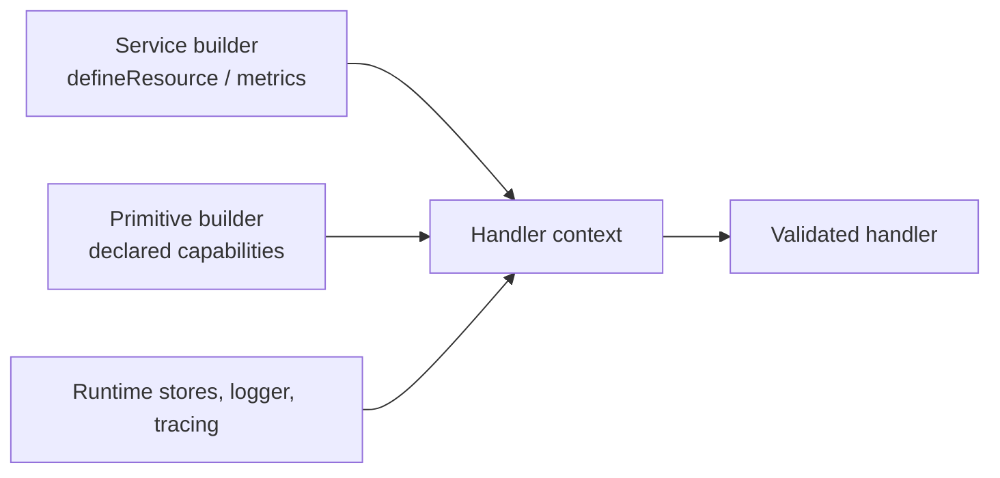

Each handler receives a small set of positional inputs: a context, validated
payload, and validated parameters; stream handlers also receive a writer and
queue workers receive a leased job message. The context is not a global service
locator. Its typed clients appear only after the corresponding capability or
resource has been declared on the service or builder.

## Read the positional inputs

| Handler registration | Positional inputs | What the handler returns |
| --- | --- | --- |
| `setCommandFunction(fn)` | `(context, payload, parameter)` | Value matching the output schema. |
| `setSubscriptionFunction(fn)` | `(context, payload, parameter)` | Optional output or a subscription handling result when the delivery policy needs one. |
| `setStreamFunction(fn)` | `(context, payload, parameter, writer)` | `Promise<void>`; write chunks and close the writer with the final result. |
| `setHandler(fn)` on a queue worker | `(context, message)` | Optional queue handler result; use `context.job` for explicit completion/retry/failure control. |

`payload` and `parameter` are readonly, post-transform values. Treat
`context.message` (or a queue worker’s `message`) as the immutable received
envelope: it carries trace, principal, and tenant context that a trusted
transport or caller established. Do not replace an identity value from an
untrusted payload field. See [authentication and authorization](/handbook/framework/secure-and-operate/security/authentication-and-authorization/).

Handlers are bound to their service instance. Use `async function (...) {}`
rather than an arrow function for `setCommandFunction`,
`setSubscriptionFunction`, and `setStreamFunction`; the builders reject arrow
functions because they cannot bind service `this`. Queue worker builders do
not reject an arrow callback, but the runtime invokes a worker handler with the
service instance as `this` too. Use `async function (...) {}` whenever the
worker needs that receiver; use an arrow only when it deliberately does not.

## Use only declared capabilities

| Context property | Available in | Declaration or runtime owner | Use it for |
| --- | --- | --- | --- |
| `message` | All handlers | Runtime | Trusted message envelope, trace/principal/tenant context, and original metadata. |
| `resources` | All handlers | `ServiceBuilder.defineResource(...)` plus `getInstance(..., { resources })` | Narrow, injected database/repository/SDK interfaces. |
| `service` | All handlers | `canInvoke(...)` | Typed request/reply calls to declared commands. |
| `stream` | All handlers | `canConsumeStream(...)` | Typed consumption of a declared service stream. |
| `queue` | Commands, streams, and queue workers | `canEnqueue(...)` | Typed enqueue and schedule helpers for declared queues. The current subscription builder has no `canEnqueue(...)`; bind the subscribed event to a queue at the service level instead. |
| `emit` | All handlers | `canEmit(...)` | Typed custom event publication. A command success event is emitted automatically after success; it does not add a callable `context.emit` target. |
| `agent` | Queue workers | `canInvokeAgent(...)` | Typed same-service attached-agent invocation. |
| `logger`, `wrapInSpan`, `startActiveSpan`, `metrics` | All handlers | Runtime; metrics need their builder declaration | Safe operational logs, spans, and low-cardinality custom metrics. |
| `configs`, `secrets`, `states` | All handlers | Runtime stores | Store operations permitted by the configured adapter; their write/cache defaults are adapter-specific. |
| `job`, `signal` | Queue workers | Queue worker runtime | Lease completion/retry/failure/dead-letter/extension and cooperative cancellation. |

Calling an undeclared downstream command, stream, queue, event, or agent is
not an escape hatch: it is absent from the typed context. Declare its schema at
the builder first, which makes the dependency visible in the service contract
and lets PURISTA validate it at runtime.

## Continue at the owning primitive

This page owns the common input and context model. Each primitive page owns its
additional clients, controls, lifecycle position, and runnable example.

| You need | Canonical task |
| --- | --- |
| Exact command context, transform context, resources, stores, and typed clients | [Use command resources, stores, and context](/handbook/framework/build-services/commands/resources-stores-and-context/) |
| Subscription message metadata, declared calls, and delivery context | [Use subscription resources, stores, and context](/handbook/framework/build-services/subscriptions/resources-stores-and-context/) |
| Stream writer, cancellation, resources, stores, and declared calls | [Use stream resources, stores, context, and cancellation](/handbook/framework/build-services/streams/resources-stores-context-and-cancellation/) |
| Queue job, signal, settlement controls, and declared calls | [Use worker resources, stores, context, and job controls](/handbook/framework/build-services/queues-and-workers/resources-stores-context-and-job-controls/) |
| Resource declaration and composition-root injection | [Provide service resources](/handbook/framework/build-services/services/provide-resources-and-metrics/) |
| State, configuration, and secret-store operations inside a handler | [Use stores from handlers](/handbook/framework/configure-applications/use-stores-from-handlers/) |
| Expected, unexpected, retryable, and terminal outcomes | [Handle errors across service primitives](/handbook/framework/build-services/handle-service-errors/) |

Do not use a context client merely because another primitive exposes a member
with the same name. Follow the declaration and callback type for the builder
you are implementing.
