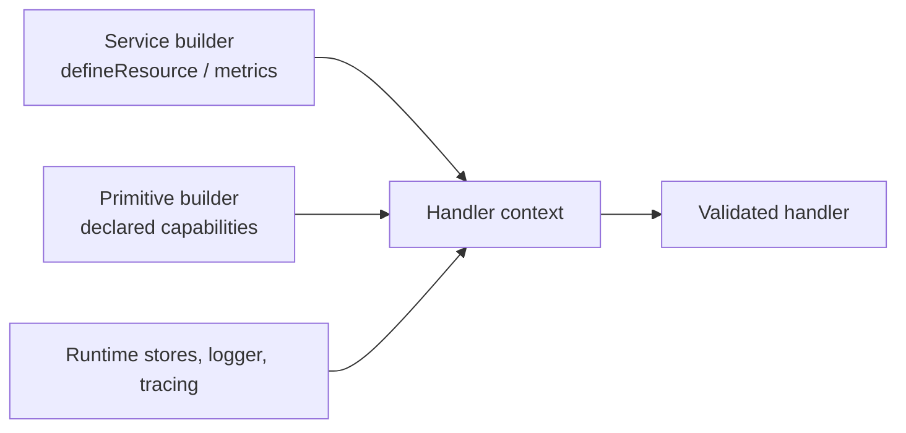

Each handler receives a small set of positional inputs: a context, validated
payload, and validated parameters; stream handlers also receive a writer and
queue workers receive a leased job message. The context is not a global service
locator. Its typed clients appear only after the corresponding capability or
resource has been declared on the service or builder.



## Read the positional inputs

| Handler registration | Positional inputs | What the handler returns |
| --- | --- | --- |
| `setCommandFunction(fn)` | `(context, payload, parameter)` | Value matching the output schema. |
| `setSubscriptionFunction(fn)` | `(context, payload, parameter)` | Optional output or a subscription handling result when the delivery policy needs one. |
| `setStreamFunction(fn)` | `(context, payload, parameter, writer)` | `Promise<void>`; write chunks and close the writer with the final result. |
| `setHandler(fn)` on a queue worker | `(context, message)` | Optional queue handler result; use `context.job` for explicit completion/retry/failure control. |

`payload` and `parameter` are readonly, post-transform values. Treat
`context.message` (or a queue worker’s `message`) as the immutable received
envelope: it carries trace, principal, and tenant context that a trusted
transport or caller established. Do not replace an identity value from an
untrusted payload field. See [authentication and authorization](/handbook/framework/secure-and-operate/security/authentication-and-authorization/).

Handlers are bound to their service instance. Use `async function (...) {}`
rather than an arrow function for `setCommandFunction`,
`setSubscriptionFunction`, and `setStreamFunction`; the builders reject arrow
functions because they cannot bind service `this`. Queue worker builders do
not reject an arrow callback, but the runtime invokes a worker handler with the
service instance as `this` too. Use `async function (...) {}` whenever the
worker needs that receiver; use an arrow only when it deliberately does not.

## Use only declared capabilities

| Context property | Available in | Declaration or runtime owner | Use it for |
| --- | --- | --- | --- |
| `message` | All handlers | Runtime | Trusted message envelope, trace/principal/tenant context, and original metadata. |
| `resources` | All handlers | `ServiceBuilder.defineResource(...)` plus `getInstance(..., { resources })` | Narrow, injected database/repository/SDK interfaces. |
| `service` | All handlers | `canInvoke(...)` | Typed request/reply calls to declared commands. |
| `stream` | All handlers | `canConsumeStream(...)` | Typed consumption of a declared service stream. |
| `queue` | Commands, streams, and queue workers | `canEnqueue(...)` | Typed enqueue and schedule helpers for declared queues. The current subscription builder has no `canEnqueue(...)`; bind the subscribed event to a queue at the service level instead. |
| `emit` | All handlers | `canEmit(...)` | Typed custom event publication. A command success event is emitted automatically after success; it does not add a callable `context.emit` target. |
| `agent` | Queue workers | `canInvokeAgent(...)` | Typed same-service attached-agent invocation. |
| `logger`, `wrapInSpan`, `startActiveSpan`, `metrics` | All handlers | Runtime; metrics need their builder declaration | Safe operational logs, spans, and low-cardinality custom metrics. |
| `configs`, `secrets`, `states` | All handlers | Runtime stores | Store operations permitted by the configured adapter; their write/cache defaults are adapter-specific. |
| `job`, `signal` | Queue workers | Queue worker runtime | Lease completion/retry/failure/dead-letter/extension and cooperative cancellation. |

Calling an undeclared downstream command, stream, queue, event, or agent is
not an escape hatch: it is absent from the typed context. Declare its schema at
the builder first, which makes the dependency visible in the service contract
and lets PURISTA validate it at runtime.

## Use a command context safely

This command has an injected repository and an explicit downstream credit
check. Those two declarations create the only non-runtime properties used by
the handler.

```ts title="src/service/invoice/v1/command/createInvoice/createInvoiceCommandBuilder.ts"
export const createInvoiceCommandBuilder = invoiceV1ServiceBuilder
  .getCommandBuilder('createInvoice', 'Create an invoice')
  .addPayloadSchema(createInvoicePayloadSchema)
  .addParameterSchema(createInvoiceParameterSchema)
  .addOutputSchema(createInvoiceOutputSchema)
  .canInvoke('Customer', '1', 'getCreditStatus', creditStatusSchema, creditCheckSchema)
  .canEmit('invoiceCreated', invoiceCreatedEventSchema)
  .setCommandFunction(async function (context, payload, _parameter) {
    const credit = await context.service.Customer[1].getCreditStatus({ customerId: payload.customerId }, undefined)
    const invoice = await context.resources.invoiceRepository.create(payload, credit)

    await context.emit('invoiceCreated', { invoiceId: invoice.id })
    context.logger.info({ invoiceId: invoice.id }, 'invoice created')
    return { invoiceId: invoice.id }
  })
```

Keep emitted/logged fields non-sensitive and low cardinality. `context.emit` is
not automatically transactional with a resource write; design an outbox or
reconciliation path where atomic publication matters.

[`getCommandBuilder(name, description, eventName?)`](/handbook/api/classes/_purista_core.ServiceBuilder/#getcommandbuilder) carries the service’s declared resource typing into this definition. [`addPayloadSchema(schema, contentType?, contentEncoding?)`](/handbook/api/classes/_purista_core.CommandDefinitionBuilder/#addpayloadschema), [`addParameterSchema(schema)`](/handbook/api/classes/_purista_core.CommandDefinitionBuilder/#addparameterschema), and [`addOutputSchema(schema, contentType?, contentEncoding?)`](/handbook/api/classes/_purista_core.CommandDefinitionBuilder/#addoutputschema) give the handler validated local values. [`canInvoke(...)`](/handbook/api/classes/_purista_core.CommandDefinitionBuilder/#caninvoke) and [`canEmit(...)`](/handbook/api/classes/_purista_core.CommandDefinitionBuilder/#canemit) add only the two remote context capabilities shown. [`setCommandFunction(handler)`](/handbook/api/classes/_purista_core.CommandDefinitionBuilder/#setcommandfunction) is the required service-bound callback; it must be a non-arrow function.

## Respect queue job controls

Queue workers may execute again after a retry, lease loss, or redrive. Return a
queue result for ordinary completion; use `context.job` only when the worker
must explicitly control lifecycle. `signal` lets long-running work stop during
shutdown or lease loss.

```ts title="src/service/report/v1/queueWorker/generateReportWorker.ts"
export const generateReportWorker = reportV1ServiceBuilder
  .getQueueWorkerBuilder('generateReport', 'generate-report')
  .setMaxParallelHandlers(2)
  .setHandler(async function (context, message) {
    if (context.signal.aborted || context.job.cancelRequested()) {
      return { status: 'retry', delayMs: 5_000, reason: 'worker is stopping' }
    }

    await context.resources.reports.generate(message.payload.reportId)
    return { status: 'success' }
  })
```

| Builder call | Parameters/default | Runtime effect and choice |
| --- | --- | --- |
| [`getQueueWorkerBuilder(queueName, workerName)`](/handbook/api/classes/_purista_core.ServiceBuilder/#getqueueworkerbuilder) | `queueName` must match the queue contract; `workerName` identifies this worker in diagnostics and metrics. | Creates the execution definition only. Register its `getDefinition()` promise with [`addQueueWorkerDefinition(...)`](/handbook/api/classes/_purista_core.ServiceBuilder/#addqueueworkerdefinition) before the service resolves definitions. |
| [`setMaxParallelHandlers(count)`](/handbook/api/classes/_purista_core.QueueWorkerBuilder/#setmaxparallelhandlers) | Default `1`; runtime clamps a non-sequential worker to at least one slot. | Limits concurrent leases for this worker. Increase only after the downstream resource and queue bridge can tolerate the added load. |
| [`setHandler(handler)`](/handbook/api/classes/_purista_core.QueueWorkerBuilder/#sethandler) | Required `async function (context, message)`; it returns `undefined` or a queue handler result. | Installs the lease-processing boundary. A worker without it causes `getDefinition()` to reject. Use `context.job` only for an explicit settlement; otherwise return one outcome. |

Do not call `complete`, `retry`, `fail`, or `moveToDeadLetter` and then return
a conflicting queue result. Keep the work idempotent: lifecycle controls decide
the queue state, not whether a remote side effect can be duplicated.

When the handler cannot continue, first classify the outcome in
[Handle service errors](/handbook/framework/build-services/handle-service-errors/).
Then use the primitive guide for the actual command response, subscription
control result, stream termination, or queue-job transition.

Next: [commands](/handbook/framework/build-services/commands/),
[subscriptions](/handbook/framework/build-services/subscriptions/),
[streams](/handbook/framework/build-services/streams/), and
[queues and workers](/handbook/framework/build-services/queues-and-workers/).
