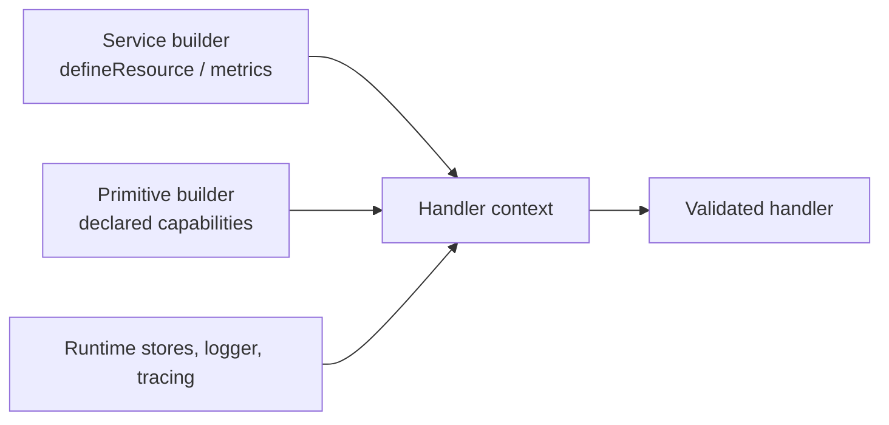

Each handler receives a small set of positional inputs: a context, validated
payload, and validated parameters; stream handlers also receive a writer and
queue workers receive a leased job message. The context is not a global service
locator. Command and stream clients become callable only after the dependency
has been declared. Queue and custom-event calls are also checked at runtime;
their base signatures remain visible in TypeScript even when a target was not
declared.

## Read the positional inputs

| Handler registration | Positional inputs | What the handler returns |
| --- | --- | --- |
| `setCommandFunction(fn)` | `(context, payload, parameter)` | Value matching the output schema. |
| `setSubscriptionFunction(fn)` | `(context, payload, parameter)` | Optional output or a subscription handling result when the delivery policy needs one. |
| `setStreamFunction(fn)` | `(context, payload, parameter, writer)` | `Promise<void>`; write chunks and close the writer with the final result. |
| `setHandler(fn)` on a queue worker | `(context, message)` | Optional queue handler result; use `context.job` for explicit completion/retry/failure control. |
| `setTransformInput(fn)` / `setTransformOutput(fn)` | `(context, payload, parameter)` where `context` contains `ContextBase`, `message`, and `resources` | The transformed payload/parameter or output. A transform has no `service`, `stream`, `emit`, `agent`, `workflow`, or `model` client. Keep it deterministic and side-effect-free. |
| `addBeforeGuardHook(...)` / `addAfterGuardHook(...)` | The full primitive handler context plus the hook's validated inputs | `void`; throw a `HandledError` for a deliberate business rejection. |

`payload` and `parameter` are readonly, post-transform values. Treat
`context.message` (or a queue worker’s `message`) as the immutable received
envelope: it carries trace, principal, and tenant context that a trusted
transport or caller established. Do not replace an identity value from an
untrusted payload field. See [authentication and authorization](/handbook/framework/secure-and-operate/security/authentication-and-authorization/).

Handlers are bound to their service instance. Use `async function (...) {}`
rather than an arrow function for `setCommandFunction`,
`setSubscriptionFunction`, and `setStreamFunction`; the builders reject arrow
functions because they cannot bind service `this`. Queue worker builders do
not reject an arrow callback, but the runtime invokes a worker handler with the
service instance as `this` too. Use `async function (...) {}` whenever the
worker needs that receiver; use an arrow only when it deliberately does not.

## Use only declared capabilities

| Context property | Available in | Declaration or runtime owner | Use it for |
| --- | --- | --- | --- |
| `message` | All handlers | Runtime | Trusted message envelope, trace/principal/tenant context, and original metadata. |
| `resources` | All handlers | `ServiceBuilder.defineResource(...)` plus `getInstance(..., { resources })` | Narrow, injected database/repository/SDK interfaces. |
| `service` | Main command, subscription, stream, and worker handlers | `canInvoke(...)` | `service.<service>['<version>'].<command>(payload, parameter)` sends a typed request/reply call through EventBridge. An undeclared entry is not callable. |
| `stream` | Main command, subscription, stream, and worker handlers | `canConsumeStream(...)` | `stream.<service>['<version>'].<stream>(payload, parameter)` consumes a declared stream. An undeclared entry is not callable. |
| `queue` | Every context because it is part of `ContextBase` | `canEnqueue(...)` on commands, streams, and workers | `queue.enqueue(queueName, payload, parameter?, options?)` and `queue.scheduleAt(queueName, runAt, payload, parameter?, options?)`. A subscription has no `canEnqueue(...)`; its queue allow-list is empty, so either call throws `Forbidden`. Bind an event to a queue at the service level instead. |
| `emit` | Main command, subscription, stream, and worker handlers | `canEmit(...)` | `emit(eventName, payload, contentType?, contentEncoding?)` publishes a custom event. The callable base signature accepts a string, so PURISTA validates the declared event and payload again at runtime. A command success event is separate and emitted automatically after success. |
| `agent`, `workflow` | Main command, subscription, stream, and worker handlers | `canInvokeAgent(...)` / `canInvokeWorkflow(...)` | Address-first mounted Harness invocation through EventBridge. |
| `model` | Main command, subscription, stream, and worker handlers | `canUseHarnessModel(...)` | Deterministic model handles explicitly exposed by the mounted Harness runtime. |
| `logger`, `wrapInSpan`, `startActiveSpan`, `metrics` | All handlers | Runtime; metrics need their builder declaration | Safe operational logs, spans, and low-cardinality custom metrics. |
| `configs` | All contexts | Runtime configuration store | `getConfig(...names)`, `setConfig(name, value)`, and `removeConfig(name)`. |
| `secrets` | All contexts | Runtime secret store | `getSecret(...names)`, `setSecret(name, stringValue)`, and `removeSecret(name)`. |
| `states` | All contexts | Runtime state store | `getState(...names)`, `setState(name, value)`, and `removeState(name)`. Use it for short-lived application/session state, not as a domain database. |
| `job`, `signal` | Queue workers | Queue worker runtime | `job.complete(output?, headers?)`, `retry(request?)`, `fail(reason, fatal?)`, `moveToDeadLetter(reason?)`, `extendLease(durationMs)`, `cancelRequested()`, plus the cooperative `AbortSignal`. |

Custom metrics are keyed by the name declared on the builder. Counters and
up/down counters expose `add(value, attributes?)`; histograms expose
`record(value, attributes?)`. When an attribute schema is declared, TypeScript
requires that exact attribute object.

## Know the runtime failures for undeclared calls

The builder declaration is part of the service contract. The runtime still
checks calls because messages, JavaScript callers, and the generic queue/event
signatures can bypass compile-time guidance.

| Call | Runtime result |
| --- | --- |
| Enqueue a queue that is not in this handler's `canEnqueue(...)` declarations | `UnhandledError(StatusCode.Forbidden, 'queue "<name>" is not allowed in this handler')` |
| Enqueue an allowed name that has no queue definition on the service | `UnhandledError(StatusCode.NotFound, 'queue "<name>" is not registered in this service')` |
| Emit a name without a `canEmit(...)` schema | `UnhandledError(StatusCode.InternalServerError, 'No schema for <event> found')` |
| Emit a payload that fails the declared event schema | `UnhandledError(StatusCode.InternalServerError, 'Payload validation for event <event> failed')` |

Declare the target first and test both the expected call and a near-miss. For a
subscription, use `ServiceBuilder.bindEventToQueue(...)` when delivery must
enter a queue; the subscription's direct queue namespace deliberately rejects
all names.

## Use the bound service instance through `this`

PURISTA binds command, subscription, stream, and worker functions to the
running `Service` instance. A normal `async function` can therefore read:

- `this.config`, the merged and schema-validated service configuration;
- `this.resources`, the resources supplied to `getInstance(...)`;
- `this.logger`, `this.serviceInfo`, and `this.isStarted`; and
- `this.getTracer()`, `this.wrapInSpan(...)`, and `this.startActiveSpan(...)`.

Prefer the context's logger, resource, and tracing members for ordinary handler
work because they carry the current execution context. Use `this.config` for
service configuration and the receiver only when the service instance itself
is the intended owner. See [configure a service](/handbook/framework/build-services/services/configure-a-service/).

## Continue at the owning primitive

This page owns the common input and context model. Each primitive page owns its
additional clients, controls, lifecycle position, and runnable example.

| You need | Canonical task |
| --- | --- |
| Exact command context, transform context, resources, stores, and typed clients | [Use command resources, stores, and context](/handbook/framework/build-services/commands/resources-stores-and-context/) |
| Subscription message metadata, declared calls, and delivery context | [Use subscription resources, stores, and context](/handbook/framework/build-services/subscriptions/resources-stores-and-context/) |
| Stream writer, cancellation, resources, stores, and declared calls | [Use stream resources, stores, context, and cancellation](/handbook/framework/build-services/streams/resources-stores-context-and-cancellation/) |
| Queue job, signal, settlement controls, and declared calls | [Use worker resources, stores, context, and job controls](/handbook/framework/build-services/queues-and-workers/resources-stores-context-and-job-controls/) |
| Resource declaration and composition-root injection | [Provide service resources](/handbook/framework/build-services/services/provide-resources-and-metrics/) |
| State, configuration, and secret-store operations inside a handler | [Use stores from handlers](/handbook/framework/configure-applications/use-stores-from-handlers/) |
| Expected, unexpected, retryable, and terminal outcomes | [Handle errors across service primitives](/handbook/framework/build-services/handle-service-errors/) |

Do not use a context client merely because another primitive exposes a member
with the same name. Follow the declaration and callback type for the builder
you are implementing.
