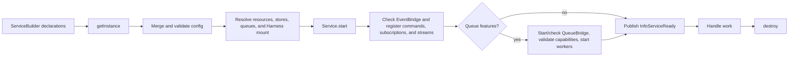

Every business capability starts as a service. Choose the handler primitive from the outcome the caller needs, then compose the primitives only when the problem requires it.



## Run the smallest service

```ts title="src/minimal-service.ts"
import { DefaultEventBridge, ServiceBuilder } from '@purista/core'
import { z } from 'zod'

const builder = new ServiceBuilder({
  serviceName: 'ping',
  serviceVersion: '1',
  serviceDescription: 'Small lifecycle example',
})

const pingCommand = builder
  .getCommandBuilder('ping', 'Return pong')
  .addPayloadSchema(z.undefined())
  .addParameterSchema(z.undefined())
  .addOutputSchema(z.literal('pong'))
  .setCommandFunction(async function () {
    return 'pong' as const
  })

const serviceBuilder = builder.addCommandDefinition(pingCommand.getDefinition())
const eventBridge = new DefaultEventBridge()
await eventBridge.start()

const service = await serviceBuilder.getInstance(eventBridge)
await service.start()
console.log(service.isStarted) // true

await service.destroy()
await eventBridge.destroy()
```

The service builder creates the command with
[`getCommandBuilder(...)`](/handbook/api/classes/_purista_core.ServiceBuilder/#getcommandbuilder)
and registers the resolved definition with
[`addCommandDefinition(...)`](/handbook/api/classes/_purista_core.ServiceBuilder/#addcommanddefinition).
The command's
[`addPayloadSchema(...)`](/handbook/api/classes/_purista_core.CommandDefinitionBuilder/#addpayloadschema),
[`addParameterSchema(...)`](/handbook/api/classes/_purista_core.CommandDefinitionBuilder/#addparameterschema),
[`addOutputSchema(...)`](/handbook/api/classes/_purista_core.CommandDefinitionBuilder/#addoutputschema),
and
[`setCommandFunction(...)`](/handbook/api/classes/_purista_core.CommandDefinitionBuilder/#setcommandfunction)
calls establish the validated request, result, and handler. The focused command
chapter explains their lifecycle and invalid combinations.

Starting the service publishes `InfoServiceReady` through the EventBridge and
logs `service ping 1 started`. Those are the observable readiness signals; a
resolved builder alone is not a running service.

## Choose the primitive

| Reader needs | Start here |
| --- | --- |
| A versioned business boundary with typed dependencies | [Services](/handbook/framework/build-services/services/) |
| A bounded request and response | [Commands](/handbook/framework/build-services/commands/) |
| A reaction to a business event | [Subscriptions](/handbook/framework/build-services/subscriptions/) |
| Progressive values for one caller | [Streams](/handbook/framework/build-services/streams/) |
| Background processing, retry, or independent capacity | [Queues and workers](/handbook/framework/build-services/queues-and-workers/) |
| A platform scheduler must start a durable business flow | [Schedule work](/handbook/framework/build-services/schedule-work/) |
| Model-assisted behavior integrated with normal service contracts | [Build AI-powered services](/handbook/framework/build-ai-powered-services/) |

Start with a command before adding a queue or agent. Commands establish schemas, service ownership, and error behavior that the more advanced flows reuse.

## Know what changes runtime behavior

`getInstance(...)` supplies `DefaultQueueBridge`, `DefaultStateStore`,
`DefaultConfigStore`, and `DefaultSecretStore` when no adapter is passed. These
defaults make local development possible. They do not provide cross-process
delivery, durable domain persistence, or an external secret boundary. Choose a
production EventBridge, QueueBridge, store, database resource, and Harness
provider explicitly when the required behavior crosses the process boundary.

`destroy()` stops service-owned stream/worker and started QueueBridge activity,
but it does not deregister command, subscription, or stream handlers from the
EventBridge and it does not make that service instance restartable. Stop
incoming traffic, destroy services, then destroy the EventBridge. Treat each
service instance as single-use.

## Use the shared references when you need them

The primitive chapters provide the local implementation flow. Use these
cross-primitive references for exact concepts that apply to several handler
types:

| You need to | Reference |
| --- | --- |
| Look up positional inputs, typed clients, resources, stores, logging, tracing, and metrics | [Handler context reference](/handbook/framework/build-services/handler-context/) |
| Decide whether to return a safe business rejection, fail, retry, or dead-letter | [Handle errors across service primitives](/handbook/framework/build-services/handle-service-errors/) |
| Choose, wire, and use state, configuration, or secret stores | [Use stores and configuration](/handbook/framework/configure-applications/) |

These references follow the service primitives in the navigation so a newcomer
can move directly from the service boundary to a first command. Primitive task
pages link back to the relevant reference at the point where it becomes useful.
