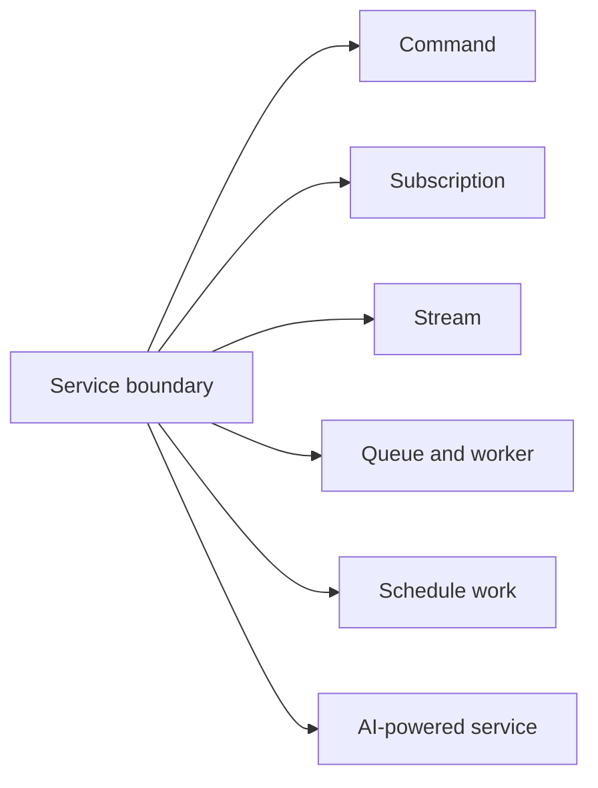

Every business capability starts as a service. Choose the handler primitive from the outcome the caller needs, then compose the primitives only when the problem requires it.

## Choose the primitive

| Reader needs | Start here |
| --- | --- |
| A versioned business boundary with typed dependencies | [Services](/handbook/framework/build-services/services/) |
| A bounded request and response | [Commands](/handbook/framework/build-services/commands/) |
| A reaction to a business event | [Subscriptions](/handbook/framework/build-services/subscriptions/) |
| Progressive values for one caller | [Streams](/handbook/framework/build-services/streams/) |
| Background processing, retry, or independent capacity | [Queues and workers](/handbook/framework/build-services/queues-and-workers/) |
| A platform scheduler must start a durable business flow | [Schedule work](/handbook/framework/build-services/schedule-work/) |
| Model-assisted behavior integrated with normal service contracts | [Build AI-powered services](/handbook/framework/build-ai-powered-services/) |

Start with a command before adding a queue or agent. Commands establish schemas, service ownership, and error behavior that the more advanced flows reuse.

## Use the shared references when you need them

The primitive chapters provide the local implementation flow. Use these
cross-primitive references for exact concepts that apply to several handler
types:

| You need to | Reference |
| --- | --- |
| Look up positional inputs, typed clients, resources, stores, logging, tracing, and metrics | [Handler context reference](/handbook/framework/build-services/handler-context/) |
| Decide whether to return a safe business rejection, fail, retry, or dead-letter | [Handle errors across service primitives](/handbook/framework/build-services/handle-service-errors/) |
| Choose, wire, and use state, configuration, or secret stores | [Use stores and configuration](/handbook/framework/configure-applications/) |

These references follow the service primitives in the navigation so a newcomer
can move directly from the service boundary to a first command. Primitive task
pages link back to the relevant reference at the point where it becomes useful.
