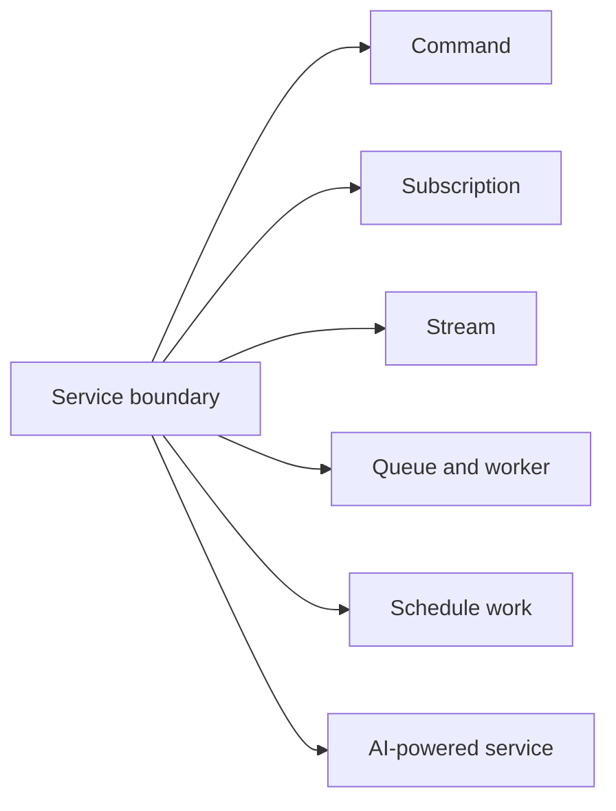

Every business capability starts as a service. Choose the handler primitive from the outcome the caller needs, then compose the primitives only when the problem requires it.

## Choose the primitive

| Reader needs | Start here |
| --- | --- |
| A versioned business boundary with typed dependencies | [Services](/handbook/framework/build-services/services/) |
| A bounded request and response | [Commands](/handbook/framework/build-services/commands/) |
| A reaction to a business event | [Subscriptions](/handbook/framework/build-services/subscriptions/) |
| Progressive values for one caller | [Streams](/handbook/framework/build-services/streams/) |
| Background processing, retry, or independent capacity | [Queues and workers](/handbook/framework/build-services/queues-and-workers/) |
| A platform scheduler must start a durable business flow | [Schedule work](/handbook/framework/build-services/schedule-event-queue-result/) |
| Model-assisted behavior integrated with normal service contracts | [Build AI-powered services](/handbook/framework/build-ai-powered-services/) |
| Read or write state, configuration, or credentials from a handler | [Use stores in a service](/handbook/framework/build-services/use-stores-in-a-service/) |
| Decide whether to return a business rejection, fail, retry, or dead-letter | [Handle service errors](/handbook/framework/build-services/handle-service-errors/) |

Start with a command before adding a queue or agent. Commands establish schemas, service ownership, and error behavior that the more advanced flows reuse.

State, configuration, and secret stores are runtime building blocks, not a
late-stage configuration detail. [Use stores in a service](/handbook/framework/build-services/use-stores-in-a-service/)
to choose and wire the right boundary before implementing a handler; it then
links to the focused store and adapter guides.

Before adding a retry or turning an exception into a caller response, read
[Handle service errors](/handbook/framework/build-services/handle-service-errors/).
That page establishes the shared classification; each primitive guide owns its
actual response, stream, redelivery, queue, or agent-recovery behavior.
