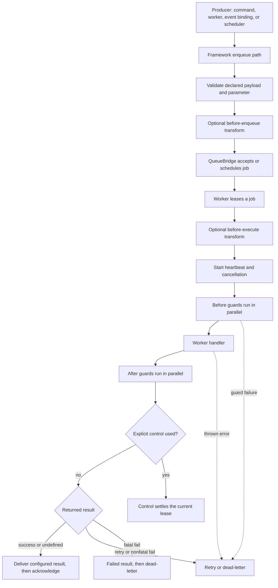

Use a queue when the caller needs an immediate acceptance but the work can run
later: rendering a report, sending a notification, or processing a document.
A queue is not a faster command. The producer accepts a job; a QueueBridge
holds it; a worker leases and performs it. The application must tolerate an
attempt being repeated.

| Contract question | Queue/worker answer |
| --- | --- |
| Who initiates it? | A declared producer enqueues or schedules a named job. |
| What is selected? | The QueueBridge stores/routes the job; an eligible worker leases an attempt. |
| Who waits? | The producer waits for acceptance only. Worker completion, retries, and results happen independently. |
| What is the normal result? | A queue receipt for the producer, then worker acknowledgement and any configured result state/event. |
| What stays decoupled? | The producer does not select a worker instance or assume when/how many attempts execute. |

`@purista/core` includes `DefaultQueueBridge` for local development and
deterministic tests. It is process-local, so durable work needs a selected and
wired QueueBridge. Installing an optional bridge package alone does not move
jobs. See [choose a QueueBridge](/handbook/framework/connect-distributed-infrastructure/queue-delivery/) before making a production delivery promise.

A producer can enqueue only a queue definition registered on the **same service
instance**. `context.queue.enqueue` and `scheduleAt` look up that service's own
queue map and otherwise throw `UnhandledError(404, 'queue "<name>" is not
registered in this service')`. For a cross-service handoff, publish a business
event and use `ServiceBuilder.bindEventToQueue(...)` on the service that owns
the queue.

## Follow one job through the runtime



Two boundaries are easy to miss:

- Framework validates a payload and parameter only when work enters through its
  declared enqueue path, and it does so before `setBeforeEnqueueTransform`.
  It does not revalidate transformed values. A direct QueueBridge producer
  bypasses this contract check.
- The worker does not validate a broker-leased message before or after its
  execute transform. Treat queue schemas as a shared producer contract, and
  keep the worker defensive at untrusted broker boundaries.

## Start with a useful first result

Create one queue plus one worker, register both with the service, then enqueue
a job from a command. Make the business effect idempotent before treating the
job as complete. A returned `undefined` is a successful acknowledgement;
return `{ status: 'retry' }` or `{ status: 'fail' }` only when recovery must
change.

```ts title="src/service/report/v1/reportV1Service.ts"
export const reportV1Service = reportV1ServiceBuilder
  .addQueueDefinition(generateReportQueueBuilder.getDefinition())
  .addQueueWorkerDefinition(generateReportWorkerBuilder.getDefinition())
```

[`addQueueDefinition(...)`](/handbook/api/classes/_purista_core.ServiceBuilder/#addqueuedefinition)
and
[`addQueueWorkerDefinition(...)`](/handbook/api/classes/_purista_core.ServiceBuilder/#addqueueworkerdefinition)
each accept one or more **promises** returned by a builder’s
[`getDefinition()`](/handbook/api/classes/_purista_core.QueueDefinitionBuilder/#getdefinition).
Register both before the service resolves definitions—for example through
`getInstance(...)` or `resolveDefinitions()`. After that boundary, either
method throws rather than silently changing a running service.

| Assembly call | What it registers | Important choice and failure boundary |
| --- | --- | --- |
| [`addQueueDefinition(...definitions)`](/handbook/api/classes/_purista_core.ServiceBuilder/#addqueuedefinition) | Queue name, schemas, lifecycle, bridge requirements, result policy, and optional schedule metadata. | Required even when a worker already names the queue. It does not create a worker or a provider-side queue by itself. |
| [`addQueueWorkerDefinition(...definitions)`](/handbook/api/classes/_purista_core.ServiceBuilder/#addqueueworkerdefinition) | Worker name, queue name, pacing, handler, guards, and declared handler clients. | Required for this service to lease work. The matching queue must be present and the configured bridge must be able to lease it. |

The queue contract alone does not start a worker. A worker definition alone
does not create a queue contract. `Service.start()` starts the bridge and its
registered workers when that service contains queues or queue workers.

## Choose the next task

| You need to | Read |
| --- | --- |
| Define, register, transform, and guard a job | [Create a queue and worker](/handbook/framework/build-services/queues-and-workers/create-a-queue-and-worker/) |
| Submit work now or at a future time | [Enqueue and schedule jobs](/handbook/framework/build-services/queues-and-workers/enqueue-and-schedule-jobs/) |
| Return success, retry, failure, state, or result events | [Return results and publish result events](/handbook/framework/build-services/queues-and-workers/return-results-and-publish-result-events/) |
| Invoke commands, consume streams, enqueue, emit, or call a mounted agent | [Compose a worker](/handbook/framework/build-services/queues-and-workers/invoke-enqueue-emit-stream-and-call-agents/) |
| Use stores, resources, tracing, cancellation, and job controls | [Use worker resources, stores, context, and job controls](/handbook/framework/build-services/queues-and-workers/resources-stores-context-and-job-controls/) |
| Choose leases, retries, idempotency, dead letters, or bridge requirements | [Configure recovery and delivery](/handbook/framework/build-services/queues-and-workers/configure-leases-retries-idempotency-and-dead-letters/) |
| Accept a job from an HTTP client | [Expose queued work](/handbook/framework/build-services/queues-and-workers/expose-queued-work/) |
| Prove handler logic, Framework flow, or a selected provider | [Test queued work](/handbook/framework/build-services/queues-and-workers/test-queued-work/) |

Queues are usually a better fit than a stream when completion must survive a
client disconnect. Use [commands](/handbook/framework/build-services/commands/)
for request/response work and [subscriptions](/handbook/framework/build-services/subscriptions/)
for reactions to an event.
