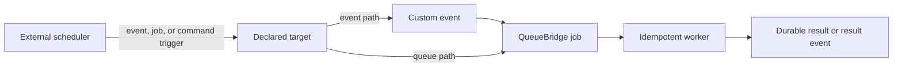

Use a schedule when an external platform must start work at a known time.
PURISTA defines the schedule contract; it does not run a production scheduler.
The platform owns timing, the QueueBridge owns durable delivery, and a worker
owns the idempotent business effect.

There is no included scheduling provider, exporter, or in-process production
runner. A definition is useful only after your chosen platform has a deployment
artifact/process that reads it or implements the equivalent trigger. Do not
mistake metadata or a generated artifact for an enabled schedule.

## Start with the right target

Choose an event when the scheduled tick is a business fact or more than one
component may react. Choose a queue when a single durable job fits. Choose a
command only for short, idempotent trigger logic.

| You need to | Read |
| --- | --- |
| Define a cron, interval, or one-shot contract and choose event/queue/command | [Create a schedule and choose a target](/handbook/framework/build-services/schedule-event-queue-result/create-a-schedule-and-choose-a-target/) |
| Send an observable scheduled event into durable work | [Emit, enqueue, or invoke on a schedule](/handbook/framework/build-services/schedule-event-queue-result/emit-enqueue-or-invoke-on-a-schedule/) |
| Prepare an external platform and prove enablement | [Export and deploy schedules](/handbook/framework/build-services/schedule-event-queue-result/export-and-deploy-schedules/) |
| Choose missed-run, overlap, and duplicate recovery behavior | [Handle missed runs, concurrency, and duplicates](/handbook/framework/build-services/schedule-event-queue-result/handle-missed-runs-concurrency-and-duplicates/) |
| Test definitions, bindings, workers, and the chosen platform | [Test scheduled behavior](/handbook/framework/build-services/schedule-event-queue-result/test-scheduled-behavior/) |

For exact schedule types, see [ScheduleDefinitionBuilder](/handbook/api/classes/_purista_core.ScheduleDefinitionBuilder/).
