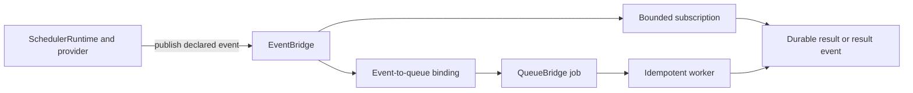

Use a schedule when time should start a business flow. PURISTA Core provides a
trigger-only `SchedulerRuntime` that runs in a separate host and publishes a
declared event. The receiving subscription or queue worker owns business work;
the scheduler host never boots business services or invokes their handlers.

`DefaultSchedulerProvider` is included for local development and deterministic
tests. Production requires an explicitly selected provider and a distributed
EventBridge when the scheduler and business application run in different
processes.

| Contract question | Schedule answer |
| --- | --- |
| Who initiates it? | A separate scheduler host observes time through its configured provider. |
| What is selected? | The Core runtime accepts an event target and publishes that named event. |
| Who waits? | No business caller waits; downstream subscription/queue processing is independent. |
| What is the normal result? | An at-least-once event carrying schedule occurrence metadata. |
| What stays decoupled? | The scheduler does not run business handlers, own worker retries, or guarantee exactly-once business effects. |

The local provider does not make a production schedule durable or distributed.
A definition becomes active only after the separate scheduler host loads it,
starts with a suitable provider/EventBridge, and reports the expected runtime
status. External platform exports remain available, but generated metadata is
not itself an enabled schedule.

## Start with the right target

The Core runtime uses an event target. Bind that event to a queue when one
durable job fits, or consume it with a bounded subscription. Queue and command
targets remain useful for external-provider exports but the Core runtime rejects
them; do not build a Core scheduler host that invokes handlers directly.

| You need to | Read |
| --- | --- |
| Define a cron, interval, or one-shot contract and choose event/queue/command | [Create a schedule and choose a target](/handbook/framework/build-services/schedule-event-queue-result/create-a-schedule-and-choose-a-target/) |
| Send an observable scheduled event into durable work | [Emit, enqueue, or invoke on a schedule](/handbook/framework/build-services/schedule-event-queue-result/emit-enqueue-or-invoke-on-a-schedule/) |
| Prepare an external platform and prove enablement | [Export and deploy schedules](/handbook/framework/build-services/schedule-event-queue-result/export-and-deploy-schedules/) |
| Choose missed-run, overlap, and duplicate recovery behavior | [Handle missed runs, concurrency, and duplicates](/handbook/framework/build-services/schedule-event-queue-result/handle-missed-runs-concurrency-and-duplicates/) |
| Test definitions, bindings, workers, and the chosen platform | [Test scheduled behavior](/handbook/framework/build-services/schedule-event-queue-result/test-scheduled-behavior/) |

For exact schedule types, see [ScheduleDefinitionBuilder](/handbook/api/classes/_purista_core.ScheduleDefinitionBuilder/).
