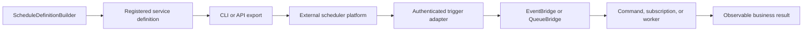

A schedule is deployment metadata that says **when** an external scheduler should
trigger a PURISTA target. Core owns the typed schedule definition and export.
Your scheduler platform owns time, activation, overlap handling, and trigger
delivery. The receiving command, subscription, or queue worker owns business
validation, authorization, retries, and idempotency.

PURISTA does not start an in-process scheduler. A schedule becomes active only
after the exported contract is installed and enabled in a scheduler platform.
This boundary prevents an application replica from accidentally creating one
timer per process.

## Choose the target by business outcome

| Target | Use it for | Execution owner |
| --- | --- | --- |
| Event | A time-based fact that several consumers may observe. | Subscriptions reached through EventBridge. |
| Queue | One durable background job with leases, retries, and dead-letter handling. | A queue worker reached through QueueBridge. |
| Command | Short, idempotent work with a bounded response. | A command reached through EventBridge. |

Create the contract with
[`getScheduleBuilder(...)`](/handbook/api/classes/_purista_core.ServiceBuilder/#getschedulebuilder)
and one target method on
[`ScheduleDefinitionBuilder`](/handbook/api/classes/_purista_core.ScheduleDefinitionBuilder/).
Register the returned definition before service definitions are resolved.

## Follow the complete path

| Task | Read |
| --- | --- |
| Define cron, interval, or one-shot metadata and select a target | [Create a schedule and choose a target](/handbook/framework/build-services/schedule-work/create-a-schedule-and-choose-a-target/) |
| Connect a platform trigger to an event, queue, or command | [Emit, enqueue, or invoke on a schedule](/handbook/framework/build-services/schedule-work/emit-enqueue-or-invoke-on-a-schedule/) |
| Produce a provider-neutral manifest or Kubernetes CronJob input | [Export and deploy schedules](/handbook/framework/build-services/schedule-work/export-and-deploy-schedules/) |
| Make repeated, overlapping, and late runs safe | [Handle missed runs, concurrency, and duplicates](/handbook/framework/build-services/schedule-work/handle-missed-runs-concurrency-and-duplicates/) |
| Test the definition, target, and real scheduler at their own boundaries | [Test scheduled behavior](/handbook/framework/build-services/schedule-work/test-scheduled-behavior/) |

The key failure boundary is activation: a valid `ScheduleDefinition` proves the
contract can be exported, but it does not prove that a platform accepted,
enabled, authenticated, or delivered the trigger. Verify one safe execution in
the deployed environment and observe the resulting event, job, command result,
trace, and log.
