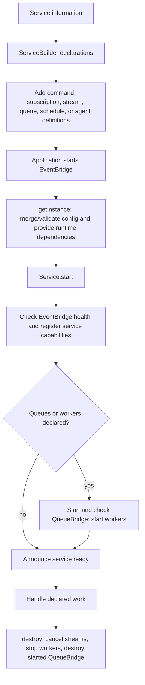

A service is PURISTA's versioned business boundary. It groups the contracts
that belong together—commands, event reactions, streams, queues, schedules,
and attached agents—while the application composition root owns concrete
dependencies, transports, credentials, and deployment lifecycle.

Use a service when several capabilities share one business responsibility. Do
not use it as a global dependency container or as a deployment version label.

## Follow a service from definition to shutdown



`getInstance(...)` creates a service but does not start it. The application
starts the EventBridge first; the service checks its health before registering
commands, subscriptions, and streams. QueueBridge startup happens inside
`Service.start()` only when the service declares queues or workers.

## Build the smallest useful service

Start with a generated service identity, one builder, and one command. The
aggregate registers all definitions before `getInstance(...)` resolves them.

```ts title="src/service/invoice/v1/invoiceV1Service.ts"
export const invoiceV1Service = invoiceV1ServiceBuilder
  .addCommandDefinition(createInvoiceCommandBuilder.getDefinition())
```

[`addCommandDefinition(...commands)`](/handbook/api/classes/_purista_core.ServiceBuilder/#addcommanddefinition)
accepts one or more resolved or pending command definitions, including the
promise returned by [`getDefinition()`](/handbook/api/classes/_purista_core.CommandDefinitionBuilder/#getdefinition).
It records the command contracts for this service; it does not instantiate or
register them with an EventBridge. Definitions resolve once and are then
cached. Add all definitions and event-to-queue bindings before
`getInstance(...)`, `testServiceSetup()`, or an explicit
`resolveDefinitions()` call. Adding a command after that boundary throws a
runtime error.

## Default runtime versus production wiring

When omitted, `getInstance(...)` creates default state, configuration, and
secret stores plus `DefaultQueueBridge`. This keeps a local service runnable,
but it does not supply durable queues, external configuration, or a production
secret boundary. Install, provision, and wire the relevant adapter at the
composition root before depending on those properties.

## Choose the next task

| You need to | Read |
| --- | --- |
| Define a stable identity and version | [Create and version a service](/handbook/framework/build-services/services/create-and-version-a-service/) |
| Register capabilities and event-to-queue bindings | [Add definitions to a service](/handbook/framework/build-services/services/add-definitions-to-a-service/) |
| Inject a repository, provider, or custom metric | [Provide resources and metrics](/handbook/framework/build-services/services/provide-resources-and-metrics/) |
| Validate service-owned startup settings | [Configure a service](/handbook/framework/build-services/services/configure-a-service/) |
| Own a genuine long-lived service boundary | [Customize service lifecycle](/handbook/framework/build-services/services/customize-service-lifecycle/) |
| Wire bridges, stores, logging, telemetry, and start the service | [Instantiate and start a service](/handbook/framework/build-services/services/instantiate-and-start-a-service/) |
| Validate the aggregate and choose the correct testing boundary | [Test a service](/handbook/framework/build-services/services/test-a-service/) |

For exact signatures, see [ServiceBuilder](/handbook/api/classes/_purista_core.ServiceBuilder/) and [Service](/handbook/api/classes/_purista_core.Service/).
