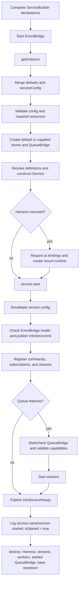

A `ServiceBuilder` describes a versioned boundary. A `Service` instance owns
the live registrations and workers for one process. Keep creation, start, and
shutdown in the application composition root so their order is visible.

When a Harness is mounted, the wrapper starts its runtime before the Framework
service and shuts it down before the service teardown. If either start fails,
the wrapper destroys the partially created service.

## Recognize startup failures

| Stage | Failure |
| --- | --- |
| `getInstance(...)` config validation | `UnhandledError(500, 'The given service configuration is invalid', issues)` |
| Required `defineResource(...)` values omitted | `UnhandledError(500, 'This services requires resources to be set in getInstance options')` |
| Mounted Harness without `ai` runtime bindings | `UnhandledError(500, 'This service mounts a Harness and requires ai runtime configuration.')` |
| `start()` called twice | `UnhandledError(500, 'Service already started')` |
| EventBridge unhealthy | `UnhandledError(503, 'eventbridge not healthy')` |
| QueueBridge unhealthy | `UnhandledError(503, 'queue bridge not healthy')` |
| Strict queue capability mismatch | `UnhandledError(501, ...)` for unsupported FIFO ordering, excessive `prefetch`, or strict event-to-queue idempotency without enforcement |

The queue capability checks run only when the selected bridge sets
`strictStartupValidation`. They happen after QueueBridge health and before
workers start.

## Prove readiness

`await service.start()` resolves only after registration, queue checks, and
worker startup. The service then publishes `InfoServiceReady`, logs
`service <name> <version> started`, and sets `service.isStarted` to `true`.
Use the message or an application readiness endpoint for orchestration; do not
treat process existence as readiness.

## Operate a live service through its public contract

Application composition, readiness, and operator endpoints can use the
[`ServiceClass`](/handbook/api/interfaces/_purista_core.ServiceClass/) surface.
Keep these calls outside business handlers unless a custom framework adapter is
being implemented.

| Public operation | What it reports or changes |
| --- | --- |
| [`start()`](/handbook/api/interfaces/_purista_core.ServiceClass/#start) / [`destroy()`](/handbook/api/interfaces/_purista_core.ServiceClass/#destroy) | Start the single-use instance or stop its owned runtime resources. Follow the ownership order below. |
| [`getServiceHealth()`](/handbook/api/interfaces/_purista_core.ServiceClass/#getservicehealth) | Builds the current service health snapshot, including bridge health and paused consumer/worker state. Use it for an authenticated operator or readiness projection. |
| [`getInFlightDiagnostics()`](/handbook/api/interfaces/_purista_core.ServiceClass/#getinflightdiagnostics) | Returns current command, subscription, and stream in-flight counts used during drain decisions. It is an instantaneous diagnostic, not a durable audit record. |
| [`getQueueWorkerPauseState()`](/handbook/api/interfaces/_purista_core.ServiceClass/#getqueueworkerpausestate) | Returns queue names currently paused in this process and their operator reasons. |
| [`pauseQueueWorkers(queueName, reason?)`](/handbook/api/interfaces/_purista_core.ServiceClass/#pausequeueworkers) / [`resumeQueueWorkers(queueName)`](/handbook/api/interfaces/_purista_core.ServiceClass/#resumequeueworkers) | Pause or resume local workers for one registered queue. This is process-local control; coordinate it across instances in the application control plane when required. |
| [`getPausedSubscriptionConsumerState()`](/handbook/api/interfaces/_purista_core.ServiceClass/#getpausedsubscriptionconsumerstate) / [`resumeSubscriptionConsumer(registrationKey)`](/handbook/api/interfaces/_purista_core.ServiceClass/#resumesubscriptionconsumer) | Inspect fail-stop subscription consumers and request resume through an EventBridge that supports this capability. A missing bridge capability rejects the resume. |
| [`getTracer()`](/handbook/api/interfaces/_purista_core.ServiceClass/#gettracer), [`startActiveSpan(...)`](/handbook/api/interfaces/_purista_core.ServiceClass/#startactivespan), [`wrapInSpan(...)`](/handbook/api/interfaces/_purista_core.ServiceClass/#wrapinspan) | Access the service tracer or wrap application-owned work in an OpenTelemetry span. Prefer the Framework's automatic spans for normal handlers. |
| [`getContextFunctions(logger)`](/handbook/api/interfaces/_purista_core.ServiceClass/#getcontextfunctions) | Builds the base logger, tracing, store, metric, and resource context used by Framework internals. It is an advanced extension/testing hook, not a way to bypass a command or stream contract. |

Pause and resume operations do not change business data or retract messages
already being processed. Protect operator endpoints with separate business
authorization and audit who changed execution state.

## Shut down in ownership order

1. stop public intake or mark the gateway unready;
2. call `destroy()` on each service;
3. destroy the EventBridge after all services; and
4. close application-owned databases, listeners, and telemetry exporters.

`Service.destroy()` cancels active stream sessions, stops workers, and destroys
a QueueBridge that the service started. It does not deregister the service's
commands, subscriptions, or streams from EventBridge, and it does not reset
`isStarted`. Destroy the bridge after the services and create a new instance
instead of attempting to restart a destroyed one.

Next: [create and version a service](/handbook/framework/build-services/services/create-and-version-a-service/).
