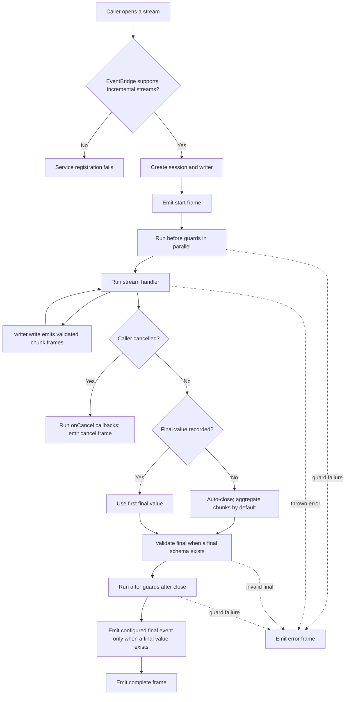

Use a stream when a connected caller benefits from visible progress: document
analysis stages, report generation, or an AI response. A stream is not durable
work. If an operation must finish after a disconnect, use a
[queue and worker](/handbook/framework/build-services/queues-and-workers/) and
let the caller retrieve the committed result.

Before adding a stream, verify the selected EventBridge. `DefaultEventBridge`
supports local incremental streams; the current AMQP, NATS, MQTT, and Dapr
EventBridges do not, and service startup rejects a registered stream on those
adapters. See [EventBridge stream support](/handbook/framework/connect-distributed-infrastructure/event-delivery/#decide-stream-support-before-designing-a-public-stream)
before choosing a distributed topology.

## Check availability before design

The current incremental-stream runtime requires `DefaultEventBridge`. The
current AMQP, NATS, MQTT, Dapr, and HTTP EventBridge implementations do not
advertise stream support, and service registration rejects a stream on those
adapters. This is a design constraint, not a transport option to enable later.

## See the stream lifecycle



`writer.close(...)` records the final value; the runtime emits `complete` after
the stream closes, after final validation when a final schema is present, after
guards, and after any eligible final event. Returning without closing
auto-closes the stream. With aggregation disabled, that implicit final is
`undefined`; the runtime still runs after guards and emits `complete`, but
does not emit a final event. `writer.fail(...)` emits an error frame but does
not close the writer—throw an error for normal terminal failure.

## Start with one verified stream

```sh title="Generate the document-analysis stream"
npm run add:stream -- analyze-document --description "Stream document analysis progress" --service document --service-version 1
```

The CLI creates schemas, types, a builder, test, and aggregate registration.
Replace its permissive initial schemas before exposing the stream. Frames are a
public contract: keep each one small and safe to expose, never stream raw
source documents, credentials, or unredacted personal data by default.

```ts title="src/service/document/v1/stream/analyzeDocument/schema.ts"
import { extendApi } from '@purista/core'
import { z } from 'zod'

export const documentV1AnalyzeDocumentInputParameterSchema = extendApi(
  z.object({ requestId: z.string().uuid() }),
  { title: 'document analysis request parameter' },
)

export const documentV1AnalyzeDocumentInputPayloadSchema = extendApi(
  z.object({ documentId: z.string().uuid() }),
  { title: 'document analysis request payload' },
)

export const documentV1AnalyzeDocumentChunkPayloadSchema = extendApi(
  z.object({ stage: z.enum(['extracting', 'classifying']), progress: z.number().int().min(0).max(100) }),
  { title: 'document analysis progress frame' },
)

export const documentV1AnalyzeDocumentFinalPayloadSchema = extendApi(
  z.object({ documentId: z.string().uuid(), status: z.literal('complete') }),
  { title: 'document analysis completion' },
)
```

## Do not overstate input validation

`addPayloadSchema(...)` and `addParameterSchema(...)` type the handler and
describe the contract/OpenAPI metadata. In the current runtime, they are not
universally validated by `Service.executeStream(...)` or a Hono route before
the handler runs. A caller using a declared `canConsumeStream(...)` validates
its own request schemas. Keep handler code defensive at untrusted stream-open
boundaries until that implementation behavior changes.

## Write frames and complete deliberately

`writer.write(...)` emits a chunk that must match the chunk schema.
`writer.close(...)` records the successful final value and validates it when a
final schema exists. If the handler returns without closing, PURISTA closes
deterministically and uses the default aggregate final value when aggregation
is enabled. A declared final schema therefore needs an explicit compatible
final value: the aggregate `{ chunkCount, chunks }` is usually a different
shape. Treat cancellation as a request to stop expensive upstream work; return
after cleanup and do not emit more frames.

```ts title="src/service/document/v1/stream/analyzeDocument/analyzeDocumentStreamBuilder.ts"
import { documentV1ServiceBuilder } from '../../documentV1ServiceBuilder.js'
import {
  documentV1AnalyzeDocumentChunkPayloadSchema,
  documentV1AnalyzeDocumentFinalPayloadSchema,
  documentV1AnalyzeDocumentInputParameterSchema,
  documentV1AnalyzeDocumentInputPayloadSchema,
} from './schema.js'

export const analyzeDocumentStreamBuilder = documentV1ServiceBuilder
  .getStreamBuilder('analyzeDocument', 'Stream document analysis progress')
  .addPayloadSchema(documentV1AnalyzeDocumentInputPayloadSchema)
  .addParameterSchema(documentV1AnalyzeDocumentInputParameterSchema)
  .addChunkSchema(documentV1AnalyzeDocumentChunkPayloadSchema)
  .addFinalSchema(documentV1AnalyzeDocumentFinalPayloadSchema)
  .setStreamFunction(async function (_context, payload, _parameter, writer) {
    await writer.write({ stage: 'extracting', progress: 25 })
    if (writer.cancelled) return

    await writer.write({ stage: 'classifying', progress: 75 })
    if (writer.cancelled) return

    await writer.close({ documentId: payload.documentId, status: 'complete' })
})
```

[`getStreamBuilder(...)`](/handbook/api/classes/_purista_core.ServiceBuilder/#getstreambuilder)
creates the service-owned definition. [`addPayloadSchema(...)`](/handbook/api/classes/_purista_core.StreamDefinitionBuilder/#addpayloadschema)
and [`addParameterSchema(...)`](/handbook/api/classes/_purista_core.StreamDefinitionBuilder/#addparameterschema)
declare the open-request contract; [`addChunkSchema(...)`](/handbook/api/classes/_purista_core.StreamDefinitionBuilder/#addchunkschema)
and [`addFinalSchema(...)`](/handbook/api/classes/_purista_core.StreamDefinitionBuilder/#addfinalschema)
declare and, by default, validate the producer's output boundaries.
[`setStreamFunction(...)`](/handbook/api/classes/_purista_core.StreamDefinitionBuilder/#setstreamfunction)
installs the required service-bound handler. The focused [create and validate a
stream](/handbook/framework/build-services/streams/create-and-validate/) guide
explains each parameter, default, and validation boundary.

The runtime delivers transport frames; the service definition stays transport
neutral. The HTTP server chapter configures how a browser consumes them. A
thrown error signals stream failure—do not disguise it as a completed frame.

## Choose the next task

| You need to | Read |
| --- | --- |
| Generate/register a stream, define contracts, and implement its handler | [Create and validate a stream](/handbook/framework/build-services/streams/create-and-validate/) |
| Write chunks, select a final result, and publish a final event | [Write chunks and complete the stream](/handbook/framework/build-services/streams/write-chunks-and-complete/) |
| Invoke, consume, enqueue, or emit from the stream | [Invoke, enqueue, emit, and consume](/handbook/framework/build-services/streams/invoke-enqueue-emit-and-consume/) |
| Use stores, resources, telemetry, and cooperative cancellation | [Use stream resources, stores, context, and cancellation](/handbook/framework/build-services/streams/resources-stores-context-and-cancellation/) |
| Project the stream over HTTP | [Expose a stream](/handbook/framework/build-services/streams/expose-a-stream/) |
| Handle cancellation and terminal failure | [Handle stream termination and failures](/handbook/framework/build-services/streams/termination-and-failures/) |
| Test direct logic, deterministic runtime flow, or the HTTP/adapter boundary | [Test a stream](/handbook/framework/build-services/streams/test-a-stream/) |

## Register and test the exact sequence

Add the completed definition to the service aggregate, then use the runtime
test harness to capture chunks and the final payload without an HTTP server.

```ts title="src/service/document/v1/documentV1Service.ts"
import { analyzeDocumentStreamBuilder } from './stream/analyzeDocument/analyzeDocumentStreamBuilder.js'
import { documentV1ServiceBuilder } from './documentV1ServiceBuilder.js'

export const documentV1Service = documentV1ServiceBuilder
  .addStreamDefinition(analyzeDocumentStreamBuilder.getDefinition())
```

[`addStreamDefinition(...)`](/handbook/api/classes/_purista_core.ServiceBuilder/#addstreamdefinition)
accepts the asynchronous definition promise and must be part of the aggregate
before the service instance resolves its definitions. It registers metadata; it
does not start the service or make an unsupported EventBridge stream-capable.

```ts title="src/service/document/v1/stream/analyzeDocument/analyzeDocumentStreamBuilder.test.ts"
import { createStreamTestHarness } from '@purista/core'
import { describe, expect, test } from 'vitest'
import { documentV1ServiceBuilder } from '../../documentV1ServiceBuilder.js'
import { analyzeDocumentStreamBuilder } from './analyzeDocumentStreamBuilder.js'

describe('analyzeDocument stream', () => {
  test('emits ordered progress and a final result', async () => {
    const harness = await createStreamTestHarness(documentV1ServiceBuilder, analyzeDocumentStreamBuilder)
    try {
      const result = await harness.run({
        payload: { documentId: '8c4de89e-aa58-47cd-8d6b-b99997c73a32' },
        parameter: { requestId: 'd1002143-4d6d-4f06-9384-3d27682b2f52' },
      })

      expect(result.chunks).toEqual([
        { stage: 'extracting', progress: 25 },
        { stage: 'classifying', progress: 75 },
      ])
      expect(result.final).toEqual({
        documentId: '8c4de89e-aa58-47cd-8d6b-b99997c73a32',
        status: 'complete',
      })
    } finally {
      await harness.destroy()
    }
  })
})
```

Test cancellation and an upstream failure separately: no frame after
cancellation, final/stream termination is observable, and a thrown error is
mapped by the chosen transport. Apply frame-size limits and transport
backpressure when exposing the stream over HTTP.

| Requirement | Choose |
| --- | --- |
| Progressive values while the client remains connected | Stream |
| Work must complete after a disconnect | Queue/worker and persisted result |
| One validated reply | Command |
| Progressive model output | AI-powered stream with the same cancellation and data rules |

For the complete API, see [StreamDefinitionBuilder](/handbook/api/classes/_purista_core.StreamDefinitionBuilder/).
